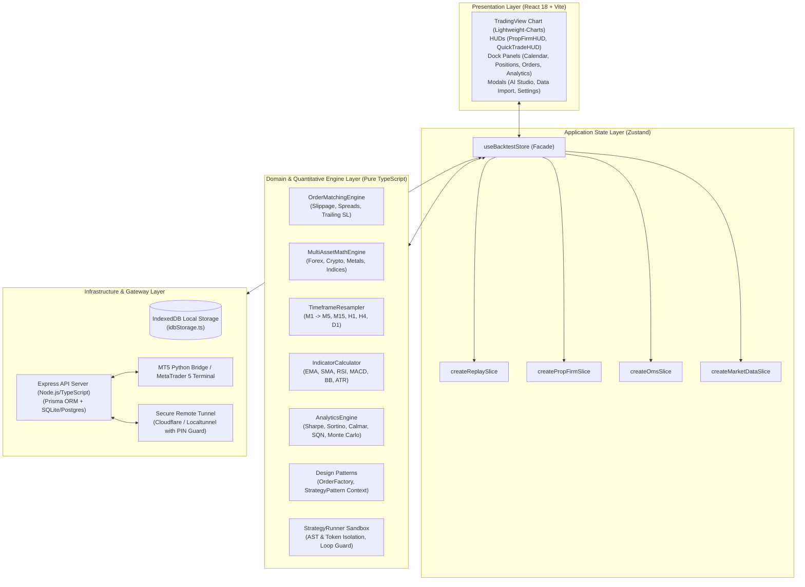
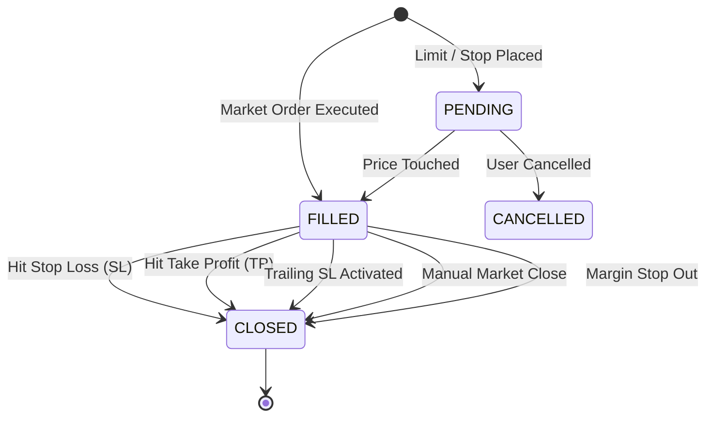

# QuantBacktest Pro - Architecture & Technical Design

Welcome to the architectural documentation for **QuantBacktest Pro**. This document provides an exhaustive overview of the system architecture, domain models, design patterns, security guarantees, and execution lifecycles for contributors and maintainers.

---

## 1. High-Level System Architecture

QuantBacktest Pro follows **Clean Architecture** and **Layered System Separation** principles. The domain and execution logic are strictly decoupled from the UI framework, allowing 100% deterministic, headless unit and property testing.

---

## 2. Layered Separation of Concerns

| Layer | Responsibility | Key Modules & Files |
| :--- | :--- | :--- |
| **Domain / Core Engine** | Pure mathematical calculations, financial accounting, order state machine, indicators, and strategy compilation. Zero React dependencies. | `src/engine/quantMath.ts` `src/engine/orderMatchingEngine.ts` `src/engine/indicators.ts` `src/engine/analytics.ts` `src/engine/strategySandbox.ts` |
| **Application State** | Coordinates domain engines, manages reactive application state, handles local caching, and drives the replay loop via Zustand Slices. | `src/store/backtestStore.ts` `src/store/slices/*` `src/store/authStore.ts` `src/store/brokerStore.ts` |
| **Presentation** | High-performance rendering, canvas-based chart visualization, responsive HUDs, and localized user interactions. | `src/components/chart/*` `src/components/panels/*` `src/components/modals/*` |
| **Infrastructure / API** | IndexedDB persistence, external REST API communication, MT5 socket bridge, and remote tunnel management. | `src/storage/idbStorage.ts` `src/api/*` `server/index.ts` `server/routes/*` |

---

## 3. Design Patterns Applied

### 3.1. Factory Method Pattern (`src/engine/patterns/OrderFactory.ts`)
Decouples order creation and validation from store actions:
- `OrderFactory.createMarketOrder()`: Generates executed market orders with exact bid/ask matching and slippage.
- `OrderFactory.createLimitOrder()`: Enforces invariant validation (BUY LIMIT < market price; SELL LIMIT > market price).
- `OrderFactory.createStopOrder()`: Validates breakout triggers (BUY STOP > market price; SELL STOP < market price).
- `OrderFactory.validateSLTP()`: Verifies side-specific risk containment rules.

### 3.2. Strategy Pattern (`src/engine/patterns/StrategyPattern.ts`)
Enables dynamic, polymorphic algorithmic trading behavior:
- `IQuantStrategy`: Interface specifying `onCandle(candle, indicators, account, api)`.
- `StrategyExecutionContext`: Maintains execution state, lifecycle hooks (`reset`, parameter updating), and runtime dispatch.
- Concrete Implementations: `EMACrossoverStrategy`, `RSIMeanReversionStrategy`, `BollingerBandsStrategy`.

### 3.3. Slice Pattern (`src/store/slices/*`)
Prevents "God Object" anti-patterns in global Zustand state:
- Modular slices (`createPropFirmSlice`, etc.) maintain isolated state definitions and actions.
- Composed cleanly into `useBacktestStore`, preserving 100% backward compatibility for existing component subscribers.

### 3.4. State Machine Pattern (`OrderMatchingEngine`)
Orders and positions transition deterministically through defined states:

---

## 4. Security Architecture (OWASP Hardened)

QuantBacktest Pro implements defense-in-depth across frontend execution and backend APIs:

1. **Strategy Sandbox Isolation (`strategySandbox.ts`)**:
   - **AST & Obfuscation Inspection**: Rejects unicode/hex escape sequences (`\x`, `\u`), dynamic property string concatenation (`['c'+'onstructor']`), and dangerous keywords (`eval`, `Function`, `import`, `globalThis`, `window`, `document`, `localStorage`, `fetch`).
   - **Host Global Shadowing**: All sensitive browser globals are shadow-bound to `undefined` in the execution scope.
   - **Denial-of-Service / Loop Guards**: Unbounded loops (`while(true)`) are statically blocked. Consecutive runtime errors trigger automatic strategy suspension.

2. **Multi-Tenant Session Isolation (`server/routes/broker.ts`)**:
   - Session configurations and in-memory mock broker engines are strictly partitioned per authenticated user (`req.userId`).
   - Prevents cross-user position visibility, order tampering, or credential leakage.

3. **Remote Tunnel PIN Protection (`server/routes/tunnel.ts`)**:
   - Remote requests via Cloudflare Tunnel (`.trycloudflare.com`) or Localtunnel (`.loca.lt`) are identified via proxy headers and network boundaries.
   - Remote callers must provide a valid `X-Tunnel-Pin` header before accessing any protected API route.

4. **Enterprise HTTP Security Headers & Rate Limiting (`server/index.ts`)**:
   - Security headers enforced: `X-Content-Type-Options: nosniff`, `X-Frame-Options: SAMEORIGIN`, `X-XSS-Protection: 1; mode=block`, `Referrer-Policy: strict-origin-when-cross-origin`.
   - Sensitive endpoints (`/api/auth/*`, `/api/tunnel/verify-pin`) are protected by sliding-window rate limiters.

---

## 5. Mandatory Coding & Contribution Guidelines

1. **Internationalization (i18n)**:
   - ZERO hardcoded UI strings. All text must use translation keys defined in `src/i18n/types.ts` and present across all 4 locales (`vi`, `en`, `ja`, `zh`).
   - Verify via `npm run check:i18n`.
2. **Type Safety**:
   - Zero TypeScript errors allowed (`npx tsc --noEmit` on root and server).
3. **Automated Testing**:
   - Run `npm test` (143/143 passing) and `npx tsx scripts/test_security_hardening.ts` (10/10 passing).
4. **Git Discipline**:
   - Local commits only. Never push to remote origin unless explicitly authorized.
