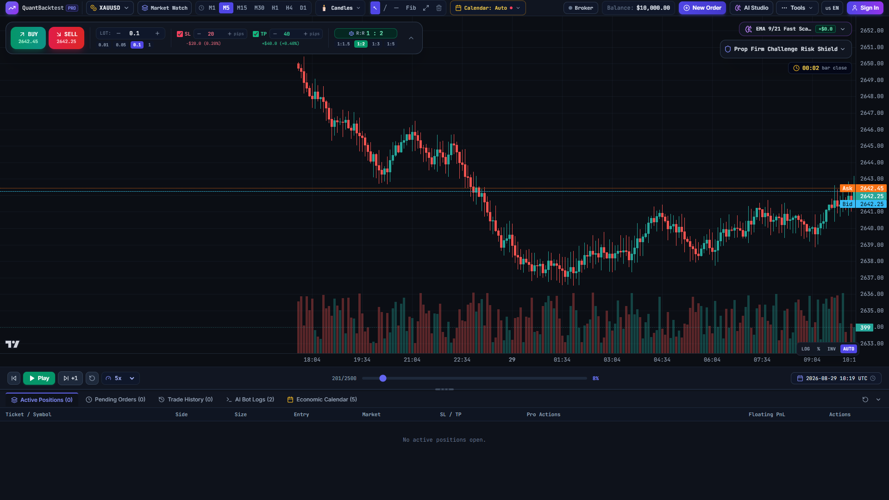
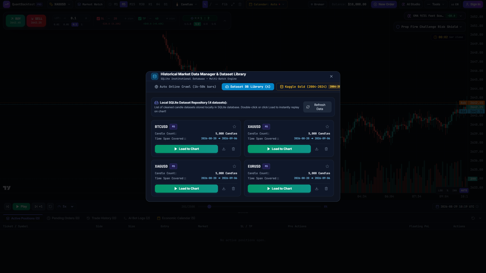
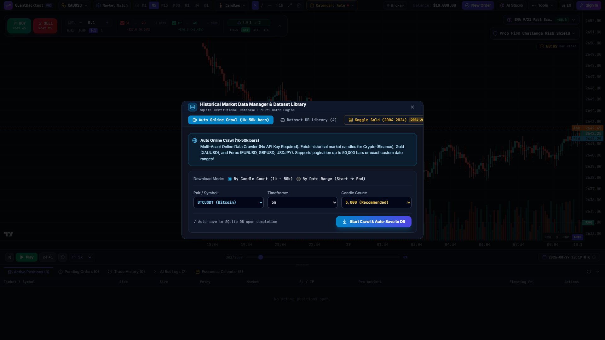
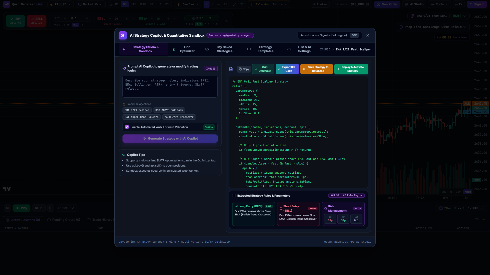
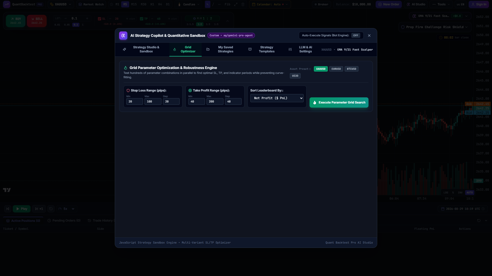
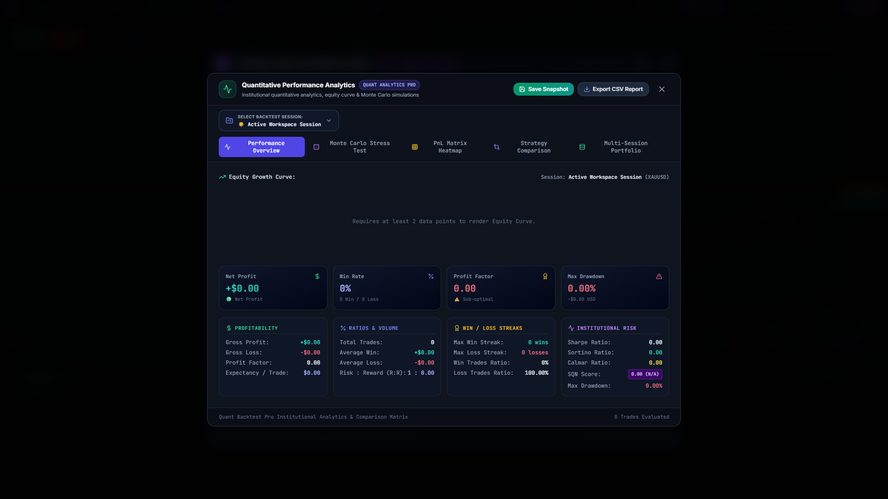

# Quant Backtest Pro 🚀

<div align="center">

> **Institutional-Grade Web-based Multi-Asset Replay, AI Strategy Generation & Trading Bot Deployment Platform**

[](https://github.com/thieucong98/quant-backtest-pro/releases/tag/v1.2.0)
[](#)
[](README.vi.md)
[](LICENSE)
[](#)
[](Dockerfile)
[](https://www.typescriptlang.org/)
[](https://react.dev/)
[](https://tailwindcss.com/)
[](https://www.sqlite.org/)

<br />

<!-- Hero Showcase Image -->


</div>

---

## 🌐 Language Navigation / Chuyển đổi ngôn ngữ
* 🇺🇸 **[English (Current)](README.md)**
* 🇻🇳 **[Tiếng Việt](README.vi.md)**

---

## 📖 Overview

**Quant Backtest Pro** is a modern, high-performance, open-source trading simulation and quantitative backtesting platform built for price-action traders, quantitative analysts, and algorithmic developers. 

It unifies **60 FPS ultra-smooth candlestick replay (even with 200,000+ candles)**, millisecond order matching, **AI-powered natural language strategy creation**, **SL/TP Multi-Variant Grid Optimization**, live **AI Bot Floating HUD**, **Data Import Manager 2.0 (with SQLite dataset persistence and multi-batch online crawler)**, and **instant multi-platform bot exportation** into a sleek, dark-themed institutional workspace.

---

## 📸 Visual Showcase & Feature Highlights

### 1. ⚡ High-Performance 60 FPS Replay & Time-Travel Backtesting
Replay price action with sub-millisecond precision. Jump to any exact historical date and time or jump between dataset milestones (*Start / 50% Midpoint / Latest*) instantly using an optimized binary-search indexer.

<div align="center">
  
</div>

- **$O(1)$ Incremental Chart Rendering**: Sub-millisecond (`0.05ms`) candle updates on TradingView Lightweight Charts, eliminating canvas rebuilds and GC thrashing at high playback speeds (`10x` to `100x`).
- **Time-Travel Date-Time Picker**: Jump directly to specific historical market events (e.g. FOMC, CPI, NFP releases).
- **Multi-Timeframe Resampling**: Live resampling from raw M1 candles to M5, M15, M30, H1, H4, D1, W1, and MN.
- **Zero-Allocation Technical Indicators**: SMA, EMA, RSI, ATR, Bollinger Bands, and MACD compute dynamically over effective lengths without memory overhead.

---

### 2. 📥 Data Import Manager 2.0 & SQLite Dataset Library
Never search or re-upload your historical data again. Automatically persist every imported CSV or crawled feed into an integrated local SQLite database.

<div align="center">
  
  
</div>

- **1-Click Load Dataset Cards**: Instant 1-click loading from the Database card grid with asset badges, timeframe tags, candle counts, and date spans.
- **Multi-Batch Online Crawler (Up to 50,000 Candles)**: Paginated historical crawler supporting Crypto (Binance REST API), Spot Gold (XAUUSD), and Forex Major pairs (EURUSD, GBPUSD, USDJPY).
- **Date-Range Mode**: Fetch exact ranges (`From Date ➔ To Date`) with live progress tracking.
- **High-Speed Integer CSV Parser**: Parses **1.44 Million candles in < 3.8 seconds** with automatic delimiter detection (`;`, `,`, `\t`).

---

### 3. 🧠 AI Strategy Studio & Rule Breakdown Cards
Transform trading ideas described in plain natural language into fully backtestable, executable TypeScript strategy code.

<div align="center">
  
</div>

- **Natural Language to Code**: Type *"Fast EMA 9 crosses above EMA 21 with RSI < 70 filter, SL 15 pips, TP 30 pips"* and receive verified execution logic.
- **Strategy Rule Breakdown**: Automatically parses code logic into structured cards for **BUY Signals**, **SELL Signals**, and **Risk Parameters**.
- **Multi-LLM Connectors**: Connects to OpenAI (GPT-4o), Google Gemini, Anthropic Claude, DeepSeek, Local Ollama, and Custom Reverse Proxies.

---

### 4. 🔥 SL/TP Grid Search & 2D Sweet-Spot Profit Heatmap
Prevent curve-fitting and uncover truly robust parameter combinations with automated multi-variant batch simulations.

<div align="center">
  
</div>

- **2D Profit Heatmap Matrix**: Visually highlights profitable clusters (*Sweet Spots*) across Stop Loss and Take Profit parameter pairs.
- **SVG Mini Sparklines**: Real-time equity trajectory curves rendered inside leaderboard table cells.
- **Statistical Quality Filters**: 1-click filters for `Minimum Trades >= 5` and `Profitable Net PnL > 0`.
- **1-Click Parameter Injection**: Injects top-performing SL/TP values directly back into your live sandbox strategy.

---

### 5. 🤖 Multi-Platform Bot Exporter & Deployment Hub
Deploy backtested strategies directly to live brokerage and algorithmic trading platforms in seconds.

<div align="center">
  
</div>

- **TradingView (Pine Script v5)**: Complete indicator script with automated webhook alert JSON payloads for 3Commas, Bybit, Binance, and PineConnector.
- **MetaTrader 5 (MQL5 EA)**: Production-ready `.mq5` Expert Advisor utilizing `CTrade` and automated lot sizing.
- **MetaTrader 4 (MQL4 EA)**: Standard `.mq4` Expert Advisor with `OrderSend()` and Magic Number tracking.
- **Python Algorithmic Bot (CCXT + Pandas-TA)**: Standalone 24/7 Python 3 script for automated crypto execution.
- **cTrader (C# cBot)**: Clean `.cs` robot for cTrader Automate.

---

### 6. 🛡️ Prop Firm Challenge Shield & Quantitative Analytics
Monitor compliance with prop firm challenge rules (FTMO, FundedNext, MFF) in real time, and audit performance using institutional Monte Carlo stress testing.

<div align="center">
  
</div>

- **Prop Firm Shield**: Set Max Daily Loss (e.g. 5%) and Max Total Drawdown (e.g. 10%) with real-time audio and visual circuit breakers.
- **Monte Carlo Stress Testing**: 500+ iterations randomized path simulation to calculate Risk-of-Ruin probabilities and confidence intervals.
- **PnL Calendar & Heatmap**: Visual breakdown of performance across trading sessions, weekdays, and months.
- **Session Comparison Matrix**: Compare multiple backtesting runs side-by-side (Sharpe Ratio, Profit Factor, Expectancy, Winrate).

---

## 🚀 Quickstart & Installation

You can run Quant Backtest Pro either with **Docker (Recommended for 1-click zero-config deployment)** or locally with **Node.js**.

---

### Option 1: 🐳 1-Click Startup with Docker Compose (Recommended)

#### Prerequisites
- [Docker Desktop](https://www.docker.com/products/docker-desktop/) or Docker Engine + Docker Compose

```bash
# 1. Clone the repository
git clone https://github.com/thieucong98/quant-backtest-pro.git
cd quant-backtest-pro

# 2. Build and start the application in background
docker compose up -d

# 3. View live logs
docker compose logs -f

# 4. Stop containers
docker compose down
```

Access the application in your browser:
- **Web Application & API**: `http://localhost:3001`
- **API Health Endpoint**: `http://localhost:3001/api/health`

> [!TIP]
> **Data Persistence**: All sessions, custom datasets, and closed trades are automatically persisted inside the Docker named volume `sqlite_data` (`/app/server/prisma`).

---

### Option 2: 🐳 Standalone Docker CLI

```bash
# Build the production Docker image
docker build -t quant-backtest-pro .

# Run the container with persistent SQLite volume mount
docker run -d -p 3001:3001 --name quant-backtest-pro -v quant_sqlite:/app/server/prisma quant-backtest-pro
```

---

### Option 3: 💻 Local Node.js Development Setup

#### Prerequisites
- [Node.js](https://nodejs.org/) (v18.0.0 or higher)
- [npm](https://www.npmjs.com/) (or `pnpm` / `yarn`)

```bash
# 1. Clone repository & install dependencies
git clone https://github.com/thieucong98/quant-backtest-pro.git
cd quant-backtest-pro
npm install

# 2. Start Full-Stack Environment (Frontend + Backend API)
# Option A: Single Unified Command (Concurrent terminal runner)
npm run dev:all

# Option B: Native Platform Launchers (Launches MT5 Gateway + API + Frontend)
# On Windows:
.\start_all.bat

# On Linux / macOS / WSL:
chmod +x start_all.sh && ./start_all.sh

# Or start services in separate terminals:
# Terminal 1: npm run dev
# Terminal 2: npm run server:start
```

Open your browser at:
- **Frontend UI**: `http://localhost:5173/`
- **Backend API Health**: `http://localhost:3001/api/health`

---

### 🔑 Default Institutional Account
- **Email**: `admin@quantbacktest.pro`
- **Password**: `QuantPro@2026`
- **Tier**: `INSTITUTIONAL` (All features, unlimited trades & multi-pair datasets unlocked)

---

## 🏗️ Architecture & Technology Stack

| Layer | Technology | Description |
| :--- | :--- | :--- |
| **Frontend UI** | React 19, TypeScript 5.8 | Strictly typed UI components with zero runtime overhead |
| **Styling** | Tailwind CSS 3.4, Lucide Icons | Modern dark-mode interface with sleek Glassmorphism |
| **Charting Engine** | Lightweight Charts v4 | TradingView's high-speed canvas charting ($O(1)$ update pipeline) |
| **State Management**| Zustand 5 | Low-overhead reactive state with throttled persistence |
| **Backend & Storage**| Node.js Express + Prisma + SQLite | Local database for sessions, trades, strategies, and datasets |
| **Quant Engines** | Custom TypeScript Quant Engines | Order matching engine (OMS), resampler, technical indicators, Monte Carlo |
| **Data Parser** | Fast Integer CSV Parser | Sub-4s parsing for 1.44M OHLCV bars with auto-delimiter detection |
| **AI Integration** | Fetch API + OpenAI standard | Multi-LLM strategy generator, SL/TP optimizer, and code transpilers |

---

## 📚 Documentation Index

| English Documentation | Vietnamese Documentation (Tiếng Việt) |
| :--- | :--- |
| 📘 [User Guide](docs/USER_GUIDE.md) | 📘 [Hướng dẫn sử dụng](docs/vi/USER_GUIDE.md) |
| 🛠️ [Developer Guide](docs/DEVELOPER_GUIDE.md) | 🛠️ [Tài liệu lập trình viên](docs/vi/DEVELOPER_GUIDE.md) |
| 🏛️ [System Architecture](docs/ARCHITECTURE.md) | 🏛️ [Kiến trúc hệ thống](docs/vi/ARCHITECTURE.md) |
| 🤖 [Strategy Bot Exporter Guide](docs/STRATEGY_BOT_EXPORTER.md) | 🤖 [Hướng dẫn xuất Bot giao dịch](docs/vi/STRATEGY_BOT_EXPORTER.md) |
| 🔌 [API Reference](docs/API_REFERENCE.md) | 🔌 [Tài liệu API RESTful](docs/vi/API_REFERENCE.md) |

---

## 📄 License

Distributed under the **MIT License**. See [LICENSE](LICENSE) for more information.
