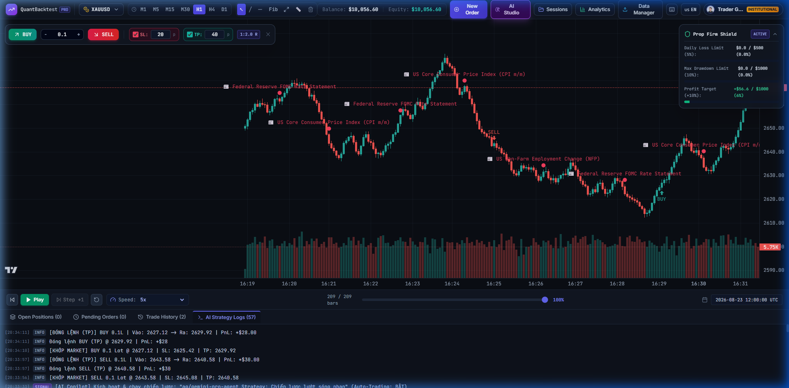
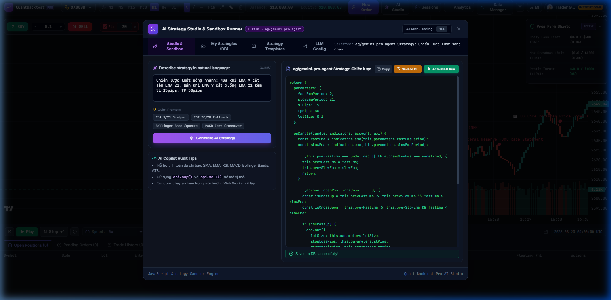
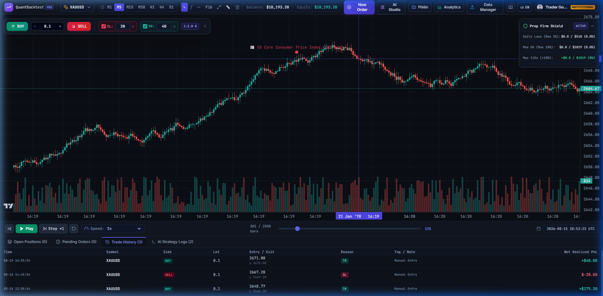
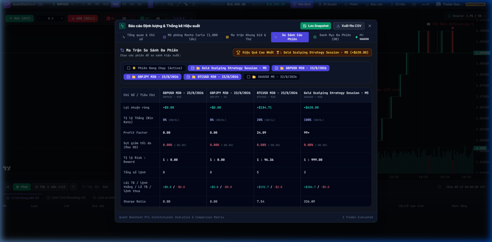
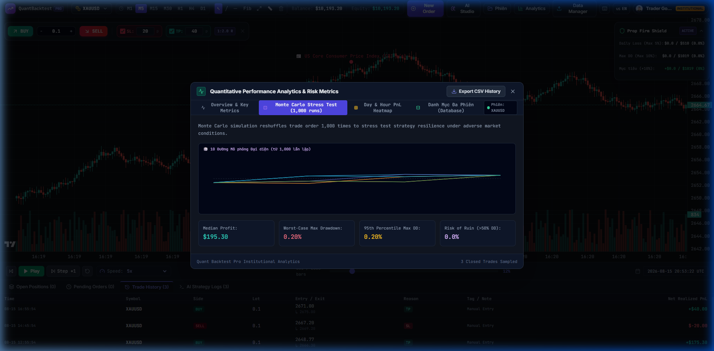
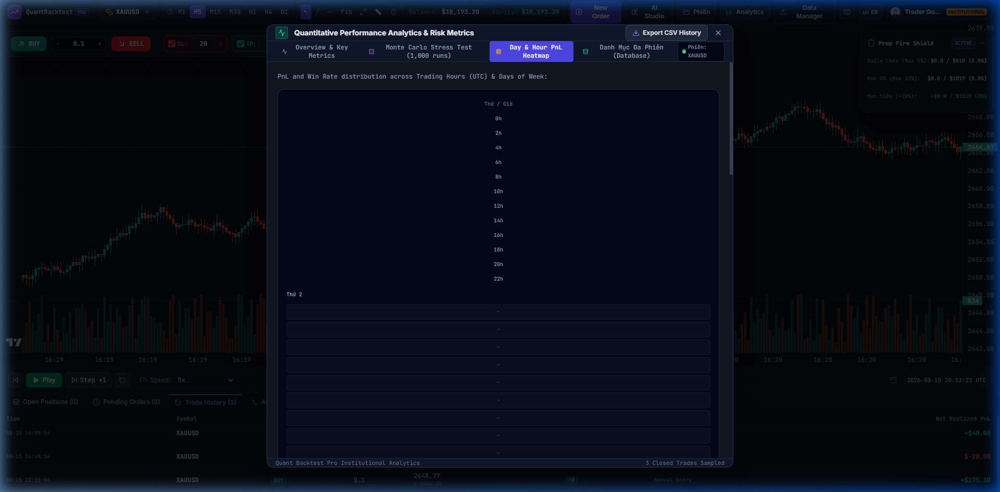

# Quant Backtest Pro 🚀 (Tiếng Việt)

> **Nền tảng Replay Đa Tài sản, Tạo Chiến lược AI & Xuất Bot Giao dịch Thuật toán Chuẩn Chuyên nghiệp**

[](README.md)
[](#)
[](LICENSE)
[](https://github.com/thieucong98/quant-backtest-pro/actions/workflows/ci.yml)
[](#-tài-trợ--ủng-hộ-dự-án-sponsorship)
[](https://www.typescriptlang.org/)
[](https://react.dev/)
[](https://vitejs.dev/)
[](https://tailwindcss.com/)
[](https://www.sqlite.org/)

---

## 🌐 Chuyển đổi ngôn ngữ / Language Navigation
* 🇺🇸 **[English](README.md)**
* 🇻🇳 **[Tiếng Việt (Hiện tại)](README.vi.md)**

---

## 📸 Hình Ảnh Trực Quan & Trải Nghiệm Giao Diện

### 1. ⚡ Bộ Tua Nến Replay & Khớp Lệnh Real-Time

*Giao diện tua nến bar-by-bar mượt mà, biểu đồ TradingView Lightweight Charts, tự động gom nến đa khung thời gian và thanh đặt lệnh nhanh 1-Click.*

---

### 2. 🧠 AI Strategy Studio & Trợ Lý Thuật Toán Multi-LLM

*Tạo mã chiến lược JavaScript tự động từ ngôn ngữ tự nhiên, hỗ trợ đa mô hình (OpenAI, Gemini, Claude, DeepSeek, Local Ollama, Custom Proxy Tunnel).*

---

### 3. 🛡️ Lá Chắn Quỹ Giao Dịch (Prop Firm Shield)

*Cài đặt hạn mức lỗ tối đa trong ngày, sụt giảm vốn tối đa (Max Drawdown) và ngắt giao dịch tự động kèm âm thanh cảnh báo.*

---

### 4. 📊 Ma Trận So Sánh Đa Phiên (Lưu Trữ SQLite)

*Theo dõi, đối chiếu và so sánh trực quan hiệu suất giữa nhiều phiên kiểm thử (Win Rate, Profit Factor, Drawdown, Sharpe).*

---

### 5. 🎲 Phân Tích Định Lượng & Mô Phỏng Monte Carlo 500 Vòng

*Đánh giá rủi ro xác suất cháy tài khoản (Risk of Ruin) và kiểm định khoảng tin cậy thuật toán qua 500 chu kỳ xáo trộn ngẫu nhiên.*

---

### 6. 📅 Bản Đồ Nhiệt Hiệu Suất PnL

*Xem chi tiết bức tranh phân bố lợi nhuận theo từng ngày trong tuần, từng tháng trong năm.*

---

## 📖 Giới thiệu Tổng quan

**Quant Backtest Pro** là nền tảng mô phỏng và kiểm thử chiến lược giao dịch định lượng (Backtesting Platform) mã nguồn mở hiện đại, hiệu năng cao, được thiết kế cho các nhà giao dịch định lượng (Quant Traders), Price Action Traders và các kỹ sư phát triển Bot thuật toán. Ứng dụng tích hợp bộ tua nến mượt mà, công cụ khớp lệnh thực tế, AI sinh mã chiến lược tự động, lưu trữ phiên kiểm thử trên SQLite và xuất mã nguồn Bot sang các nền tảng MT4/MT5/TradingView/Python chỉ với 1 cú click.

---

## ✨ Các Tính Năng Nổi Bật

```
                                  QUANT BACKTEST PRO
 ┌────────────────────────────────────────────────────────────────────────────────────────┐
 │                                                                                        │
 │   ┌───────────────────────┐   ┌───────────────────────┐   ┌────────────────────────┐   │
 │   │  Bộ Tua Nến Replay    │   │  AI Strategy Studio   │   │  Xuất Bot Đa Nền Tảng  │   │
 │   │  - Replay Tick/Candle │   │  - Hỗ trợ Multi-LLM   │   │  - MT5 / MT4 (MQL)     │   │
 │   │  - Trượt giá thực tế  │   │  - Custom Proxy Tunnel│   │  - Pine Script v5      │   │
 │   │  - M1 tới Monthly     │   │  - Đo độ trễ Ping thực│   │  - Python CCXT / cBot  │   │
 │   └───────────────────────┘   └───────────────────────┘   └────────────────────────┘   │
 │                                                                                        │
 │   ┌───────────────────────┐   ┌───────────────────────┐   ┌────────────────────────┐   │
 │   │  Lưu Trữ SQLite       │   │  Phân Tích Định Lượng │   │  Lá Chắn Quỹ (Prop)    │   │
 │   │  - Quản lý đa phiên   │   │  - Monte Carlo 500 lần│   │  - Giới hạn lỗ ngày    │   │
 │   │  - Database chiến lược│   │  - Bản đồ nhiệt PnL   │   │  - Giới hạn Drawdown   │   │
 │   │  - Ma trận so sánh    │   │  - Đường cong Equity  │   │  - Cảnh báo âm thanh   │   │
 │   └───────────────────────┘   └───────────────────────┘   └────────────────────────┘   │
 │                                                                                        │
 └────────────────────────────────────────────────────────────────────────────────────────┘
```

### 1. ⚡ Bộ Tua Nến & Phát Lại Dữ Liệu Lịch Sử Siêu Tốc
- **Phát lại từng cây nến (Bar-by-Bar Replay)**: Tua từng nến, tua ngược lại hoặc tự động phát với dải tốc độ từ `0.1x` đến `50x`.
- **Tự động ghép khung thời gian (Multi-Timeframe Resampling)**: Tự động gom nến từ dữ liệu gốc M1 sang M5, M15, M30, H1, H4, D1, W1 và MN.
- **Tích hợp Lịch Kinh Tế**: Đánh dấu các mốc tin tức mạnh như FOMC, CPI, NFP, Lãi suất ngân hàng trung ương trực tiếp trên biểu đồ.

### 2. 🛡️ Khớp Lệnh Thực Tế & Quản Trị Rủi Ro
- **Mô phỏng Khớp Lệnh Chân Thực**: Hỗ trợ Lệnh Thị Trường (Market), Lệnh Chờ (Limit, Stop) kèm theo Spread, Phí hoa hồng (Commission) và Độ trượt giá (Slippage).
- **Quy tắc Quản trị Rủi ro Linh hoạt**: Tự động tính SL/TP theo Pips hoặc Giá cố định, Trailing Stop, Dời StopLoss về hòa vốn (Break-Even), Đóng một phần khối lượng 1-click.
- **Lá chắn Tài khoản Quỹ (Prop Firm Shield)**: Đặt hạn mức Lỗ tối đa trong ngày (ví dụ: 5%) và Tổng sụt giảm tối đa (Max Drawdown, ví dụ: 10%), tự động khóa giao dịch và phát âm thanh cảnh báo khi vi phạm.

### 3. 🧠 AI Strategy Studio & Trợ Lý Thuật Toán Đa Mô Hình (Multi-LLM)
- **Tạo chiến lược bằng ngôn ngữ tự nhiên**: Chỉ cần gõ: *"Mua khi EMA 9 cắt lên EMA 21, Bán khi EMA 9 cắt xuống EMA 21, SL 15 pips, TP 30 pips"* để nhận ngay mã nguồn JavaScript chạy trên Sandbox cô lập.
- **Hỗ trợ Đa Nhà Cung Cấp LLM**: Kết nối OpenAI, Google Gemini, Anthropic Claude, DeepSeek, Local Ollama và **Custom OpenAI-compatible Reverse Proxy Tunnel**.
- **Kiểm tra Kết Nối & Đo Độ Trễ Thực Tế**: Kiểm tra ping thực tế với thời gian phản hồi (ms) và phát hiện chính xác lỗi cấu hình.
- **1-Click Kích Hoạt & Chạy Tiếp (Activate & Run)**: Tự động biên dịch, bật Auto-Trading, đóng modal và bắt đầu tua nến khớp lệnh tự động.

### 4. 🤖 Trung Tâm Xuất Bot Giao Dịch Đa Nền Tảng (Bot Exporter Hub)
Chuyển đổi bất kỳ chiến lược nào thành mã nguồn Bot tự động hoàn chỉnh:
- **TradingView (Pine Script v5)**: Dán vào Pine Editor kèm mẫu Webhook Alert JSON kết nối **3Commas, Bybit, Binance, PineConnector**.
- **MetaTrader 5 (MQL5 EA)**: Expert Advisor `.mq5` đầy đủ thư viện `CTrade`, quản trị SL/TP pips, biên dịch bằng F7 trong MetaEditor.
- **MetaTrader 4 (MQL4 EA)**: Expert Advisor `.mq4` kinh điển với `OrderSend()` và quản lý Magic Number.
- **Python Bot (CCXT + Pandas-TA)**: Script Python 3 chạy độc lập 24/7 trên VPS kết nối Binance, Bybit, OKX.
- **cTrader (C# cBot)**: Robot C# hiệu năng cao cho cTrader Automate.
- **Universal JSON Package**: Xuất/Nhập file chiến lược (`.json` / `.js`) để chia sẻ và backup.

### 5. 📊 Báo Cáo Phân Tích & Quản Lý Phiên Kiểm Thử SQLite
- **Lưu trữ Bền vững**: Toàn bộ lịch sử lệnh, đường cong vốn (Equity), vị thế mở/đóng, vẽ biểu đồ được tự động lưu vào SQLite (`server/backtest.db`).
- **Ma trận So sánh Đa Phiên**: So sánh đối chiếu trực quan hiệu suất giữa nhiều phiên giao dịch (Win Rate, Profit Factor, Max Drawdown, Sharpe Ratio, Expectancy).
- **Mô phỏng Monte Carlo**: Chạy ngẫu nhiên 500 chu kỳ để tính xác suất cháy tài khoản (Risk of Ruin) và khoảng tin cậy.
- **Bản đồ nhiệt PnL**: Theo dõi phân bố lợi nhuận theo từng ngày trong tuần và tháng.

### 6. 🌍 Đa Ngôn Ngữ Hoàn Chỉnh (i18n)
- Chuyển đổi tức thì giữa **Tiếng Việt (`vi`)**, **English (`en`)**, **日本語 (`ja`)**, và **中文 (`zh`)**.

---

## 🚀 Hướng Dẫn Cài Đặt Nhanh

### Yêu cầu hệ thống
- [Node.js](https://nodejs.org/) (phiên bản 18.0.0 trở lên)
- [npm](https://www.npmjs.com/) (hoặc `pnpm` / `yarn`)

### 1. Clone repository về máy
```bash
git clone https://github.com/your-username/quant-backtest-pro.git
cd quant-backtest-pro
```

### 2. Cài đặt các gói thư viện phụ thuộc
```bash
npm install
```

### 3. Khởi động môi trường phát triển
```bash
npm run dev
```

Truy cập ứng dụng trên trình duyệt:
- **Giao diện người dùng (Frontend)**: `http://localhost:5173/`
- **Cơ sở dữ liệu & API Backend**: `http://localhost:3001/api/health`

---

## 🏗️ Kiến Trúc & Công Nghệ Sử Dụng

| Tầng | Công nghệ | Mục đích sử dụng |
| :--- | :--- | :--- |
| **Frontend UI** | React 19, TypeScript 5.8 | Giao diện tương tác người dùng chuẩn Type-Safe |
| **Styling** | Tailwind CSS 3.4, Lucide Icons | Giao diện Dark Theme hiện đại, tối ưu đồ họa |
| **Biểu đồ** | Lightweight Charts v4 | Bộ render nến Canvas tốc độ cao từ TradingView |
| **Quản lý State** | Zustand 5 | Quản lý trạng thái toàn cục với độ trễ thấp |
| **Backend & Lưu trữ**| Node.js Express + SQLite (`better-sqlite3`) | Lưu trữ bền vững phiên giao dịch và chiến lược |
| **Bộ Tính Toán Quant** | TypeScript Quant Engine | Mô phỏng khớp lệnh, resample nến, chỉ báo kỹ thuật, Monte Carlo |
| **Tích hợp AI** | Fetch API + Chuẩn OpenAI | Sinh mã thuật toán và chuyển đổi đa ngôn ngữ bot |

---

## 📚 Danh Mục Tài Liệu Chi Tiết

| Tài liệu Tiếng Việt | Tài liệu Tiếng Anh (English) |
| :--- | :--- |
| 📘 [Hướng dẫn sử dụng](docs/vi/USER_GUIDE.md) | 📘 [User Guide](docs/USER_GUIDE.md) |
| 🛠️ [Tài liệu lập trình viên](docs/vi/DEVELOPER_GUIDE.md) | 🛠️ [Developer Guide](docs/DEVELOPER_GUIDE.md) |
| 🏛️ [Kiến trúc hệ thống](docs/vi/ARCHITECTURE.md) | 🏛️ [System Architecture](docs/ARCHITECTURE.md) |
| 🤖 [Hướng dẫn xuất Bot giao dịch](docs/vi/STRATEGY_BOT_EXPORTER.md) | 🤖 [Strategy Bot Exporter Guide](docs/STRATEGY_BOT_EXPORTER.md) |
| 🔌 [Tài liệu API RESTful](docs/vi/API_REFERENCE.md) | 🔌 [API Reference](docs/API_REFERENCE.md) |

---

## 🤝 Đóng Góp Phát Triển (Contributing)

Chúng tôi rất hoan nghênh những đóng góp từ cộng đồng! Vui lòng đọc kỹ [Hướng dẫn đóng góp (Contributing Guide)](CONTRIBUTING.md) và [Quy tắc ứng xử (Code of Conduct)](CODE_OF_CONDUCT.md) trước khi tạo Pull Request.

---

## 🛡️ Bảo Mật (Security)

Mọi báo cáo về lỗ hổng bảo mật vui lòng tham khảo [Chính sách bảo mật (Security Policy)](SECURITY.md).

---

## 💖 Tài Trợ & Ủng Hộ Dự Án (Sponsorship)

Nếu bạn thấy **Quant Backtest Pro** hữu ích cho việc nghiên cứu giao dịch hoặc phát triển Bot thuật toán của bạn, hãy cân nhắc ủng hộ và đồng hành cùng dự án:

- 🌟 **Tặng 1 Star** cho repository trên GitHub để lan tỏa dự án đến nhiều Trader hơn.
- 💖 **[GitHub Sponsors](https://github.com/sponsors/thieucong98)**: Tài trợ trực tiếp cho tác giả để duy trì máy chủ, nghiên cứu thuật toán mới và cập nhật tính năng.
- ☕ **Ủng hộ qua Buy Me A Coffee / Crypto / Chuyển khoản**: Mỗi tách cà phê là nguồn động lực to lớn cho mã nguồn mở!

---

## 📄 Giấy Phép (License)

Dự án được phân phối dưới giấy phép **MIT License**. Xem chi tiết tại file [LICENSE](LICENSE).

---

<p align="center">
  <b>Quant Backtest Pro</b> • Xây dựng với ❤️ cho cộng đồng Trader & Nhà phát triển Định lượng toàn cầu.
</p>
