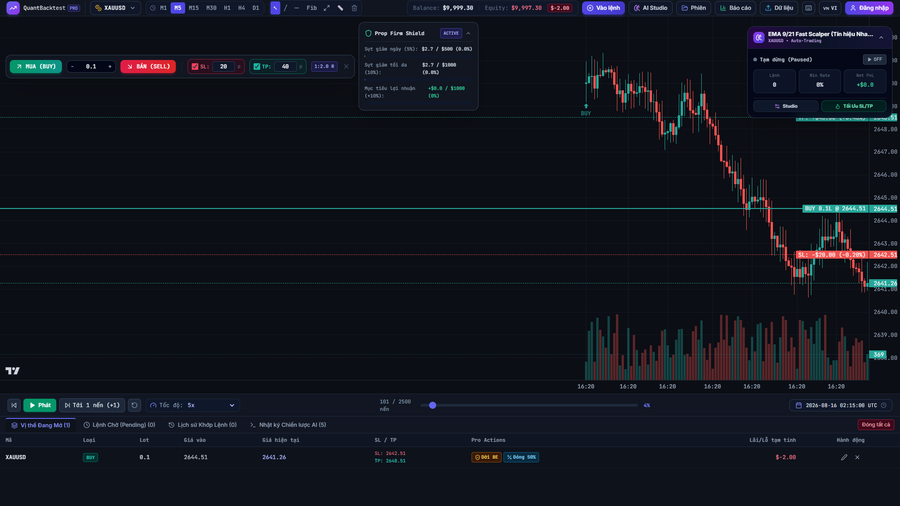
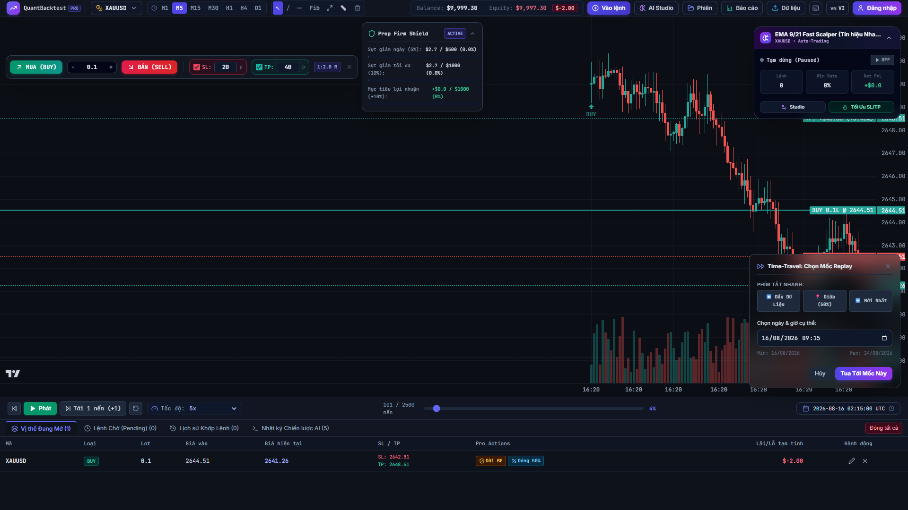
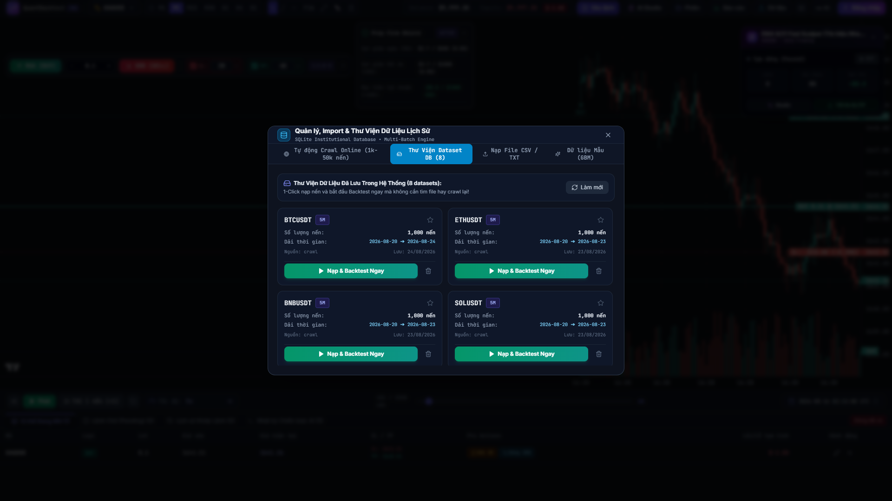
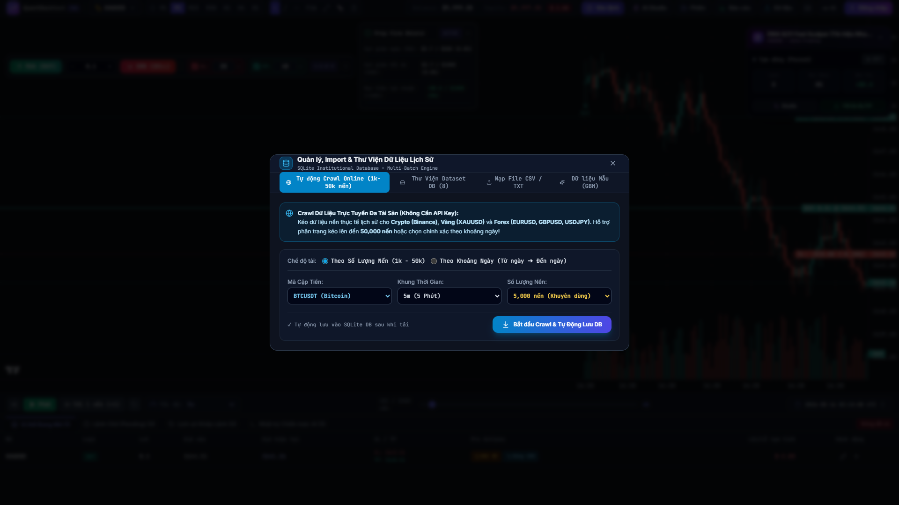
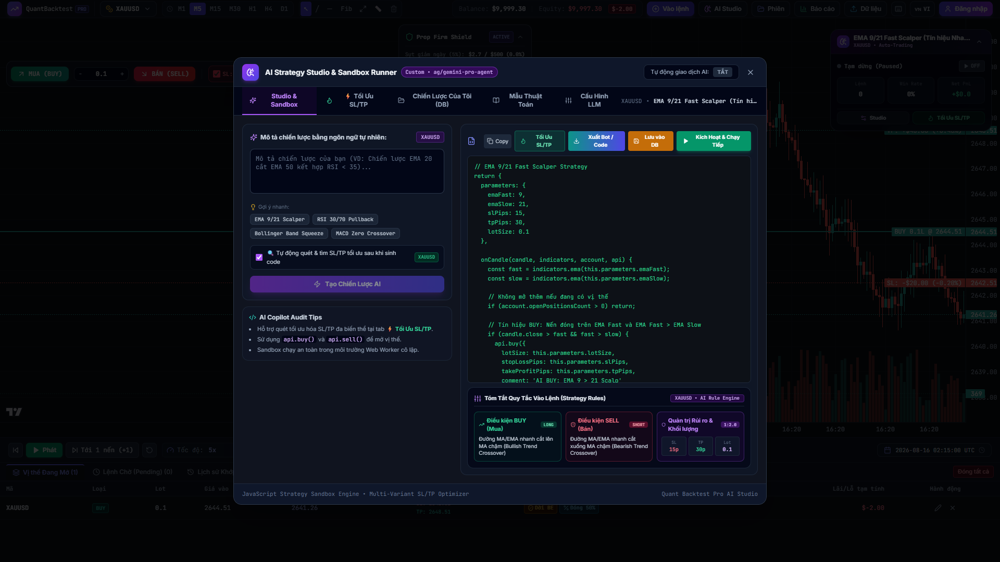
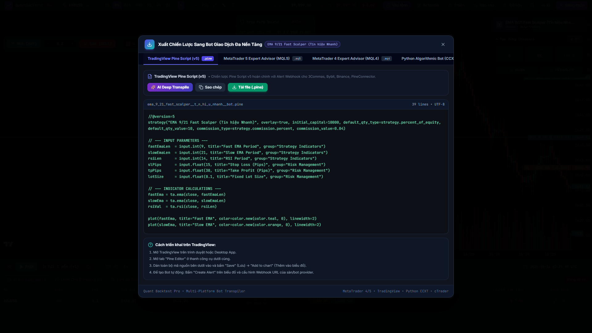
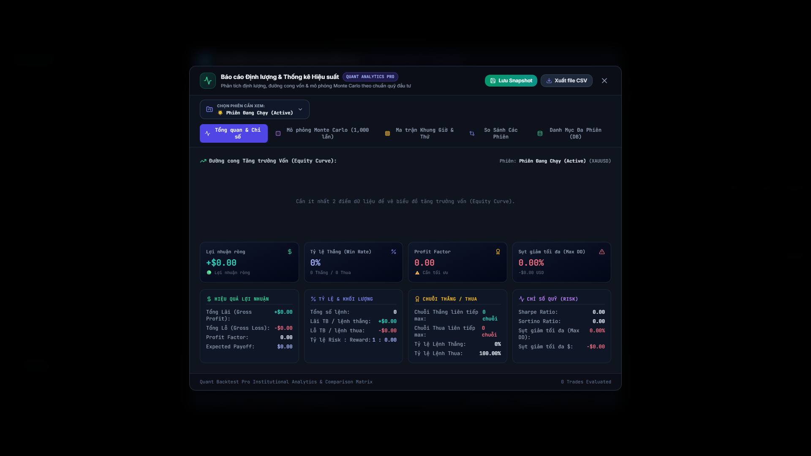

# Quant Backtest Pro 🚀

<div align="center">

> **Nền tảng Replay Đa Tài Sản, Khởi Tạo Thuật Toán AI & Xuất Bot Giao Dịch Đạt Chuẩn Tổ Chức Tài Chính (Institutional-Grade)**

[](https://github.com/thieucong98/quant-backtest-pro/releases/tag/v1.3.0)
[](#)
[](README.md)
[](LICENSE)
[](#)
[](Dockerfile)
[](https://www.typescriptlang.org/)
[](https://react.dev/)
[](https://tailwindcss.com/)
[](https://www.sqlite.org/)

<br />

<!-- Hero Showcase Image -->


</div>

---

## 🌐 Language Navigation / Chuyển đổi ngôn ngữ
* 🇻🇳 **[Tiếng Việt (Hiện tại)](README.vi.md)**
* 🇺🇸 **[English](README.md)**

---

## 📖 Giới Thiệu Tổng Quan

**Quant Backtest Pro** là nền tảng mô phỏng, kiểm thử định lượng và tự động hóa giao dịch mã nguồn mở hiện đại hàng đầu dành cho các Trader Price Action, Nhà phân tích định lượng (Quants) và Lập trình viên thuật toán.

Hệ thống kết hợp giữa **công nghệ Replay nến 60 FPS siêu mượt (chạy trơn tru kể cả với hơn 200,000 nến)**, bộ máy khớp lệnh thực tế (OMS), **AI Strategy Studio sinh code từ ngôn ngữ tự nhiên**, **Bộ tối ưu tham số SL/TP (Grid Search Optimizer)**, **AI Bot Live Floating HUD**, **Quản lý & Thư viện Dữ liệu Dataset 2.0 (tích hợp SQLite và Crawler đa tài sản)**, và **Trung tâm xuất Bot giao dịch đa nền tảng chỉ với 1 click**.

---

## 📸 Bộ Ảnh Trực Quan & Tính Năng Nổi Bật

### 1. ⚡ Động Cơ Replay Nến 60 FPS & Tính Năng Tua Nến Time-Travel
Tua nến lịch sử với độ trễ cực thấp (< 0.05ms). Nhảy tới bất kỳ ngày giờ nào trong quá khứ hoặc chuyển nhanh giữa các mốc (*Đầu dữ liệu / Giữa 50% / Mới nhất*) với thuật toán Binary Search tối ưu.

<div align="center">
  
</div>

- **Cơ chế $O(1)$ Incremental Series Update**: Cập nhật từng nến chỉ mất `0.05ms` trên TradingView Lightweight Charts, loại bỏ hoàn toàn việc vẽ lại Canvas và nghẽn rác bộ nhớ (GC thrashing) ở tốc độ tua cao (`10x` đến `100x`).
- **Bộ Chọn Ngày Giờ Time-Travel**: Chọn trực tiếp thời điểm các sự kiện kinh tế lớn (FOMC, CPI, Non-Farm) để kiểm thử phản ứng giá.
- **Tự động tổng hợp Đa Khung Thời Gian (Resampling)**: Chuyển đổi linh hoạt từ dữ liệu gốc M1 sang M5, M15, M30, H1, H4, D1, W1, MN.
- **Tính toán chỉ báo Zero-Allocation**: SMA, EMA, RSI, ATR, Bollinger Bands, MACD tính toán trực tiếp mà không nhân bản mảng gây tốn RAM.

---

### 2. 📥 Quản Lý Dữ Liệu 2.0 & Thư Viện Dataset SQLite
Không bao giờ phải mất công tìm kiếm file hay nạp lại dữ liệu mỗi khi mở ứng dụng. Mọi file CSV nạp vào hoặc dữ liệu crawl online đều được lưu tự động vào cơ sở dữ liệu SQLite cục bộ.

<div align="center">
  
  
</div>

- **Nạp 1-Click từ Thư Viện Dataset**: Bấm 1 nút trên thẻ Card Grid để nạp ngay nến lên biểu đồ kèm thông tin cặp tiền, khung thời gian, số nến và dải ngày tháng.
- **Crawler Trực Tuyến Phân Trang (Lên đến 50,000 nến)**: Tự động kéo dữ liệu lịch sử nến cho Crypto (Binance REST API), Vàng Giao Ngay (XAUUSD) và Ngoại hối (EURUSD, GBPUSD, USDJPY).
- **Chế độ Crawl theo Khoảng Ngày**: Chọn chính xác `Từ ngày ➔ Đến ngày` kèm thanh tiến trình phần trăm thực tế.
- **Bộ Phân Tích CSV Siêu Tốc**: Phân tích **1.44 triệu nến (74.4 MB) trong < 3.8 giây** với khả năng tự động nhận diện dấu ngăn (`;`, `,`, `\t`).

---

### 3. 🧠 AI Strategy Studio & Thẻ Tóm Tắt Quy Tắc (Rule Breakdown)
Chuyển đổi ý tưởng giao dịch diễn đạt bằng tiếng Việt hoặc tiếng Anh thông thường thành mã nguồn thuật toán TypeScript có thể backtest và chạy tự động ngay lập tức.

<div align="center">
  
</div>

- **Ngôn ngữ tự nhiên sang Code**: Nhập *"EMA 9 cắt lên EMA 21, RSI < 70, SL 15 pips, TP 30 pips"* để nhận logic kiểm thử hoàn chỉnh.
- **Thẻ Tóm Tắt Quy Tắc (Rule Breakdown)**: Tự động phân tích code thành các thẻ trực quan: **Điều kiện MUA**, **Điều kiện BÁN**, và **Thông số Quản lý Rủi ro**.
- **Hỗ trợ Đa Nền Tảng LLM**: Kết nối OpenAI (GPT-4o), Google Gemini, Anthropic Claude, DeepSeek, Local Ollama và Reverse Proxy tùy chỉnh.

---

### 4. 🔥 Tối Ưu Hóa Tham Số SL/TP Đa Biến & Ma Trận Nhiệt 2D
Tránh bẫy Overfitting (khớp quá mức dữ liệu quá khứ) và tìm ra dải tham số bền vững (*Sweet Spots*) với công nghệ quét lưới hàng loạt.

<div align="center">
  
</div>

- **Ma Trận Nhiệt Lợi Nhuận 2D (Profit Heatmap)**: Nhận diện trực quan các vùng tham số xanh ổn định nhất theo các cặp Stop Loss và Take Profit.
- **Biểu Đồ Mini Sparkline SVG**: Hiển thị quỹ đạo tăng trưởng vốn của từng cấu hình ngay trong từng dòng của bảng xếp hạng.
- **Bộ Lọc Thống Kê**: Lọc nhanh cấu hình `Số lệnh >= 5` và `Lợi nhuận ròng > 0`.
- **1-Click Bơm Tham Số Tối Ưu**: Bơm ngược giá trị SL/TP tối ưu nhất vào chiến lược AI live đang chạy trên biểu đồ.

---

### 5. 🤖 Trung Tâm Xuất Bot Giao Dịch Đa Nền Tảng
Triển khai chiến lược đã kiểm thử thành công lên các nền tảng giao dịch thực tế chỉ trong vài giây.

<div align="center">
  
</div>

- **TradingView (Pine Script v5)**: Chỉ báo đầy đủ kèm cấu trúc Webhook Alert JSON cho 3Commas, Bybit, Binance và PineConnector.
- **MetaTrader 5 (MQL5 EA)**: Expert Advisor `.mq5` chuẩn thư viện `CTrade` và quản lý rủi ro theo pips, sẵn sàng biên dịch trong MetaEditor (F7).
- **MetaTrader 4 (MQL4 EA)**: Expert Advisor `.mq4` cổ điển với hàm `OrderSend()` và quản lý Magic Number.
- **Bot Python Thuật Toán (CCXT + Pandas-TA)**: Script Python 3 độc lập chạy 24/7 trên Binance, Bybit và OKX.
- **cTrader (C# cBot)**: Robot `.cs` hiệu năng cao cho cTrader Automate.

---

### 6. 🛡️ Prop Firm Challenge Shield & Báo Cáo Phân Tích Định Lượng
Kiểm soát vi phạm quy tắc thi tuyển Quỹ (FTMO, FundedNext, MFF) theo thời gian thực và đánh giá độ bền chiến lược với mô phỏng Monte Carlo.

<div align="center">
  
</div>

- **Lá Chắn Quỹ (Prop Firm Shield)**: Đặt giới hạn Sụt giảm ngày (5%) và Sụt giảm tối đa (10%) kèm âm thanh cảnh báo và ngắt giao dịch tức thì.
- **Mô Phỏng Căng Thẳng Monte Carlo**: Chạy 500+ kịch bản ngẫu nhiên để tính toán xác suất Cháy tài khoản (Risk of Ruin) và khoảng tin cậy.
- **Lịch Lãi Lỗ (PnL Calendar & Heatmap)**: Bảng phân tích chi tiết hiệu suất theo phiên giao dịch, ngày trong tuần và tháng.
- **Ma Trận So Sánh Các Phiên**: Đối chiếu trực tiếp nhiều phiên backtest khác nhau (Sharpe Ratio, Profit Factor, Expectancy, Winrate).

---

## 🚀 Hướng Dẫn Cài Đặt & Khởi Chạy Ứng Dụng

Bạn có thể khởi chạy Quant Backtest Pro bằng **Docker (Khuyến nghị để chạy nhanh 1-Click không cần cấu hình)** hoặc chạy thủ công bằng **Node.js**.

---

### Cách 1: 🐳 Khởi Chạy 1-Click Với Docker Compose (Khuyến nghị)

#### Yêu cầu hệ thống
- [Docker Desktop](https://www.docker.com/products/docker-desktop/) hoặc Docker Engine + Docker Compose

```bash
# 1. Clone mã nguồn từ GitHub
git clone https://github.com/thieucong98/quant-backtest-pro.git
cd quant-backtest-pro

# 2. Xây dựng và khởi chạy ứng dụng ngầm
docker compose up -d

# 3. Theo dõi log ứng dụng thời gian thực
docker compose logs -f

# 4. Dừng container khi không sử dụng
docker compose down
```

Truy cập ứng dụng trên trình duyệt:
- **Giao diện Web & API**: `http://localhost:3001`
- **Kiểm tra API Server**: `http://localhost:3001/api/health`

> [!TIP]
> **Lưu trữ dữ liệu vĩnh viễn**: Mọi phiên giao dịch, lịch sử nến và tập dữ liệu tùy chỉnh sẽ được lưu tự động trong Docker volume `sqlite_data` (`/app/server/prisma`).

---

### Cách 2: 🐳 Khởi Chạy Bằng Docker CLI

```bash
# Xây dựng Docker image bản production
docker build -t quant-backtest-pro .

# Khởi chạy container với volume lưu trữ SQLite
docker run -d -p 3001:3001 --name quant-backtest-pro -v quant_sqlite:/app/server/prisma quant-backtest-pro
```

---

### Cách 3: 💻 Chạy Trực Tiếp Bằng Node.js

#### Yêu cầu hệ thống
- [Node.js](https://nodejs.org/) (phiên bản 18.0.0 trở lên)
- [npm](https://www.npmjs.com/) (hoặc `pnpm` / `yarn`)

```bash
# 1. Clone mã nguồn & cài đặt thư viện
git clone https://github.com/thieucong98/quant-backtest-pro.git
cd quant-backtest-pro
npm install

# 2. Khởi chạy toàn bộ môi trường (Frontend + Backend API)
# Cách A: 1 Lệnh duy nhất (Chạy đồng thời với hiển thị log hợp nhất)
npm run dev:all

# Cách B: Dùng script khởi chạy tự động đa nền tảng
# Trên Windows:
.\start_all.bat

# Trên Linux / macOS / WSL:
chmod +x start_all.sh && ./start_all.sh

# Hoặc khởi chạy thủ công trên 2 cửa sổ riêng:
# Cửa sổ 1: npm run dev
# Cửa sổ 2: npm run server:start
```

Mở trình duyệt tại địa chỉ:
- **Giao diện Web**: `http://localhost:5173/`
- **Kiểm tra API Backend**: `http://localhost:3001/api/health`

---

### 🔑 Tài Khoản Trader Mặc Định
- **Email**: `admin@quantbacktest.pro`
- **Mật khẩu**: `QuantPro@2026`
- **Hạng mức (Tier)**: `INSTITUTIONAL` (Mở khóa toàn bộ tính năng và không giới hạn số lượng lệnh)

---

## 🏗️ Kiến Trúc & Công Nghệ Sử Dụng

| Tầng hệ thống | Công nghệ | Mô tả chức năng |
| :--- | :--- | :--- |
| **Giao diện (Frontend)** | React 19, TypeScript 5.8 | Giao diện component định kiểu nghiêm ngặt, hiệu năng cao |
| **Giao diện & Biểu tượng**| Tailwind CSS 3.4, Lucide Icons | Thiết kế Dark Theme hiện đại theo phong cách Glassmorphism |
| **Đồ thị (Charting)** | Lightweight Charts v4 | Động cơ Canvas tốc độ cao của TradingView ($O(1)$ series update) |
| **Quản lý Trạng thái** | Zustand 5 | Quản lý state phản ứng nhanh với cơ chế lưu trữ throttled |
| **Backend & Lưu trữ** | Node.js Express + Prisma + SQLite | Cơ sở dữ liệu cục bộ cho phiên, lệnh, chiến lược và dataset |
| **Bộ máy Định lượng** | Custom TypeScript Quant Engines | Khớp lệnh OMS, tổng hợp khung thời gian, chỉ báo kỹ thuật, Monte Carlo |
| **Xử lý Dữ liệu** | Fast Integer CSV Parser | Đọc 1.44M nến dưới 3.8s với khả năng tự nhận diện định dạng file |
| **Tích hợp Trí tuệ Nhân tạo**| Fetch API + Chuẩn OpenAI | Khởi tạo chiến lược AI, tối ưu hóa SL/TP và xuất mã nguồn Bot |

---

## 📚 Danh Mục Tài Liệu Chi Tiết

| Tiếng Việt (Vietnamese) | Tiếng Anh (English Documentation) |
| :--- | :--- |
| 📘 [Hướng dẫn sử dụng](docs/vi/USER_GUIDE.md) | 📘 [User Guide](docs/USER_GUIDE.md) |
| 📋 [Danh mục tính năng & QA Checklist](docs/vi/FEATURE_CATALOG_CHECKLIST.md) | 📋 [Feature Catalog & QA Checklist](docs/FEATURE_CATALOG_CHECKLIST.md) |
| 🛠️ [Tài liệu lập trình viên](docs/vi/DEVELOPER_GUIDE.md) | 🛠️ [Developer Guide](docs/DEVELOPER_GUIDE.md) |
| 🏛️ [Kiến trúc hệ thống](docs/vi/ARCHITECTURE.md) | 🏛️ [System Architecture](docs/ARCHITECTURE.md) |
| 🤖 [Hướng dẫn xuất Bot giao dịch](docs/vi/STRATEGY_BOT_EXPORTER.md) | 🤖 [Strategy Bot Exporter Guide](docs/STRATEGY_BOT_EXPORTER.md) |
| 🔌 [Tài liệu API RESTful](docs/vi/API_REFERENCE.md) | 🔌 [API Reference](docs/API_REFERENCE.md) |

---

## 📄 Bản Quyền (License)

Phát hành dưới giấy phép **MIT License**. Xem thông tin chi tiết tại [LICENSE](LICENSE).
