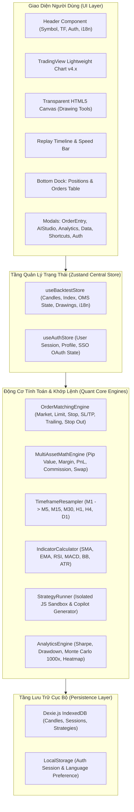
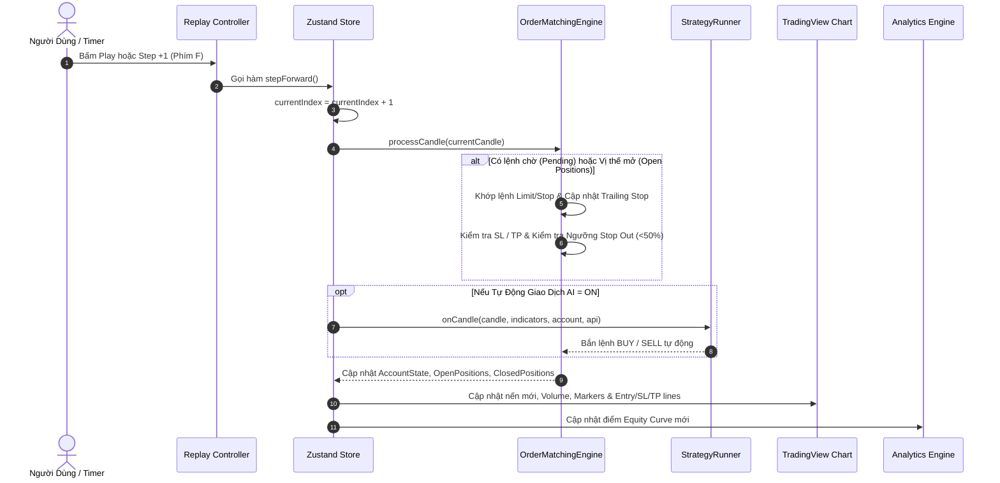
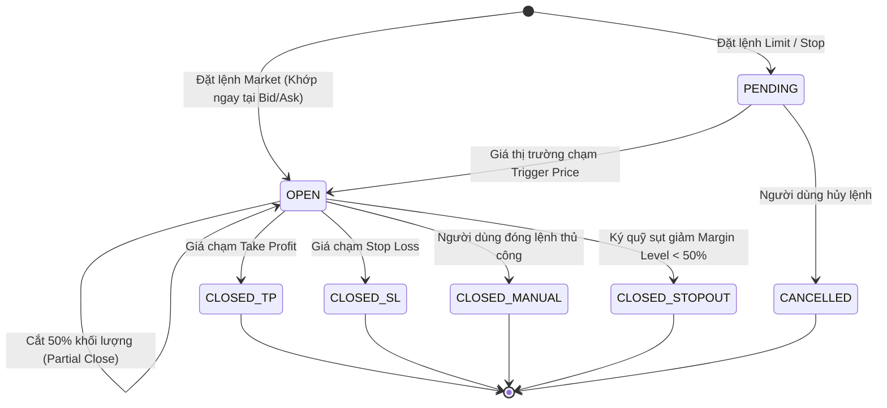

# TÀI LIỆU THIẾT KẾ KIẾN TRÚC HỆ THỐNG (SYSTEM ARCHITECTURE SPECIFICATION)
## NỀN TẢNG QUANT BACKTEST PRO

Tài liệu này mô tả sơ đồ kiến trúc tổng thể, luồng dữ liệu thời gian thực (Data Flow) và máy trạng thái (State Machine) của hệ thống **Quant Backtest Pro**.

---

## 1. SƠ ĐỒ KIẾN TRÚC TỔNG THỂ (HIGH-LEVEL ARCHITECTURE)

---

## 2. LUỒNG DỮ LIỆU VÒNG LẶP REPLAY (REPLAY DATA FLOW)

---

## 3. MÁY TRẠNG THÁI KHỚP LỆNH (ORDER LIFECYCLE STATE MACHINE)

---

## 4. TỐI ƯU HÓA HIỆU NĂNG RENDER (RENDER PERFORMANCE)

Để duy trì tốc độ **60 FPS** khi tua nến ở tốc độ tối đa **100x (100 nến/giây)**:
1. **Decoupled Canvas Rendering**: Lớp vẽ kỹ thuật (DrawingCanvas) lắng nghe sự kiện tọa độ của Lightweight Charts độc lập, không kích hoạt re-render toàn bộ trang React.
2. **Selective State Subscriptions**: Các component chỉ subscribe đúng slice state cần thiết thông qua Zustand selector.
3. **Incremental Memory Management**: Array nến chỉ cắt lát slice theo `currentIndex + 1` để giảm thiểu chi phí bộ nhớ.
