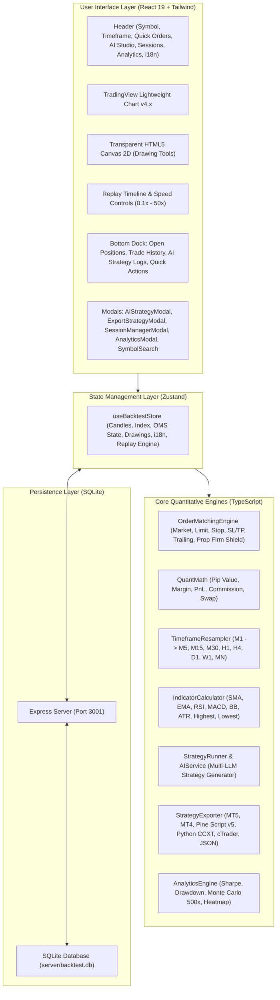

# System Architecture Specification
## Quant Backtest Pro Platform (English)

This document provides a detailed technical specification of the system architecture, simulation engines, local-first storage design, Multi-LLM provider abstraction, and multi-platform trading bot exportation engine for **Quant Backtest Pro**.

---

## 1. Technology Stack

| Layer | Technology | Purpose & Responsibility |
| :--- | :--- | :--- |
| **Core Framework** | React 19, TypeScript 5.8 Strict Mode | Financial calculations type safety and reactive UI state |
| **Bundler & Tooling** | Vite 6.x | Ultra-fast HMR and optimized production bundle |
| **Styling & Design** | Tailwind CSS 3.4, PostCSS | Modern glassmorphic dark theme tailored for market analysis |
| **State Management** | Zustand 5 | Low-overhead central store with zero unnecessary re-renders during high-speed replay |
| **Charting Engine** | TradingView Lightweight Charts v4.x | High-performance HTML5 Canvas chart renderer at 60 FPS |
| **Drawing Overlay** | Custom HTML5 Canvas 2D Engine | Trendlines, Fibonacci Retracements, Boxes, and Measure tools synchronized with chart coordinates |
| **Persistent Storage** | Express REST API + SQLite (`better-sqlite3`) | Persistent storage for backtest sessions, equity points, and custom strategies |
| **Matching Engine** | Custom OrderMatchingEngine | High-fidelity execution of Market/Pending orders, Spreads, Commissions, Slippage, and Prop Shield |
| **Quant Analytics** | TypeScript Quant Math Engine | Sharpe Ratio, Max Drawdown, Profit Factor, Monte Carlo 500-run simulation, PnL Heatmap |
| **Bot Transpilers** | StrategyExporter Engine | Code transpilation to MQL5, MQL4, Pine Script v5, Python CCXT, cTrader C#, and JSON Packages |
| **AI Strategy Engine** | Function Sandbox & Multi-LLM API | Integration with OpenAI, Gemini, Claude, DeepSeek, Ollama, and Custom Reverse Proxy Tunnels |

---

## 2. High-Level Architecture Diagram

---

## 3. Core Engine Subsystems

### 3.1. Order Matching Engine (`orderMatchingEngine.ts`)
The matching engine simulates a real broker electronic communication network (ECN) account:
1. **Account State**: Real-time maintenance of `balance`, `equity`, `margin`, `freeMargin`, and `marginLevel`.
2. **Execution Simulation**: Instant execution of Market orders with configurable spread and slippage.
3. **Pending Orders**: Monitoring and triggering of `BUY_LIMIT`, `SELL_LIMIT`, `BUY_STOP`, `SELL_STOP` orders as historical prices tick.
4. **SL / TP & Trailing Stop**: Automatic execution on high/low candle breaches.
5. **Prop Firm Shield**: Real-time monitoring of Daily Loss and Maximum Overall Drawdown, triggering circuit breakers when thresholds are exceeded.

### 3.2. Timeframe Resampler Engine (`resampler.ts`)
- Consumes raw 1-minute (M1) historical candles.
- Dynamically resamples bars into higher timeframe intervals (M5, M15, M30, H1, H4, D1, W1, MN) using UTC timestamps.

### 3.3. Multi-LLM Strategy Engine (`aiService.ts` & `strategySandbox.ts`)
- Connects to any standard OpenAI-compatible API or reverse proxy gateway.
- Executes JavaScript strategy functions inside an isolated execution sandbox on each candle step.
- Injects standard indicator math: `indicators.sma()`, `indicators.ema()`, `indicators.rsi()`, `indicators.macd()`, `indicators.bollingerBands()`, `indicators.atr()`.
- Exposes order execution APIs: `api.buy()`, `api.sell()`, `api.closePosition()`, `api.modifySLTP()`, `api.log()`.

### 3.4. Strategy Bot Exporter & Transpiler (`strategyExporter.ts`)
- Deterministically translates JavaScript strategy parameters and entry/exit logic into:
  - **TradingView Pine Script (v5)**
  - **MetaTrader 5 (MQL5 EA)**
  - **MetaTrader 4 (MQL4 EA)**
  - **Python (CCXT + Pandas-TA)**
  - **cTrader (C# cBot)**
  - **Universal JSON Strategy Package**

---

## 4. Local-First Storage & Security Architecture

1. **Local SQLite File**: All user sessions, trades, and strategy definitions are stored locally in `server/backtest.db`.
2. **Client-Side Privacy**: All AI API keys and custom endpoint URLs are stored strictly in the user's browser `localStorage` and are never shared with third-party tracking services.
