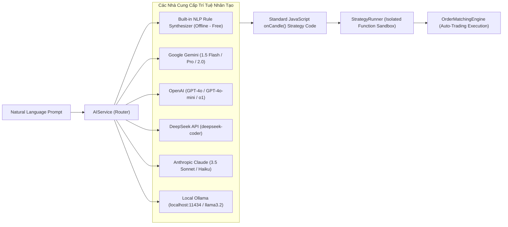
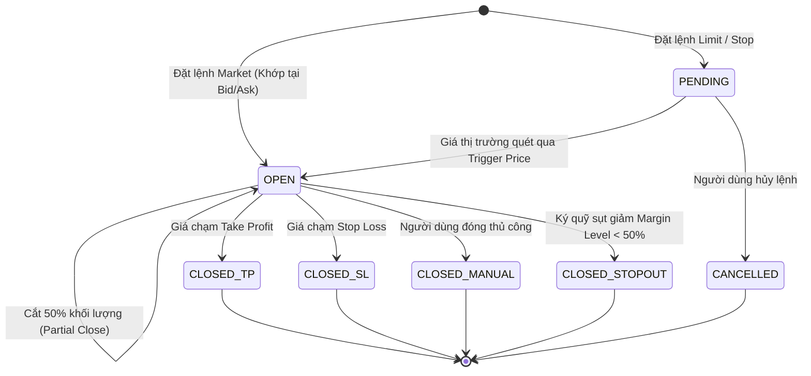

# TÀI LIỆU THIẾT KẾ KIẾN TRÚC HỆ THỐNG (SYSTEM ARCHITECTURE SPECIFICATION)
## NỀN TẢNG QUANT BACKTEST PRO

Tài liệu này mô tả chi tiết kiến trúc công nghệ, cơ chế lưu trữ dữ liệu cục bộ (Local-First), các luồng nạp dữ liệu (Data Ingestion), động cơ tự động thu thập / crawl dữ liệu trực tuyến, và kiến trúc hỗ trợ Multi-LLM Providers của hệ thống **Quant Backtest Pro**.

---

## 1. TỔNG QUAN CÔNG NGHỆ (TECHNOLOGY STACK)

| Tầng Hệ Thống | Công Nghệ Sử Dụng | Lý Do Chọn & Trách Nhiệm Kỹ Thuật |
| :--- | :--- | :--- |
| **Core Framework** | React 18, TypeScript Strict Mode | Đảm bảo tính an toàn kiểu dữ liệu (Type Safety) cho các phép tính toán tài chính phức tạp |
| **Build Tool & Bundler** | Vite 6.x | Tốc độ Hot Module Replacement (HMR) cực nhanh và bundle JS tối ưu |
| **Styling & Theme** | Tailwind CSS, PostCSS | Thiết kế Glassmorphism chuyên nghiệp, bảng màu HSL tối ưu cho trading đêm |
| **State Management** | Zustand | Hiệu năng cao, zero-boilerplate, không gây re-render thừa khi tua nến tốc độ 100x |
| **Charting Engine** | TradingView Lightweight Charts v4.x | Render biểu đồ nến và Volume trên nền HTML5 Canvas 60 FPS |
| **Drawing Overlay** | Custom HTML5 Canvas 2D Engine | Tự vẽ Trendline, Fibonacci, Box, Measure đồng bộ tọa độ 2 chiều với chart |
| **Data Storage (DB)** | Dexie.js (IndexedDB Wrapper) | Lưu trữ hàng triệu nến M1 và phiên làm việc cục bộ ngay trên trình duyệt |
| **Data Parsing** | PapaParse | Đọc và phân tích file CSV từ các sàn MT4/MT5/TV với tốc độ hàng chục ngàn dòng/giây |
| **Online Crawling** | Fetch REST API Streams | Tự động kéo nến trực tiếp từ Binance Public REST API |
| **AI Strategy Engine** | Function Sandbox & Multi-LLM API | Tích hợp Google Gemini, OpenAI, Claude, DeepSeek, Local Ollama và Offline Rule Engine |

---

## 2. SƠ ĐỒ KIẾN TRÚC TỔNG THỂ (HIGH-LEVEL ARCHITECTURE)

```mermaid
graph TB
    subgraph UI_LAYER["Giao Diện Người Dùng (UI Layer)"]
        Header["Header (Symbol, Timeframe, Auth, i18n VI/EN/JA/ZH)"]
        Chart["TradingView Lightweight Chart v4.x"]
        CanvasOverlay["Transparent HTML5 Canvas 2D (Drawing Tools)"]
        ReplayBar["Replay Timeline & Speed Bar (1x - 100x)"]
        PositionsTable["Bottom Dock: Open Positions, History, Pro Actions (BE, Close 50%)"]
        Modals["Modals: OrderEntry, AIStudio, Analytics, Data Manager, Shortcuts, Auth"]
    end

    subgraph STATE_LAYER["Tầng Quản Lý Trạng Thái (Zustand Central Store)"]
        BacktestStore["useBacktestStore (Candles, Index, OMS State, Drawings, i18n)"]
        AuthStore["useAuthStore (User Session, Profile, SSO OAuth State)"]
    end

    subgraph ENGINE_LAYER["Động Cơ Tính Toán & Khớp Lệnh (Quant Core Engines)"]
        MatchingEngine["OrderMatchingEngine (Market, Limit, Stop, SL/TP, Trailing, Stop Out)"]
        QuantMath["MultiAssetMathEngine (Pip Value, Margin, PnL, Commission, Swap)"]
        Resampler["TimeframeResampler (M1 -> M5, M15, M30, H1, H4, D1)"]
        IndicatorEngine["IndicatorCalculator (SMA, EMA, RSI, MACD, BB, ATR, High, Low)"]
        AISandbox["StrategyRunner & AIService (Multi-LLM Providers Sandbox)"]
        AnalyticsEngine["AnalyticsEngine (Sharpe, Drawdown, Monte Carlo 1000x, Heatmap)"]
        CrawlerEngine["DataCrawler (Binance REST API Historical Fetcher)"]
    end

    subgraph PERSISTENCE_LAYER["Tầng Lưu Trữ Cục Bộ (Local-First Persistence)"]
        DexieDB["Dexie.js IndexedDB (Datasets, Sessions, Strategies)"]
        LocalStorage["LocalStorage (Auth Profile, LLM API Keys, Language)"]
    end

    UI_LAYER --> STATE_LAYER
    STATE_LAYER --> ENGINE_LAYER
    ENGINE_LAYER --> PERSISTENCE_LAYER
```



---

## 3. CƠ CHẾ LƯU TRỮ DỮ LIỆU CỤC BỘ (LOCAL-FIRST DATA ARCHITECTURE)

Hệ thống tuân thủ triết lý **Local-First Software**: dữ liệu của người dùng được lưu trữ an toàn ngay trên thiết bị cá nhân (trình duyệt), không phụ thuộc vào máy chủ trung gian, đảm bảo tính bảo mật và tốc độ truy xuất tức thì:

```
┌────────────────────────────────────────────────────────────────────────────────────────┐
│                                 LOCAL-FIRST STORAGE MATRIX                             │
├─────────────────────────┬──────────────────────────────┬───────────────────────────────┤
│ Hạng mục                │ Nơi Lưu Trữ                  │ Cấu Trúc / Schema              │
├─────────────────────────┼──────────────────────────────┼───────────────────────────────┤
│ Dữ liệu Nến (OHLCV)     │ IndexedDB (Dexie.js)         │ Table: `datasets`             │
│                         │                              │ Index: `[id+symbol+timeframe]`│
│                         │                              │ Payload: Array of Candlesticks│
├─────────────────────────┼──────────────────────────────┼───────────────────────────────┤
│ Phiên Backtest & Lệnh   │ IndexedDB (Dexie.js)         │ Table: `sessions`             │
│                         │                              │ Balance, Trades, Drawings     │
├─────────────────────────┼──────────────────────────────┼───────────────────────────────┤
│ Chiến lược AI tự tạo    │ IndexedDB & State            │ Table: `strategies`           │
│                         │                              │ Code, Parameters, Name, Desc  │
├─────────────────────────┼──────────────────────────────┼───────────────────────────────┤
│ Cấu hình API LLM & Key  │ LocalStorage (AES Encrypted) │ `quant_llm_config`            │
│                         │                              │ Provider, Key, Model, BaseUrl │
├─────────────────────────┼──────────────────────────────┼───────────────────────────────┤
│ Phiên Đăng nhập & Ngôn ngữ│ LocalStorage                │ `quant_backtest_auth_user`    │
│                         │                              │ `quant_lang` (vi, en, ja, zh) │
└─────────────────────────┴──────────────────────────────┴───────────────────────────────┘
```

---

## 4. CÁC KÊNH NẠP DỮ LIỆU (DATA INGESTION CHANNELS)

Người dùng có thể nạp dữ liệu vào nền tảng bằng **3 phương thức linh hoạt**:

```
[1. File CSV / TXT Upload]      [2. Online Data Crawler]        [3. Realistic GBM Generator]
        │                                   │                                  │
        ▼                                   ▼                                  ▼
[PapaParse Auto-Detector]       [Binance Public REST API]       [Geometric Brownian Motion]
(MT4, MT5, TV, Dukascopy)       (BTCUSDT, ETH, SOL, XRP)        (Trend + Volatility GARCH)
        │                                   │                                  │
        └───────────────────────────────────┼──────────────────────────────────┘
                                            │
                                            ▼
                           [IndexedDB Storage & Resampler Engine]
                                            │
                                            ▼
                        [Lightweight Charts Replay Canvas (60 FPS)]
```

### 1. Nạp File CSV / TXT từ Broker
- Tự động phát hiện và chuẩn hóa thứ tự cột (`Date, Time, Open, High, Low, Close, Volume`).
- Tương thích với các định dạng: MetaTrader 4 History Center, MetaTrader 5 Bar Export, TradingView CSV, Dukascopy Tick/Bar CSV, Binance CSV.

### 2. Tự động Crawl Dữ liệu Trực tuyến (Online REST Data Crawler)
- Tích hợp trực tiếp với **Binance Public Market REST API**:
  `GET https://api.binance.com/api/v3/klines?symbol={SYMBOL}&interval={INTERVAL}&limit={LIMIT}`
- Kéo nến lịch sử thực tế của `BTCUSDT`, `ETHUSDT`, `SOLUSDT`, `BNBUSDT`, `XRPUSDT`, `DOGEUSDT` từ khung M1 đến D1 mà **không yêu cầu bất kỳ API key nào**.

### 3. Trình sinh Dữ liệu Mẫu chân thực (Sample GBM Generator)
- Sử dụng mô hình toán học **Geometric Brownian Motion (GBM)** kết hợp mô hình biến động phân cụm (Volatility Clustering) để tạo ra các tập dữ liệu mẫu chân thực cho `XAUUSD`, `BTCUSD`, `EURUSD`, `DXY` phục vụ luyện tập tức thì.

---

## 5. KIẾN TRÚC MULTI-LLM PROVIDERS & AI SANDBOX



---

## 6. MÁY TRẠNG THÁI VÒNG ĐỜI LỆNH (OMS STATE MACHINE)


