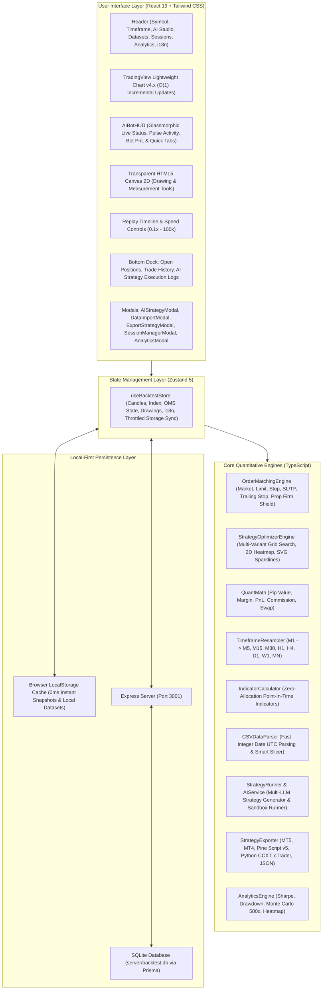

# System Architecture Specification
## Quant Backtest Pro Platform (English)

This document provides a detailed technical specification of the system architecture, 60 FPS replay engine, zero-allocation indicator pipeline, SL/TP Multi-Variant Optimizer, local-first storage design, Multi-LLM provider abstraction, and multi-platform trading bot exportation engine for **Quant Backtest Pro**.

---

## 1. Technology Stack

| Layer | Technology | Purpose & Responsibility |
| :--- | :--- | :--- |
| **Core Framework** | React 19, TypeScript 5.8 Strict Mode | Financial calculations type safety and reactive UI state |
| **Bundler & Tooling** | Vite 6.x | Ultra-fast HMR and optimized production bundle |
| **Styling & Design** | Tailwind CSS 3.4, PostCSS | Modern glassmorphic dark theme tailored for high-density market analysis |
| **State Management** | Zustand 5 | Low-overhead central store with throttled persistence and zero unnecessary re-renders |
| **Charting Engine** | TradingView Lightweight Charts v4.x | $O(1)$ incremental canvas series updates supporting 200,000+ candles at 60 FPS |
| **Drawing Overlay** | Custom HTML5 Canvas 2D Engine | Trendlines, Fibonacci Retracements, Boxes, and Measure tools synchronized with chart coordinates |
| **Persistent Storage** | Express REST API + Prisma + SQLite (`better-sqlite3`) | Local database persistence for sessions, trades, strategies, and datasets |
| **Matching Engine** | Custom OrderMatchingEngine | High-fidelity execution of Market/Pending orders, Spreads, Commissions, Slippage, and Prop Shield |
| **Quant Analytics** | TypeScript Quant Math Engine | Sharpe Ratio, Max Drawdown, Profit Factor, Monte Carlo 500-run simulation, PnL Heatmap |
| **SL/TP Optimizer** | StrategyOptimizerEngine | Multi-variant parameter grid search, 2D profit heatmap, SVG sparkline equity curves |
| **Bot Transpilers** | StrategyExporter Engine | Code transpilation to MQL5, MQL4, Pine Script v5, Python CCXT, cTrader C#, and JSON Packages |
| **AI Strategy Engine** | Function Sandbox & Multi-LLM API | Integration with OpenAI, Gemini, Claude, DeepSeek, Ollama, and Custom Reverse Proxy Tunnels |
| **Data Engine** | Fast Integer CSV Parser + REST Crawler | Sub-4s parsing for 1.44M OHLCV bars with auto-delimiter detection & Binance live feeds |

---

## 2. High-Level Architecture Diagram

```mermaid
graph TB
    subgraph UI_LAYER["User Interface Layer (React 19 + Tailwind CSS)"]
        Header["Header (Symbol, Timeframe, AI Studio, Datasets, Sessions, Analytics, i18n)"]
        Chart["TradingView Lightweight Chart v4.x (O(1) Incremental Updates)"]
        FloatingHUD["AIBotHUD (Glassmorphic Live Status, Pulse Activity, Bot PnL & Quick Tabs)"]
        CanvasOverlay["Transparent HTML5 Canvas 2D (Drawing & Measurement Tools)"]
        ReplayBar["Replay Timeline & Speed Controls (0.1x - 100x)"]
        PositionsTable["Bottom Dock: Open Positions, Trade History, AI Strategy Execution Logs"]
        Modals["Modals: AIStrategyModal, DataImportModal, ExportStrategyModal, SessionManagerModal, AnalyticsModal"]
    end

    subgraph STATE_LAYER["State Management Layer (Zustand 5)"]
        BacktestStore["useBacktestStore (Candles, Index, OMS State, Drawings, i18n, Throttled Storage Sync)"]
    end

    subgraph ENGINE_LAYER["Core Quantitative Engines (TypeScript)"]
        MatchingEngine["OrderMatchingEngine (Market, Limit, Stop, SL/TP, Trailing Stop, Prop Firm Shield)"]
        OptimizerEngine["StrategyOptimizerEngine (Multi-Variant Grid Search, 2D Heatmap, SVG Sparklines)"]
        QuantMath["QuantMath (Pip Value, Margin, PnL, Commission, Swap)"]
        Resampler["TimeframeResampler (M1 -> M5, M15, M30, H1, H4, D1, W1, MN)"]
        IndicatorEngine["IndicatorCalculator (Zero-Allocation Point-In-Time Indicators)"]
        CSVParser["CSVDataParser (Fast Integer Date UTC Parsing & Smart Slicer)"]
        AISandbox["StrategyRunner & AIService (Multi-LLM Strategy Generator & Sandbox Runner)"]
        ExporterEngine["StrategyExporter (MT5, MT4, Pine Script v5, Python CCXT, cTrader, JSON)"]
        AnalyticsEngine["AnalyticsEngine (Sharpe, Drawdown, Monte Carlo 500x, Heatmap)"]
    end

    subgraph STORAGE_LAYER["Local-First Persistence Layer"]
        LocalCache["Browser LocalStorage Cache (0ms Instant Snapshots & Local Datasets)"]
        BackendServer["Express Server (Port 3001)"]
        SQLiteDB["SQLite Database (server/backtest.db via Prisma)"]
    end

    UI_LAYER --> STATE_LAYER
    STATE_LAYER --> ENGINE_LAYER
    STATE_LAYER <--> LocalCache
    STATE_LAYER <--> BackendServer
    BackendServer <--> SQLiteDB
```

---

## 3. Core Engine Subsystems

### 3.1. High-Performance $O(1)$ Chart Replay Engine (`TradingViewChart.tsx`)
- **Incremental Fast Path**: On sequential replay step forward (`nextIndex === currentIndex + 1`), calls `candleSeries.update(candle)` and `volumeSeries.update(volume)`. This reduces frame render overhead from `150ms` down to **`0.05ms`**, ensuring **60 FPS** at speeds up to `100x`.
- **Full Refresh Path**: Only executed when switching timeframes, jumping via timeline scrubber, or loading a new dataset.
- **News Event Scaler**: Proportional step distribution to cap news markers at `100-150` items max across large historical datasets.

### 3.2. Zero-Allocation Indicator Point-In-Time Pipeline (`indicators.ts`)
- All indicator calculations (`sma`, `ema`, `rsi`, `atr`, `bollingerBands`, `macd`, `highest`, `lowest`) execute over `this.effectiveLength` pointing into the preloaded dataset array.
- Completely eliminates array slicing (`candles.slice()`) inside high-frequency replay loops.

### 3.3. SL/TP Multi-Variant Grid Search Optimizer (`strategyOptimizer.ts`)
- Simulates combinations of Stop Loss and Take Profit ranges over historical bars.
- Generates a **2D Profit Heatmap** mapping SL vs TP net profitability to locate parameter sweet spots.
- Downsamples equity trajectory into 10–12 points per variant to render responsive **SVG Mini Sparklines**.
- Applies statistical quality filters: `Minimum Trades (>= 5)` and `Profitable Net PnL > 0`.
- Injects optimal SL/TP pips into live strategy code via AST regex replacement.

### 3.4. AI Bot Live Floating HUD (`AIBotHUD.tsx`)
- Glassmorphic overlay displaying real-time bot trade metrics, winrate, realized and floating PnL.
- Smooth collapse to a minimalist pill view.
- Provides direct tab routing to the Studio and Optimizer views.

### 3.5. Data Import Manager 2.0 & Fast Integer Parser (`csvParser.ts`)
- Fast integer date parsing using `Date.UTC(y, m - 1, d, h, min, s) / 1000` avoiding `Date` object allocation.
- Processes **1.44 million candles (74.4 MB) in under 3.8 seconds**.
- Auto-detects delimiters (`;`, `,`, `\t`) and symbol names.
- Smart Range Slicer (`200k`, `100k`, `50k`, `Full`) to manage client memory efficiently.
- Local-First Dataset Library backed by browser storage and SQLite.

### 3.6. Order Matching Engine (`orderMatchingEngine.ts`)
The matching engine simulates a real broker electronic communication network (ECN) account:
1. **Account State**: Real-time maintenance of `balance`, `equity`, `margin`, `freeMargin`, and `marginLevel`.
2. **Execution Simulation**: Instant execution of Market orders with configurable spread and slippage.
3. **Pending Orders**: Monitoring and triggering of `BUY_LIMIT`, `SELL_LIMIT`, `BUY_STOP`, `SELL_STOP` orders as historical prices tick.
4. **SL / TP & Trailing Stop**: Automatic execution on high/low candle breaches.
5. **Prop Firm Shield**: Real-time monitoring of Daily Loss and Maximum Overall Drawdown, triggering circuit breakers when thresholds are exceeded.

---

## 4. Local-First Storage & Security Architecture

1. **Throttled Local Snapshot**: Backtest state is saved to `localStorage` (debounced at 2,000ms) with downsampled equity curves for instant F5 restoration.
2. **SQLite Database**: Full trade logs, strategy code, and datasets persist in `server/backtest.db`.
3. **Client-Side Privacy**: AI API keys and custom endpoint URLs remain strictly inside the user's browser and are never transmitted to external telemetry servers.

---

## 5. v2.0 Multi-Chart Synchronization & Local Execution Bridge Architecture (RFC-002)

> 📄 **Authoritative Technical Specification**: For complete formulas, Web Worker message schemas, and broker driver definitions, refer to [Technical RFC 002: Multi-Chart Web Worker Synchronization & Local Execution Bridge](rfcs/RFC-002-MULTI-CHART-WORKER-SYNC-EXECUTION-BRIDGE.md).

### 5.1. Dedicated Web Worker Architecture (`ReplaySyncWorker`)
- **Off-Thread Playback Loop**: Completely isolates high-frequency replay progression, timeframe resampling, and order matching into a background Web Worker thread, preserving solid **60 FPS** UI frame rates at replay speeds up to 100x.
- **$O(1)$ Direct-Index Buffer Table (`TimestampIndexBuffer`)**: Uses structured typed arrays (`Int32Array`) to resolve timeframe candle alignment in exact $O(1)$ constant time ($<5\mu s$), avoiding binary search ($O(\log N)$) overhead across 1.44M historical candles.
- **Dynamic Developing Candle Synthesizer**: Progressively synthesizes Higher Timeframe (e.g. H1) candles tick-by-tick from Lower Timeframe (e.g. M5) bars with incremental wick/close updates, guaranteeing **Zero Lookahead Bias**.
- **Coalesced Frame Throttling**: Batches replay frame emissions at display refresh cadence (60 Hz / 16.6ms) during high-speed runs to prevent browser message queue saturation.

### 5.2. Dual-Canvas Memory Management & 60 FPS Render Pipeline
- **Windowed Series Virtualization**: Restricts active Lightweight Charts candle buffers to visible ranges plus pre-cache margins ($\approx 5,000$ candles per chart), reducing steady-state heap consumption from $>185 \text{ MB}$ to **$\le 68 \text{ MB}$**.
- **Direct Canvas Matrix Crosshair Synchronization**: Subscribes directly to Lightweight Charts coordinate APIs and HTML5 2D overlays, projecting synchronized crosshairs across Chart A and Chart B with **0 React re-renders** and 0 memory allocations per mouse event.
- **Unified RAF Compositing Scheduler**: Coordinates dual-canvas rasterization through a single `requestAnimationFrame` loop, automatically pausing inactive or hidden tabs.

### 5.3. Local Execution Bridge Daemon (`localhost:8766`)
- **Process Topology**: Lightweight Node.js/TypeScript daemon running on loopback (`127.0.0.1`), bridging browser signals to external exchanges and terminals.
- **Bi-directional WebSocket Stream (`/stream`)**: Sub-2ms duplex streaming for order submissions, live execution reports, and account margin updates.
- **TradingView Webhook Ingestion (`/v1/webhook/tradingview`)**: HMAC-SHA256 authenticated webhook receiver dispatching directly to broker drivers.
- **Multi-Broker Protocol Adapters (`IBrokerDriver`)**:
  - `BinanceDriver`: Spot and USD-M Futures with REST and HMAC execution streams.
  - `BybitDriver`: Bybit v5 Unified Trading Account (Linear and Inverse).
  - `InteractiveBrokersDriver`: Local socket IPC to TWS or IB Gateway (ports 7496/7497).
  - `MetaTraderDriver`: MT4/MT5 terminal integration via ZeroMQ/Python IPC.
- **Prop Firm Pre-Trade Shield & Circuit Breakers**: Daemon-level evaluation of Max Daily Loss, Trailing Drawdown, and 250ms latency circuit breakers before order routing.
