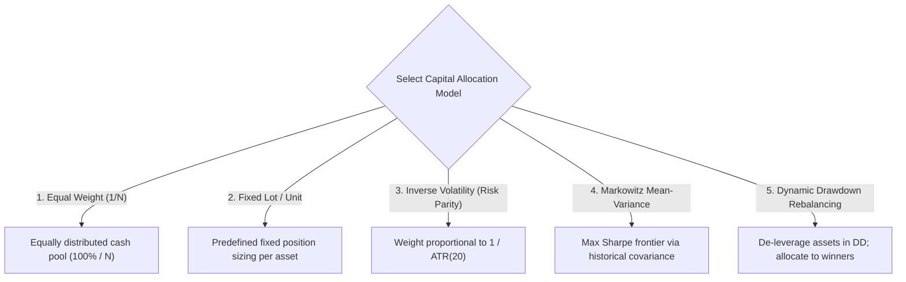
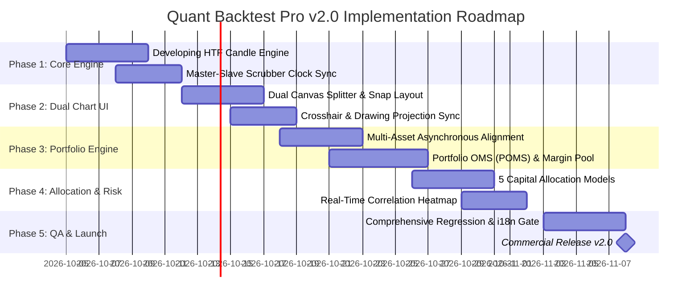

# Institutional Product Requirement Document (PRD) — Release v2.0
## Quant Backtest Pro Platform: Synchronized Dual-Chart Replay & Portfolio Backtesting Engine
**Author**: Prometheus (Chief Product Officer / CPO)  
**Stakeholders**: Athena (CEO), Daedalus (CTO), Minerva (Lead PM), Arachne (UI/UX Architect), Argus (Lead QA), Iris (CMO)  
**Status**: Approved for Engineering Architecture & Sprint Grooming  
**Target Release**: Quant Backtest Pro v2.0 Enterprise

---

## 1. Executive Summary & Problem Statement

### 1.1. The Single-Timeframe Fallacy (Customer Problem 1)
Professional quant traders, proprietary fund managers, and institutional discretionary analysts operate using top-down multi-timeframe analysis (MTF). A macro trend established on the Higher Timeframe (HTF, e.g., 4-Hour or Daily) dictates directional bias and high-probability liquidity zones, while trade entries, stop-loss invalidation, and execution efficiency are optimized on the Lower Timeframe (LTF, e.g., 5-Minute or 1-Minute).

In single-chart backtesting software, users suffer from two catastrophic biases:
1. **Hindsight Horizon Bias**: Toggling back and forth between timeframes reveals future candles on the HTF before the LTF entry occurs, destroying test validity.
2. **Context Blindness**: Reviewing only the LTF obscures major macro support/resistance and order flow shifts, resulting in unrealistic strategy performance.

### 1.2. The Single-Asset Overfitting Trap (Customer Problem 2)
Retail backtesting tools typically evaluate trading systems on a single symbol (e.g., EURUSD or BTCUSDT). In real market conditions:
- Single-asset strategies undergo prolonged drawdowns during regime shifts (e.g., trend-following during choppy consolidations).
- Institutional capital is deployed across **diversified baskets** of uncorrelated instruments (Forex, Metals, Crypto, Indices) to stabilize the portfolio equity curve and maximize risk-adjusted metrics (Sharpe, Sortino, Calmar).
- Traders currently have to run separate backtests, export CSV logs, and manually compute cross-asset covariance in external tools like Python or Excel.

### 1.3. Value Proposition & Strategic Vision (v2.0)
Quant Backtest Pro v2.0 transforms our 60 FPS single-chart replay engine into a unified **Institutional Quantitative Ecosystem**:
- **Synchronized Dual-Chart Multi-Timeframe Replay**: Real-time side-by-side or stacked charts sharing a unified sub-millisecond timeline scrubber. The HTF candle dynamically forms in real-time as LTF bars tick forward without lookahead bias.
- **Multi-Symbol Portfolio Backtesting Engine**: Simultaneous backtesting across baskets of 2 to 10+ symbols with shared margin pool, dynamic capital allocation models (Risk Parity, Markowitz Mean-Variance, Inverse Volatility), and live cross-asset correlation matrices.

---

## 2. Target Personas & Primary User Journeys

### 2.1. Target Personas

| Persona Profile | Core Motivations & Pain Points | Primary v2.0 Workflow |
| :--- | :--- | :--- |
| **Dr. Alexander Wright**<br>*Systematic Portfolio Manager* | Manages multi-asset quant fund; requires mathematical proof of diversification benefits and cross-asset correlation breakdowns. | Configures a 6-symbol basket, selects Risk Parity capital allocation, inspects real-time correlation heatmap, and evaluates Portfolio Diversification Ratio. |
| **Samantha Reed**<br>*Institutional Prop Firm Trader* | Trades multi-timeframe price action (SMC / Liquidity Reversals); needs strict execution without violating prop firm daily drawdowns. | Splits workspace into H4 (Macro) + M5 (Execution), activates Crosshair Lock, takes trades on M5, and monitors unified Prop Firm Shield metrics. |
| **Kenji Takahashi**<br>*Algorithmic Quant Developer* | Develops automated multi-pair strategies; needs robust out-of-sample portfolio stress testing and dynamic volatility weighting. | Backtests multi-asset bots via AI Studio Sandbox, evaluates portfolio equity curves, and exports institutional MQL5/Pine Script multi-symbol code. |

### 2.2. Primary User Journeys

#### Journey A: Synchronized Multi-Timeframe Strategy Execution
1. **Setup**: User opens the Replay Toolbar, clicks `[Dual Chart]`, and selects **Split Horizontal** (or Vertical).
2. **Assignment**: User assigns Chart A to `XAUUSD [H1]` (Macro Context) and Chart B to `XAUUSD [M5]` (Execution).
3. **Scrubber Navigation**: User drags the unified Time Scrubber or uses `[Time-Travel Jump]`. Both charts advance in lockstep.
4. **Developing Candle Inspection**: As M5 candles print forward, the developing H1 candle's high, low, open, and close update incrementally with live wick extension.
5. **Crosshair Synchronization**: Hovering over an order block on Chart A projects an exact timestamp guide line onto Chart B.
6. **Execution**: User executes a `BUY` order on Chart B. Order entry arrows, stop-loss markers, and risk-reward boxes immediately render on both Chart A and Chart B.

#### Journey B: Basket Portfolio Backtest & Correlation Analysis
1. **Basket Assembly**: User clicks `[Portfolio Basket]`, selects preset "Risk-On / Risk-Off Quad" (`XAUUSD`, `BTCUSDT`, `SPX500`, `USDJPY`), and sets total account equity to `$100,000`.
2. **Capital Allocation Model**: User selects `Inverse Volatility (Risk Parity)` with daily rebalancing.
3. **Execution**: Replay engine streams price feeds across all 4 symbols simultaneously, honoring each asset's market hours and weekend gaps.
4. **Live Analysis**: The user monitors the **Cross-Asset Correlation Matrix Heatmap** to detect correlation spikes (>0.85).
5. **Portfolio Tearsheet**: At completion, the user analyzes the aggregated **Portfolio Equity Curve**, standalone vs portfolio max drawdown, and Monte Carlo 500x simulation.

---

## 3. Detailed Functional Specifications

### 3.1. Synchronized Dual-Chart Multi-Timeframe Replay (MTF)

```
┌─────────────────────────────────────────────────────────────────────────────────────────────┐
│ [EURUSD] [H1] | Indicators: EMA, ATR | [⚙ Synced]  │ [EURUSD] [M5] | Indicators: RSI | [⚙ Synced]   │
├────────────────────────────────────────────────────┼────────────────────────────────────────┤
│                                                    │                                        │
│  CHART A: HIGHER TIMEFRAME (MACRO STRUCTURE)       │  CHART B: LOWER TIMEFRAME (EXECUTION)  │
│  - Displays developing H1 candle with dynamic wick │  - 60 FPS bar-by-bar micro playback    │
│  - Macro Supply/Demand zones & Liquidity pools    │  - Precision entry, SL/TP execution    │
│  - Synchronized vertical crosshair guide line      │  - Synchronized vertical crosshair     │
│                                                    │                                        │
├────────────────────────────────────────────────────┴────────────────────────────────────────┤
│ ⏪ [Jump 0%]  ◀ [Step]  ▶ [Play / Pause (Space)]  ▶ [Step]  ⏩ [Jump 100%] | Speed: [5x ▼] | 🔒 Lock │
└─────────────────────────────────────────────────────────────────────────────────────────────┘
```

#### 3.1.1. Chart Topologies & Viewport Splitter
- **Vertical Split (Side-by-Side)**: 50/50 default ratio with draggable split divider. Snap points at 70/30, 50/50, 30/70.
- **Horizontal Split (Stacked)**: Top (HTF) and Bottom (LTF) stacked arrangement. Snap points at 60/40, 50/50, 40/60.
- **Picture-in-Picture (PIP)**: Floating draggable mini-chart window (resizable from 240px to 480px width) overlaid on primary chart.
- **Single Chart Mobile Mode**: Tiered collapse with floating 1-tap `[Toggle HTF / LTF]` button and bottom drawer peek.

#### 3.1.2. Master-Slave Synchronization & Developing Candle Engine
- **Time Base Authority**: The chart with the highest temporal granularity (e.g. M1 or M5) acts as the **Master Replay Clock**.
- **Developing HTF Candle Builder ($O(1)$ Incremental State)**:
  - When replaying LTF bars that fall inside an active HTF candle interval $[T_{	ext{start}}, T_{	ext{end}})$:
    $$	ext{HTF}_{	ext{open}} = 	ext{LTF}_0.	ext{open}$$
    $$	ext{HTF}_{	ext{high}} = \max(	ext{HTF}_{	ext{high}}, 	ext{LTF}_t.	ext{high})$$
    $$	ext{HTF}_{	ext{low}} = \min(	ext{HTF}_{	ext{low}}, 	ext{LTF}_t.	ext{low})$$
    $$	ext{HTF}_{	ext{close}} = 	ext{LTF}_t.	ext{close}$$
  - The HTF candle is rendered with a pulsing "in-progress" border highlight, updating in $O(1)$ via `candleSeries.update()`.
- **Absolute Lookahead Elimination**:
  - Future HTF candles whose timestamps are greater than the current LTF timestamp are strictly truncated from the series buffer.
  - Zero lookahead bias: HTF indicators (e.g., 200 EMA, Bollinger Bands) are recomputed strictly using only formed + current developing bar data.

#### 3.1.3. Synchronization Lock Modes

| Lock Mode | Behavior Description | User Override Capability |
| :--- | :--- | :--- |
| **Time Lock (Scrubber)** | Moving the replay timeline or pressing Step Forward/Backward advances both charts simultaneously. | Can be temporarily unlinked via `[Unlock Time]` toggle. |
| **Crosshair Lock** | Moving the mouse cursor over Chart A projects a synchronized vertical time line and price indicator onto Chart B. | Toggleable via `[Lock Crosshairs]` icon button in header. |
| **Scale & Pan Lock** | Dragging or zooming the time axis on Chart A pans Chart B proportionally. | Disabled by default to allow macro zooming on HTF while keeping micro focus on LTF. |
| **Drawing Sync** | Boxes, trendlines, and horizontal rays placed on HTF project onto LTF with coordinate transformation. | User can mark drawings as "Global" (both charts) or "Local" (single chart). |

---

### 3.2. Multi-Symbol Portfolio & Basket Backtesting

```
┌─────────────────────────────────────────────────────────────────────────────────────────────┐
│ PORTFOLIO BASKET MANAGER: [Global Macro Triad: XAUUSD (40%) + EURUSD (35%) + BTCUSDT (25%)] │
├─────────────────────────────────────────────────────────────────────────────────────────────┤
│ Capital Allocation: [Inverse Volatility (Risk Parity) ▼] | Initial Equity: $100,000 USD    │
│ Margin Engine: [Consolidated Cross Margin ▼]            | Prop Shield: Max DD 10% / Daily 5%│
├───────────────────────────────────────────────────────┬─────────────────────────────────────┤
│ 📈 AGGREGATED PORTFOLIO EQUITY CURVE                  │ 📊 CROSS-ASSET CORRELATION MATRIX   │
│ ┌──────────────────────────────────────────────────┐  │        XAU    EUR    BTC            │
│ │ Portfolio Equity: $118,450 (+18.45%)             │  │ XAU   [1.00] [-0.24] [+0.12]         │
│ │ Standalone Avg DD: 8.4% | Portfolio DD: 3.8%     │  │ EUR  [-0.24]  [1.00] [+0.41]        │
│ │ Diversification Ratio: 1.62                      │  │ BTC  [+0.12] [+0.41]  [1.00]        │
│ └──────────────────────────────────────────────────┘  │ *Alert: No high correlation hazards │
├───────────────────────────────────────────────────────┴─────────────────────────────────────┤
│ [Symbol: XAUUSD | PnL: +$11,200] [Symbol: EURUSD | PnL: +$4,800] [Symbol: BTCUSDT | +$2,450] │
└─────────────────────────────────────────────────────────────────────────────────────────────┘
```

#### 3.2.1. Basket Configuration & Data Alignment Engine
- **Basket Sizing**: Supports 2 to 10 simultaneous symbols per portfolio backtest run.
- **Preset Baskets**:
  - `Forex Major FX-6`: EURUSD, GBPUSD, USDJPY, AUDUSD, USDCHF, USDCAD.
  - `Risk-On / Risk-Off Macro`: XAUUSD, SPX500, USDJPY, BTCUSDT.
  - `Crypto Core Basket`: BTCUSDT, ETHUSDT, SOLUSDT.
  - `Precious Metals & Energy`: XAUUSD, XAGUSD, USOIL.
- **Asynchronous Timeline Alignment Algorithm**:
  - Handles mismatched trading sessions (Crypto 24/7 vs Forex 24/5 vs Commodities/Indices with daily breaks).
  - During asset holiday / market closure, the inactive asset's price is held constant (forward-filled OHLC) with zero trading activity allowed.
  - Prevents synthetic slippage or phantom fills during closed market hours.

#### 3.2.2. Capital Allocation Models



1. **Equal Weight ($1/N$)**:
   $$w_i = rac{1}{N} \quad orall i \in \{1, \dots, N\}$$
2. **Inverse Volatility (Risk Parity / Vol Target)**:
   $$w_i = rac{1 / \sigma_i}{\sum_{j=1}^N (1 / \sigma_j)}$$
   where $\sigma_i$ is the rolling 20-period Average True Range (ATR) or annualized standard deviation of asset returns. High-volatility assets (e.g. BTC) receive smaller allocations; low-volatility assets (e.g. EURUSD) receive larger allocations.
3. **Markowitz Mean-Variance Optimization**:
   Maximizes the portfolio Sharpe ratio:
   $$\max_w rac{w^T \mu - r_f}{\sqrt{w^T \Sigma w}} \quad 	ext{subject to} \quad \sum w_i = 1, \quad w_i \ge 0$$
   where $\Sigma$ is the empirical covariance matrix and $\mu$ is expected returns.
4. **Dynamic Drawdown Equity Reallocation**:
   Dynamically scales down capital allocated to an asset when its standalone drawdown exceeds 5%, preserving dry powder and routing capital to assets trending at new equity highs.

#### 3.2.3. Portfolio Order Matching System (POMS) & Margin Engine
- **Consolidated Account Balance & Equity**:
  $$	ext{Portfolio Equity}(t) = 	ext{Master Balance} + \sum_{i=1}^N 	ext{Unrealized PnL}_i(t)$$
- **Multi-Currency Quote Conversion**:
  - All trades executed across various quote currencies (e.g. EURUSD in USD, EURGBP in GBP, USDJPY in JPY) are converted in real-time to base account currency (USD) using the active replay exchange rates.
- **Cross-Asset Margin & Liquidation Protection**:
  - Margin Requirement:
    $$	ext{Used Margin} = \sum_{i=1}^N rac{	ext{Position Sizing}_i 	imes 	ext{Current Price}_i}{	ext{Leverage}_i}$$
  - Margin Call threshold at 100% margin level; automated emergency partial liquidation at 50% margin level.
- **Consolidated Prop Firm Challenge Shield**:
  - Portfolio Daily Loss Limit (default: 5% of starting day balance across all open and closed basket positions).
  - Portfolio Maximum Trailing Drawdown (default: 10% from highest portfolio equity peak).
  - Breaching either limit immediately halts all replay order executions, logs the violation, and triggers visual and audio circuit breakers.

#### 3.2.4. Cross-Asset Correlation Matrix & Quant Tearsheet Metrics
- **Real-Time $N 	imes N$ Correlation Matrix**:
  $$r_{xy} = rac{\sum (R_{x,t} - ar{R}_x)(R_{y,t} - ar{R}_y)}{\sqrt{\sum (R_{x,t} - ar{R}_x)^2 \sum (R_{y,t} - ar{R}_y)^2}}$$
  Rendered as an interactive 2D color-coded heatmap (Red: $+1.0$, Green: $-1.0$, Neutral: $0.0$).
- **Correlation Hazard Alert**: When correlation between two major open positions exceeds $+0.85$, a visual warning icon alerts the user of severe concentration risk.
- **Portfolio Diversification Ratio ($DR$)**:
  $$DR = rac{\sum_{i=1}^N w_i \sigma_i}{\sigma_p}$$
  A $DR > 1.0$ quantitatively proves the volatility reduction benefit of the selected basket compared to standalone assets.
- **Aggregated Portfolio Tearsheet**:
  - Master Equity Curve overlaid with individual asset PnL contribution sparklines.
  - Drawdown Underwater Comparison: Portfolio Max DD vs Individual Max DDs.
  - 500-Run Monte Carlo Simulation across the synthesized portfolio trades.

---

## 4. 12-Dimensional Edge Case & Failure Scenario Matrix (`ak-scenario` Rigor)

To guarantee institutional software reliability, all failure modes across 12 critical technical and quantitative dimensions are mapped below:

| # | Dimension | Failure Mode / Boundary Condition | System Mitigation & Resolution Strategy | User UI / Alert Feedback |
| :-: | :--- | :--- | :--- | :--- |
| **1** | **Temporal Asynchrony & Holidays** | BTC trades on Saturday/Sunday while Forex and US Indices are closed; candle timestamps diverge. | Forward-fill inactive symbol OHLC with zero-volume bars; freeze open position PnL for closed markets; POMS blocks new order entry for closed symbols. | Symbol status badge on chart: `[XAUUSD: MARKET CLOSED]` with timestamp of next expected open. |
| **2** | **Multi-Timeframe Timestamp Drift** | LTF (M1) timestamps do not align cleanly with HTF (H1) bar boundaries due to broker time zones (GMT+2 vs UTC). | Timestamp normalization engine floors all timestamps into absolute UTC epoch intervals based on timeframe duration modulus. | Micro-toast warning if dataset time zones mismatch upon loading. |
| **3** | **Weekend Rollover Price Gaps** | Monday market open price gaps over pending Stop-Loss or Limit orders placed during Friday close. | POMS executes pending orders at the true opening tick price rather than the target price (realistic gap slippage simulation). | Execution log records: `SL Filled with Gap Slippage (-12.4 pips)` with amber badge. |
| **4** | **Dual-Canvas GPU Memory Exhaustion** | Two simultaneous TradingView chart canvases + two drawing layers rendering 300,000 bars cause browser WebGL context loss. | Ring-buffer sliding window (retains max 50,000 active rendered bars in DOM, virtualizes older bars); auto-detects `webglcontextlost` and restores canvas without data loss. | Low-overhead status monitor in status bar; silent automatic context recovery. |
| **5** | **Cross-Asset Currency Conversion Drift** | Trading GBPJPY and AUDNZD while base account is USD; intermediary currency rates fluctuate. | Dedicated Real-Time FX Converter module updates synthetic exchange cross-rates at every replay tick from historical feeds. | Tooltip on PnL displaying conversion path (e.g. `JPY -> USD @ 0.00645`). |
| **6** | **Concurrent Order Collision** | Multiple strategies fire simultaneous market orders at the exact same replay millisecond. | POMS processes orders in a deterministic priority queue (FIFO based on strategy priority, risk allocation, and margin availability). | Order execution table logs distinct execution timestamps with sub-millisecond sequence IDs. |
| **7** | **Portfolio Margin Depletion** | High volatility across 3 symbols causes simultaneous drawdowns, depleting free margin below maintenance levels. | Margin Health Monitor initiates soft warning at 120% margin level; at 50% margin level, liquidates largest losing position first to restore solvency. | High-priority flashing red warning in PropFirmHUD: `MARGIN CALL: Liquidation Imminent (48%)`. |
| **8** | **Drawing Coordinate Projection Inversion** | Drawing a rectangular supply zone on H4 and zooming into M1 creates infinite coordinate aspect ratio distortions. | Coordinate transformation matrix clamps pixel height and transforms time interval coordinates into absolute UTC start/end timestamps. | Drawing remains crisp and dimensionally accurate across any zoom level. |
| **9** | **Scrubber Scrub-Back OMS Inconsistency** | User scrubs backward on the timeline while 5 portfolio positions were opened in the forward timeline. | Deterministic OMS State Snapshotting: stores immutable transaction journal; rewind restores exact balance, open orders, and prop shield state at target epoch. | Smooth backward rewind; no phantom trades, no corrupted balance state. |
| **10** | **Replay Speed Saturation at 100x** | At 100x speed, dual charts rendering at 60 FPS choke JavaScript single thread and drop UI frames. | Web Worker offloads price parsing, indicator calculations, and correlation math; main thread only receives throttled 60 FPS visual snapshots. | FPS counter stays at 60 FPS; frame-drop warning indicator if render cycle exceeds 16.6ms. |
| **11** | **Viewport & Orientation Clashes** | User switches from 1920x1080 desktop to 375x812 mobile view during active dual-chart replay. | Progressive responsive collapse: dual charts transform into single chart with floating quick-switch HTF/LTF pill and mini bottom drawer. | Clean layout transition with zero horizontal overflow, preserving all active drawings and replay index. |
| **12** | **Offline Persistence & Network Loss** | User operates in offline/flight mode or local Express backend disconnects during session. | Local-first architecture: all portfolio snapshots, multi-chart configurations, and trades persist instantly to IndexedDB with sync queue for SQLite. | Cloud icon changes to `[Offline Cache Active]` with zero interruption to backtesting. |

---

## 5. Non-Functional Requirements & Performance Benchmarks

| Metric Category | Target Specification | Validation Method |
| :--- | :--- | :--- |
| **Replay Frame Rate** | Constant **60 FPS** during sequential playback on dual charts at up to 50x speed. | Chrome DevTools Performance Profiler; max frame budget $\le 16.6	ext{ms}$. |
| **Incremental Render Latency** | $\le 0.1	ext{ms}$ per tick update for both charts combined. | Micro-benchmarking with `performance.now()`. |
| **Memory Consumption** | Total heap footprint increase $\le 65	ext{MB}$ for dual charts holding 200,000 candles. | Heap snapshot analysis before and after 5-hour continuous replay. |
| **Correlation Calculation Time** | $\le 15	ext{ms}$ for $10 	imes 10$ asset matrix across 50,000 historical bars. | Web Worker computation benchmark. |
| **i18n Parity & String Safety** | **100% Locale Parity** across English, Vietnamese, Japanese, and Chinese. Zero hardcoded strings. | Automated CI scanner: `npm run check:i18n`. |
| **Responsive Viewports** | Flawless rendering on Desktop (1920x1080), Laptop (1366x768 & 1280x800), Tablet (1024x768), and Mobile (375x812). | Automated Playwright viewport matrix testing. |

---

## 6. Comprehensive Responsive UX Wireframes & UI Specifications

### 6.1. Desktop (1920x1080) Dual-Chart Replay Workspace

```
┌─────────────────────────────────────────────────────────────────────────────────────────────────────────────────────────────────────────┐
│ 🪙 [XAUUSD] [H1] │ 📐 Tools: [Line][Box][Fibo] │ 👁 View: [Dual Split ◫] │ [Portfolio Basket (3)] │ Balance: $100,000 │ 🛡 Prop Shield: 100% │
├────────────────────────────────────────────────────────────────────┬────────────────────────────────────────────────────────────────────┤
│ CHART A: HIGHER TIMEFRAME [XAUUSD - H1]                            │ CHART B: LOWER TIMEFRAME [XAUUSD - M5]                             │
│ ┌────────────────────────────────────────────────────────────────┐ │ ┌────────────────────────────────────────────────────────────────┐ │
│ │ 2,654.50 ────────────────────────────────────────── HTF RESIST │ │ │ 2,652.80 ────────────────────────────────────────── High of Day│ │
│ │                                                                │ │ │                                ┌──┐                            │ │
│ │                  ┌──┐                                          │ │ │                         ┌──┐   │  │ ◀ Short Entry @ 2,651.20   │ │
│ │           ┌──┐   │  │                                          │ │ │                  ┌──┐   │  │   └──┘                            │ │
│ │    ┌──┐   │  │   │  │ [Developing H1 Candle] ◀──────┐          │ │ │           ┌──┐   │  │   └──┘                                   │ │
│ │    │  │   └──┘   └──┘                               │          │ │ │    ┌──┐   │  │   └──┘                                          │ │
│ │    └──┘                                             │          │ │ │    └──┘   └──┘                                                 │ │
│ │                                                     │          │ │ │                                                                │ │
│ │ 2,630.00 ────────────────────────────────────────── │ ──────── │ │ │ 2,642.00 ────────────────────────────────────────── SL: 2,654.80│ │
│ └─────────────────────────────────────────────────────┼──────────┘ │ └────────────────────────────────────────────────────────────────┘ │
│ Synchronized Timeline: 2026-03-24 14:35:00 UTC        │            │ Synchronized Timeline: 2026-03-24 14:35:00 UTC                     │
├───────────────────────────────────────────────────────┴────────────┴────────────────────────────────────────────────────────────────────┤
│ ⏪ [Start]  ◀ [Step]  ▶ [Play (Space)]  ▶ [Step]  ⏩ [End] │ Speed: [10x ▼] │ 🔒 [Time Lock: ON] [Crosshair: ON] │ Progress: [=====>    ] 42% │
├─────────────────────────────────────────────────────────────────────────────────────────────────────────────────────────────────────────┤
│ [Open Positions (2)] [Trade History (34)] [Portfolio Basket (3)] [Correlation Matrix] [AI Execution Logs]                              │
├─────────────────────────────────────────────────────────────────────────────────────────────────────────────────────────────────────────┤
│ Symbol  | Type | Sizing    | Entry Price | Current Price | SL       | TP       | PnL ($)     | Prop Contribution | Actions              │
│ XAUUSD  | SELL | 1.50 Lots | 2,651.20    | 2,648.50      | 2,654.80 | 2,635.00 | +$405.00    | +0.40%            | [Close] [BE] [Partial]│
│ EURUSD  | BUY  | 3.00 Lots | 1.08500     | 1.08720      | 1.08200 | 1.09200 | +$660.00    | +0.66%            | [Close] [BE] [Partial]│
└─────────────────────────────────────────────────────────────────────────────────────────────────────────────────────────────────────────┘
```

### 6.2. Laptop (1366x768 & 1280x800) Progressive Collapse Layout
- Header elements collapse into categorized icon groups.
- Dual charts maintain a 50/50 horizontal or vertical ratio with collapsible bottom trade dock.
- Quick Trade Dock docks as a compact side pill or floating HUD.

### 6.3. Tablet (1024x768 & 768x1024) Touch-Friendly Dual Layout
- Landscape mode features dual charts with a touch-friendly 24px wide splitter drag handle.
- Portrait mode automatically switches to a stacked vertical split (Top: HTF 45%, Bottom: LTF 55%).
- Replay controls feature enlarged touch targets (minimum 44x44px).

### 6.4. Mobile (375x812) Viewport & Single-Pane Replay with HTF Quick-Peek Drawer
- Displays full-screen primary execution chart (LTF).
- A floating high-contrast pill button in the top left displays: `[⚡ H1 Context: BULLISH]`.
- Tapping the pill slides up a smooth, gesture-driven **Bottom Sheet Modal** rendering the HTF chart preview in real-time.
- One-tap `[⇄ Swap Charts]` allows instant seamless swapping of primary and context charts.

### 6.5. Portfolio Basket Configuration Modal Wireframe

```
┌─────────────────────────────────────────────────────────────────────────────────────────┐
│ 💼 CONFIGURE MULTI-SYMBOL PORTFOLIO BASKET                                         [✕] │
├─────────────────────────────────────────────────────────────────────────────────────────┤
│ Preset Basket Templates:                                                                │
│ [ Forex Majors (6) ]  [★ Risk-On / Risk-Off Quad ]  [ Crypto Core (3) ]  [ Custom + ]   │
├─────────────────────────────────────────────────────────────────────────────────────────┤
│ Selected Assets & Individual Weighting:                                                 │
│ • XAUUSD   [Gold Spot]       | Weight: [ 40.0% ] | Margin/Lot: $1,000 | 🗑 Delete      │
│ • EURUSD   [Euro / US Dollar] | Weight: [ 35.0% ] | Margin/Lot: $300   | 🗑 Delete      │
│ • BTCUSDT  [Bitcoin / Tether] | Weight: [ 25.0% ] | Margin/Lot: $500   | 🗑 Delete      │
│ [+ Add Instrument to Basket]                                                            │
├─────────────────────────────────────────────────────────────────────────────────────────┤
│ Capital Allocation & Portfolio Settings:                                                │
│ Initial Master Balance:   [ $100,000.00 USD ]                                           │
│ Allocation Engine:         [ Inverse Volatility (Risk Parity / Vol Target)            ▼]│
│ Rebalancing Frequency:     [ Daily (00:00 UTC)                                       ▼]│
│ Rebalancing Threshold:     [ Deviations > 5.0%                                       ▼]│
│ Prop Firm Shield Limit:    [ Max Drawdown: 10.0%  │  Daily Loss: 5.0%                 ▼]│
├─────────────────────────────────────────────────────────────────────────────────────────┤
│ 💡 Theoretical Basket Stats:                                                            │
│ Expected Diversification Ratio: 1.58 | Estimated Historical Max DD Reduction: -38.5%    │
├─────────────────────────────────────────────────────────────────────────────────────────┤
│ [ Cancel ]                                             [ 🚀 Launch Portfolio Backtest ] │
└─────────────────────────────────────────────────────────────────────────────────────────┘
```

### 6.6. Cross-Asset Correlation Heatmap & Portfolio Tearsheet HUD Wireframe

```
┌─────────────────────────────────────────────────────────────────────────────────────────┐
│ 📊 CROSS-ASSET CORRELATION MATRIX & PORTFOLIO TEARSHEET                                 │
├─────────────────────────────────────────────────────────────────────────────────────────┤
│ Rolling Window: [90-Day Returns ▼] | Method: [Pearson ▼] | Alert Threshold: [> 0.85]     │
├─────────────────────────────────────────────────────────────────────────────────────────┤
│               XAUUSD       EURUSD       BTCUSDT       SPX500       USDJPY               │
│ XAUUSD        [+1.00]      [-0.24]      [+0.12]       [-0.18]      [-0.52]              │
│ EURUSD        [-0.24]      [+1.00]      [+0.41]       [+0.62]      [-0.45]              │
│ BTCUSDT       [+0.12]      [+0.41]      [+1.00]       [+0.58]      [-0.10]              │
│ SPX500        [-0.18]      [+0.62]      [+0.58]       [+1.00]      [+0.32]              │
│ USDJPY        [-0.52]      [-0.45]      [-0.10]       [+0.32]      [+1.00]              │
├─────────────────────────────────────────────────────────────────────────────────────────┤
│ 🛡 Portfolio Risk & Health Summary:                                                     │
│ • Diversification Ratio: 1.64 (Excellent - Risk well-distributed across non-correlated) │
│ • Highest Correlated Pair: EURUSD <-> SPX500 (+0.62) [Safe: Below 0.85 threshold]     │
│ • Portfolio Sharpe Ratio: 2.14 vs Standalone Average: 1.32 (+62% improvement)          │
│ • Portfolio Max DD: 4.2% vs Worst Standalone Asset DD: 12.8% (BTCUSDT)                  │
└─────────────────────────────────────────────────────────────────────────────────────────┘
```

---

## 7. Internationalization (i18n) Key Architecture & Translation Dictionary

In strict compliance with **Section 1 of AGENTS.md** (Zero hardcoded strings, 100% locale parity across all 4 locales, no string fallbacks), the complete i18n dictionary for the v2.0 feature release is authored below:

### 7.1. Key Definitions & Types (`src/i18n/types.ts`)

```typescript
// Multi-Chart & Multi-Timeframe Replay
multiChartMode: string;
singleChart: string;
dualChartVertical: string;
dualChartHorizontal: string;
pictureInPicture: string;
chartA: string;
chartB: string;
higherTimeframeContext: string;
lowerTimeframeExecution: string;
developingCandle: string;
lockTimeline: string;
unlockTimeline: string;
lockCrosshairs: string;
unlockCrosshairs: string;
syncDrawings: string;
globalDrawings: string;
localDrawings: string;
swapCharts: string;
developingWickProgress: string;

// Portfolio & Basket Backtesting
portfolioBasket: string;
configureBasket: string;
basketName: string;
addAssetToBasket: string;
removeAssetFromBasket: string;
assetWeight: string;
allocationModel: string;
equalWeight: string;
fixedLotSize: string;
riskParity: string;
meanVarianceOpt: string;
dynamicRebalancing: string;
rebalanceFreq: string;
rebalanceDaily: string;
rebalanceWeekly: string;
rebalanceThreshold: string;
diversificationRatio: string;
correlationMatrix: string;
correlationHazardAlert: string;
portfolioEquity: string;
standaloneEquity: string;
portfolioMaxDD: string;
standaloneAvgDD: string;
crossMarginPool: string;
marginHealthWarning: string;
launchPortfolioBacktest: string;
marketClosedStatus: string;
```

### 7.2. Four-Locale Parity Table

| Translation Key | English (`en.ts`) | Vietnamese (`vi.ts`) | Japanese (`ja.ts`) | Chinese (`zh.ts`) |
| :--- | :--- | :--- | :--- | :--- |
| `multiChartMode` | Multi-Chart Mode | Chế độ Đa Biểu Đồ | マルチチャートモード | 多图表模式 |
| `singleChart` | Single Chart | Biểu đồ đơn | シングルチャート | 单图表 |
| `dualChartVertical` | Split Vertical (Side-by-Side) | Chia dọc (Song song) | 左右分割 | 左右垂直分屏 |
| `dualChartHorizontal` | Split Horizontal (Stacked) | Chia ngang (Xếp tầng) | 上下分割 | 上下水平分屏 |
| `pictureInPicture` | Picture-in-Picture (PIP) | Cửa sổ phụ (PIP) | ピクチャーインピクチャー (PIP) | 画中画 (PIP) |
| `chartA` | Chart A (Primary) | Biểu đồ A (Chính) | チャートA (メイン) | 图表 A (主图) |
| `chartB` | Chart B (Secondary) | Biểu đồ B (Phụ) | チャートB (サブ) | 图表 B (副图) |
| `higherTimeframeContext` | Higher Timeframe (Context) | Khung thời gian lớn (Xu hướng) | 上位足 (環境認識) | 大周期 (趋势环境) |
| `lowerTimeframeExecution` | Lower Timeframe (Execution) | Khung thời gian nhỏ (Vào lệnh) | 下位足 (エントリー執行) | 小周期 (入场执行) |
| `developingCandle` | Developing Candle | Nến đang hình thành | 形成中のローソク足 | 形成中的K线 |
| `lockTimeline` | Lock Timeline Scrubber | Khóa dòng thời gian | タイムラインを同期固定 | 锁定时间轴同步 |
| `unlockTimeline` | Unlock Timeline Scrubber | Mở khóa dòng thời gian | タイムライン同期解除 | 解锁时间轴同步 |
| `lockCrosshairs` | Lock Crosshair Cursor | Khóa con trỏ đối chiếu | 十字カーソルを同期 | 锁定十字光标同步 |
| `unlockCrosshairs` | Unlock Crosshair Cursor | Mở khóa con trỏ đối chiếu | 十字カーソル同期解除 | 解锁十字光标同步 |
| `syncDrawings` | Sync Chart Drawings | Đồng bộ công cụ vẽ | 描画ツールを同期 | 同步图表画线 |
| `globalDrawings` | Global Drawings (Both Charts) | Vẽ toàn cục (Cả 2 biểu đồ) | 全体描画 (両チャート) | 全局画线 (双图表) |
| `localDrawings` | Local Drawings (This Chart) | Vẽ cục bộ (Biểu đồ này) | 個別描画 (本チャートのみ) | 局部画线 (仅本图表) |
| `swapCharts` | Swap Chart Panes | Đổi vị trí 2 biểu đồ | チャート表示を入れ替え | 对调双图表位置 |
| `developingWickProgress` | Live Candle Formation | Nến đang chạy trực tiếp | リアルタイム足形成中 | 动态K线成型中 |
| `portfolioBasket` | Portfolio Basket | Danh mục Đa Tài Sản | ポートフォリオ・バスケット | 投资组合标的篮子 |
| `configureBasket` | Configure Portfolio Basket | Thiết lập Danh mục Tài sản | ポートフォリオ設定 | 配置投资组合篮子 |
| `basketName` | Basket Identifier | Tên danh mục | バスケット名 | 组合篮子名称 |
| `addAssetToBasket` | Add Instrument to Basket | Thêm mã giao dịch vào giỏ | 銘柄をバスケットに追加 | 添加品种至投资组合 |
| `removeAssetFromBasket` | Remove Asset | Xóa tài sản | 銘柄を削除 | 移除品种 |
| `assetWeight` | Asset Capital Weight (%) | Tỷ trọng phân bổ vốn (%) | 資産配分比率 (%) | 资产资金权重 (%) |
| `allocationModel` | Capital Allocation Model | Mô hình Phân bổ Vốn | 資金配分モデル | 资金分配模型 |
| `equalWeight` | Equal Weight (1/N) | Trọng số đều (1/N) | 均等ウェイト (1/N) | 等权重分配 (1/N) |
| `fixedLotSize` | Fixed Lot Sizing | Khối lượng cố định (Fixed Lot) | 固定ロット | 固定手数分配 |
| `riskParity` | Inverse Volatility (Risk Parity) | Nghịch đảo biến động (Risk Parity)| リスクパリティ (逆ボラティリティ) | 风险平价 (逆波动率) |
| `meanVarianceOpt` | Mean-Variance (Markowitz) | Tối ưu hóa Markowitz | マーコウィッツ平均分散最適化 | 马科维茨均值-方差优化 |
| `dynamicRebalancing` | Dynamic Drawdown Rebalance | Tái cân bằng theo Drawdown | ドローダウン連動リバランス | 回撤动态再平衡 |
| `rebalanceFreq` | Rebalance Frequency | Tần suất tái cân bằng | リバランス頻度 | 再平衡周期 |
| `rebalanceDaily` | Daily Rebalance (00:00 UTC) | Tái cân bằng hàng ngày (00:00 UTC)| 毎日リバランス (00:00 UTC) | 每日再平衡 (00:00 UTC) |
| `rebalanceWeekly` | Weekly Rebalance (Monday Open) | Tái cân bằng hàng tuần (Thứ Hai)| 毎週リバランス (月曜始値) | 每周再平衡 (周一开盘) |
| `rebalanceThreshold` | Drift Threshold Trigger | Ngưỡng lệch kích hoạt | 許容乖離トリガー | 偏离度触发阈值 |
| `diversificationRatio` | Diversification Ratio (DR) | Hệ số Đa dạng hóa (DR) | 分散投資比率 (DR) | 多样化分散比率 (DR) |
| `correlationMatrix` | Cross-Asset Correlation Matrix | Ma trận Tương quan Đa Tài sản | 資産間相関マトリックス | 跨资产相关性矩阵 |
| `correlationHazardAlert`| High Correlation Hazard (>0.85) | Cảnh báo rủi ro tương quan cao | 高相関集中リスク警告 (>0.85) | 高度相关集中风险警报 (>0.85)|
| `portfolioEquity` | Consolidated Portfolio Equity | Vốn tổng hợp Danh mục | ポートフォリオ合算資産 | 投资组合综合净值 |
| `standaloneEquity` | Standalone Asset Equity | Vốn tài sản đơn lẻ | 個別銘柄資産 | 单一品种独立净值 |
| `portfolioMaxDD` | Portfolio Max Drawdown | Sụt giảm tối đa Danh mục | ポートフォリオ最大DD | 投资组合最大回撤 |
| `standaloneAvgDD` | Standalone Average Drawdown | Sụt giảm trung bình đơn lẻ | 個別平均ドローダウン | 单品种平均回撤 |
| `crossMarginPool` | Consolidated Cross Margin Pool| Bể Ký quỹ chéo Hợp nhất | 統合クロスマージンプール | 综合跨品种保证金池 |
| `marginHealthWarning` | Margin Call Hazard Warning | Cảnh báo Nguy cơ Margin Call | マージンコール危機警告 | 追加保证金追缴警报 |
| `launchPortfolioBacktest`| Launch Portfolio Backtest | Khởi chạy Backtest Danh mục | ポートフォリオ検証を開始 | 启动投资组合回测 |
| `marketClosedStatus` | Market Inactive / Weekend Break | Thị trường đóng cửa / Nghỉ cuối tuần| 市場休止中 / 週末クローズ | 市场休市 / 周末停盘 |

---

## 8. Implementation Phasing & Engineering Handoff



### 8.1. Engineering Epic Breakdown

#### Epic 1: Multi-Timeframe Replay Data Pipeline (`src/engine/resampler.ts`, `src/store/backtestStore.ts`)
- **Owner**: @Daedalus (CTO) & @Vulcan (Senior Full-Stack SWE)
- **Deliverables**:
  - Implement master clock synchronizer in Web Worker (`multiChartWorker.ts`).
  - Develop `generateDevelopingCandle(ltfCandles, htfInterval)` maintaining $O(1)$ memory buffer.
  - Unit test suite verifying zero lookahead bias with 100% test coverage.

#### Epic 2: Dual Canvas Viewports & Splitter UI (`src/components/chart/DualTradingViewChart.tsx`)
- **Owner**: @Arachne (UI/UX Architect) & @Vulcan (Senior Full-Stack SWE)
- **Deliverables**:
  - Resizable dual-pane container with vertical/horizontal snap layout.
  - Synchronized crosshair coordinate broadcasting via mouse event bus.
  - Drawing canvas coordinate projection matrix between HTF and LTF.

#### Epic 3: Basket Engine & Portfolio Order Matching System (POMS) (`src/engine/portfolioMatchingEngine.ts`)
- **Owner**: @Daedalus (CTO) & @Vulcan (Senior Full-Stack SWE)
- **Deliverables**:
  - Multi-asset calendar alignment and forward-fill holiday imputations.
  - Multi-currency quote conversion to USD base.
  - Unified margin pool, margin call thresholds, and portfolio Prop Firm Shield.

#### Epic 4: Capital Allocation Models & Correlation Matrix (`src/engine/portfolioAllocation.ts`)
- **Owner**: @Daedalus (CTO)
- **Deliverables**:
  - Implement 5 allocation strategies: Equal Weight, Fixed Lot, Risk Parity (ATR), Markowitz Efficient Frontier, Dynamic Drawdown.
  - Real-time $N 	imes N$ Pearson/Spearman correlation matrix with $>0.85$ risk alert.

#### Epic 5: Portfolio Tearsheet & Mobile Responsive Polish (`src/components/panels/PortfolioTearsheetModal.tsx`)
- **Owner**: @Arachne (UI/UX Architect) & @Argus (Lead QA)
- **Deliverables**:
  - Aggregated Portfolio Equity Curve with stacked asset attribution.
  - Mobile bottom drawer for HTF quick peek.
  - Verify all 4-locale i18n translations with `npm run check:i18n`.

---

## 9. Executive Sign-Off & Department Handover

### 💡 Product Specification (PRD) — Prometheus (CPO)
- **Feature Title**: Quant Backtest Pro v2.0: Synchronized Dual-Chart Replay & Portfolio Backtesting Engine
- **User Problem Solved**: Eliminates hindsight horizon bias and context blindness via real-time multi-timeframe replay, and eliminates single-asset curve-fitting via institutional multi-symbol basket backtesting with dynamic capital allocation models.
- **Core Acceptance Criteria**:
  1. Synchronized dual-chart playback with $O(1)$ dynamic HTF forming candle generation and zero lookahead bias.
  2. Multi-symbol portfolio backtesting supporting 2-10 assets with 5 capital allocation models (Equal Weight, Fixed Lot, Risk Parity, Markowitz, Dynamic DD).
  3. Real-time $N 	imes N$ cross-asset correlation matrix heatmap with concentration risk warnings.
  4. 100% responsive design across Desktop, Laptop, Tablet, and Mobile with zero horizontal overflow.
  5. 100% i18n locale parity across English, Vietnamese, Japanese, and Chinese with zero hardcoded strings.
- **Key Scenarios & Edge Cases**: Exhaustively mapped across 12 dimensions in Section 4.
- **Handoff Target**:
  - **@Minerva (Lead PM)**: For sprint breakdown, user story ticketing, and release scheduling.
  - **@Arachne (UI/UX Architect)**: For component layout implementation, splitter gestures, and responsive tokens.
  - **@Daedalus (CTO)**: For Web Worker synchronization architecture and POMS execution pipeline.
  - **@Argus (Lead QA)**: For regression test matrix authoring and zero-lookahead audit.

---
*Signed by Prometheus, Chief Product Officer (CPO) — Autonomous Technology Corporation (AUT)*
