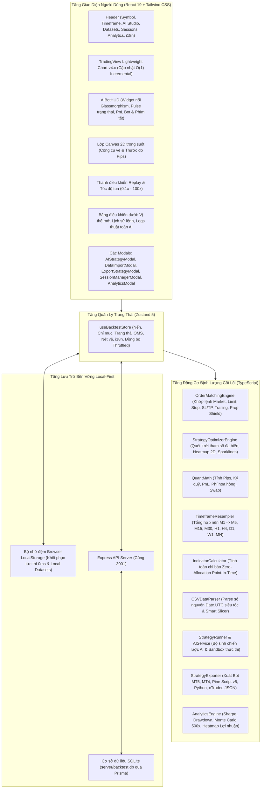

# Tài Liệu Đặc Tả Kiến Trúc Hệ Thống (System Architecture)
## Nền Tảng Quant Backtest Pro (Tiếng Việt)

Tài liệu này cung cấp đặc tả kỹ thuật chi tiết về kiến trúc hệ thống, động cơ Replay 60 FPS hiệu năng cao, cơ chế tính toán chỉ báo Zero-Allocation, bộ tối ưu hóa lưới tham số SL/TP, kiến trúc lưu trữ Local-First, bộ sinh thuật toán AI đa LLM và trung tâm xuất Bot giao dịch đa nền tảng của **Quant Backtest Pro**.

---

## 1. Ngăn Xếp Công Nghệ (Technology Stack)

| Tầng | Công nghệ | Mục đích & Trách nhiệm |
| :--- | :--- | :--- |
| **Framework Cốt lõi** | React 19, TypeScript 5.8 Strict Mode | Đảm bảo tính toàn vẹn kiểu dữ liệu tài chính và quản lý giao diện phản ứng |
| **Đóng gói & Tooling** | Vite 6.x | Tốc độ biên dịch HMR siêu tốc và tối ưu hóa bundle xuất bản |
| **Giao diện & Thiết kế** | Tailwind CSS 3.4, PostCSS | Giao diện tối hiện đại chuẩn Glassmorphism phục vụ phân tích kỹ thuật |
| **Quản lý State** | Zustand 5 | Quản lý state tập trung với cơ chế đồng bộ Throttled, không gây re-render thừa |
| **Động cơ Biểu đồ** | TradingView Lightweight Charts v4.x | Cập nhật nến $O(1)$ Incremental, đáp ứng mượt mà 200,000+ nến ở 60 FPS |
| **Lớp Vẽ Đồ Họa** | HTML5 Canvas 2D Engine tùy biến | Vẽ Trendline, Fibonacci, Khối hộp, Thước đo đồng bộ tọa độ biểu đồ |
| **Lưu Trữ Bền Vững** | Express REST API + Prisma + SQLite (`better-sqlite3`) | Lưu trữ vĩnh viễn các phiên giao dịch, lịch sử lệnh, chiến lược và datasets |
| **Động cơ Khớp lệnh** | OrderMatchingEngine tùy biến | Mô phỏng khớp lệnh Market/Pending, Spread, Commission, Slippage và Prop Firm Shield |
| **Phân Tích Định Lượng**| Quant Math Engine | Tính toán Sharpe Ratio, Max Drawdown, Profit Factor, Monte Carlo 500 vòng, PnL Heatmap |
| **Tối Ưu SL/TP** | StrategyOptimizerEngine | Quét lưới tham số đa biến, ma trận nhiệt 2D Heatmap, đường cong vốn SVG Sparkline |
| **Trình Xuất Bot** | StrategyExporter Engine | Chuyển đổi mã sang MQL5, MQL4, Pine Script v5, Python CCXT, cTrader C#, JSON |
| **Thuật Toán AI** | Function Sandbox & Multi-LLM API | Kết nối OpenAI, Gemini, Claude, DeepSeek, Ollama, và Reverse Proxy Tunnels |
| **Động cơ Dữ Liệu** | Fast Integer CSV Parser + REST Crawler | Parse 1.44M nến < 3.8s, tự động nhận diện dấu phân cách và crawl Binance API |

---

## 2. Sơ Đồ Kiến Trúc Tổng Thể (System Architecture Diagram)

---

## 3. Các Phân Hệ Động Cơ Cốt Lõi

### 3.1. Động cơ Replay Biểu Đồ $O(1)$ Incremental (`TradingViewChart.tsx`)
- **Fast Path tuần tiến**: Khi bước qua 1 nến (`nextIndex === currentIndex + 1`), hệ thống chỉ gọi `candleSeries.update(candle)` và `volumeSeries.update(volume)`. Thời gian render giảm từ `150ms` xuống **`0.05ms`**, duy trì **60 FPS** ở tốc độ tua tối đa `100x`.
- **Full Refresh Path**: Chỉ kích hoạt khi đổi khung thời gian (Timeframe), kéo thanh trượt Scrubber hoặc nạp dataset mới.
- **Tối ưu Sự kiện Tin tức**: Giới hạn tối đa `100-150` nhãn tin tức trải đều trên toàn bộ dải nến lớn để tránh tràn DOM.

### 3.2. Đường Ống Chỉ Báo Zero-Allocation (`indicators.ts`)
- Mọi hàm chỉ báo (`sma`, `ema`, `rsi`, `atr`, `bollingerBands`, `macd`, `highest`, `lowest`) tính toán trực tiếp trên con trỏ `this.effectiveLength` của mảng nến đã nạp sẵn.
- Triệt tiêu hoàn toàn thao tác cắt mảng `candles.slice()`, không sinh rác bộ nhớ trong vòng lặp replay.

### 3.3. Bộ Tối Ưu Lưới Tham Số SL/TP Đa Biến (`strategyOptimizer.ts`)
- Tự động chạy hàng chục kịch bản mô phỏng Stop Loss và Take Profit trên dữ liệu nến thực tế.
- Xây dựng **Ma trận nhiệt 2D Heatmap** thể hiện mối tương quan giữa SL và TP với lợi nhuận ròng, giúp trader xác định vùng tham số ổn định (*Sweet Spot*).
- Lấy mẫu 10–12 điểm vốn cho mỗi cấu hình để vẽ **Đường cong vốn SVG Mini Sparkline** siêu nhẹ.
- Tích hợp bộ lọc chất lượng: `Số lệnh >= 5` và `Net PnL > 0`.
- Bơm tự động tham số SL/TP tối ưu vào mã nguồn Sandbox bằng thuật toán regex AST.

### 3.4. AI Bot Live Floating HUD (`AIBotHUD.tsx`)
- Widget nổi chuẩn Glassmorphism hiển thị số lệnh bot, tỷ lệ thắng, PnL đã chốt và PnL thả nổi.
- Hỗ trợ thu nhỏ thành thanh Pill và mở trực tiếp các tab Studio / Tối Ưu.

### 3.5. Quản Lý Dữ Liệu Data Import Manager 2.0 (`csvParser.ts`)
- Giải mã ngày giờ bằng số nguyên `Date.UTC(y, m - 1, d, h, min, s) / 1000`, xử lý **1.44 triệu nến (74.4 MB) trong 3.87 giây**.
- Tự động nhận diện dấu phân cách (`;`, `,`, `\t`) và tên symbol.
- Bộ cắt nến thông minh (`200k`, `100k`, `50k`, `Full`).
- Thư viện Dataset Local-First hỗ trợ lưu trữ cục bộ và đồng bộ SQLite.

### 3.6. Động cơ Khớp Lệnh Thực Tế (`orderMatchingEngine.ts`)
Mô phỏng tài khoản ECN chuyên nghiệp:
1. **Trạng thái tài khoản**: Cập nhật tức thời `balance`, `equity`, `margin`, `freeMargin`, `marginLevel`.
2. **Khớp lệnh thị trường**: Mô phỏng khớp lệnh với Spread và Slippage tùy chỉnh.
3. **Quản lý lệnh chờ**: Tự động kích hoạt `BUY_LIMIT`, `SELL_LIMIT`, `BUY_STOP`, `SELL_STOP` khi giá chạm mức.
4. **SL / TP & Trailing Stop**: Tự động chốt lời/cắt lỗ theo giá High/Low của nến.
5. **Prop Firm Shield**: Giám sát giới hạn lỗ ngày và mức sụt giảm tối đa, ngắt giao dịch tức thời khi vi phạm.

---

## 4. Kiến Trúc Bảo Mật & Local-First

1. **Đồng bộ Throttled Local Snapshot**: Trạng thái phiên lưu vào `localStorage` (debounce 2,000ms) kèm đường cong vốn nén mẫu để khôi phục F5 tức thời (0ms).
2. **Cơ sở dữ liệu SQLite**: Toàn bộ lịch sử lệnh, chiến lược và datasets được bảo toàn trong `server/backtest.db`.
3. **Bảo Mật Phía Client**: API keys và endpoint tùy chỉnh được lưu trữ nội bộ trên trình duyệt, tuyệt đối không gửi về bất kỳ máy chủ theo dõi thứ ba nào.
