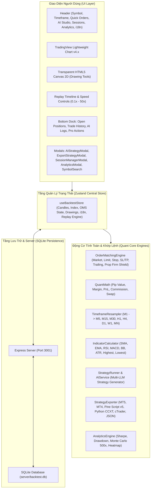

# TÀI LIỆU THIẾT KẾ KIẾN TRÚC HỆ THỐNG (SYSTEM ARCHITECTURE SPECIFICATION)
## NỀN TẢNG QUANT BACKTEST PRO (TIẾNG VIỆT)

Tài liệu này mô tả chi tiết kiến trúc kỹ thuật, cơ chế khớp lệnh mô phỏng, mô hình lưu trữ cục bộ SQLite (`server/backtest.db`), động cơ sinh mã chiến lược Multi-LLM AI và trung tâm xuất mã nguồn Bot giao dịch đa nền tảng (**Bot Exporter & Transpiler**) của hệ thống **Quant Backtest Pro**.

---

## 1. TỔNG QUAN CÔNG NGHỆ (TECHNOLOGY STACK)

| Tầng Hệ Thống | Công Nghệ Sử Dụng | Mục Đích & Trách Nhiệm Kỹ Thuật |
| :--- | :--- | :--- |
| **Core Framework** | React 19, TypeScript 5.8 Strict Mode | Đảm bảo tính an toàn kiểu dữ liệu (Type Safety) cho các phép tính toán tài chính phức tạp |
| **Build Tool & Bundler** | Vite 6.x | Tốc độ Hot Module Replacement (HMR) cực nhanh và bundle JS tối ưu |
| **Styling & Theme** | Tailwind CSS 3.4, PostCSS | Thiết kế Glassmorphism chuyên nghiệp, bảng màu HSL tối ưu cho trading đêm |
| **State Management** | Zustand 5 | Hiệu năng cao, zero-boilerplate, không gây re-render thừa khi tua nến tốc độ cao |
| **Charting Engine** | TradingView Lightweight Charts v4.x | Render biểu đồ nến và Volume trên nền HTML5 Canvas 60 FPS |
| **Drawing Overlay** | Custom HTML5 Canvas 2D Engine | Tự vẽ Trendline, Fibonacci, Box, Measure đồng bộ tọa độ 2 chiều với chart |
| **Persistent Storage** | Express REST API + SQLite (`better-sqlite3`) | Lưu trữ bền vững các phiên backtest, lịch sử lệnh và chiến lược AI |
| **Matching Engine** | Custom OrderMatchingEngine | Mô phỏng khớp lệnh Market/Pending, Spreads, Commissions, Slippage và Prop Shield |
| **Quant Analytics** | TypeScript Math Engine | Tính toán Sharpe Ratio, Max Drawdown, Profit Factor, Monte Carlo 500 vòng |
| **Bot Transpilers** | StrategyExporter Engine | Chuyển đổi mã chiến lược sang MQL5, MQL4, Pine Script v5, Python CCXT, cTrader C# |
| **AI Strategy Engine** | Function Sandbox & Multi-LLM API | Tích hợp OpenAI, Gemini, Claude, DeepSeek, Ollama và Custom Reverse Proxy Tunnel |

---

## 2. SƠ ĐỒ KIẾN TRÚC TỔNG THỂ (HIGH-LEVEL ARCHITECTURE)

---

## 3. CÁC ĐỘNG CƠ CỐT LÕI (CORE QUANT ENGINES)

### 3.1. Động cơ Khớp lệnh (Order Matching Engine)
Tọa lạc tại `src/engine/orderMatchingEngine.ts`, chịu trách nhiệm:
1. Quản lý số dư `Balance`, vốn tức thời `Equity`, `FreeMargin`, và đòn bẩy `Leverage`.
2. Khớp lệnh `MarketOrder` theo giá Ask/Bid thực tế kèm độ trượt giá `Slippage` và Spread.
3. Kích hoạt lệnh chờ `PendingOrder` (Buy/Sell Limit, Buy/Sell Stop) khi giá nến chạm mức đặt.
4. Quét quét nến từng tick: kiểm tra chạm Stop Loss, Take Profit, cập nhật Trailing Stop.
5. Bảo vệ tài khoản quỹ (**Prop Firm Shield**): Tự động tính toán Max Daily Loss và Max Total Drawdown, đóng toàn bộ lệnh khi chạm ngưỡng vi phạm.

### 3.2. Động cơ Resample Nến Đa Khung Thời Gian (Timeframe Resampler)
Tọa lạc tại `src/engine/resampler.ts`:
- Nhận dữ liệu nến thô 1 Phút (M1).
- Tự động gom nến theo thời gian UTC để tạo ra các khung thời gian lớn hơn (M5, M15, M30, H1, H4, D1, W1, MN) với đầy đủ thông số Open, High, Low, Close, Volume.

### 3.3. Động cơ AI Multi-LLM & Sandbox Chiến Lược
Tọa lạc tại `src/engine/aiService.ts` và `src/engine/strategySandbox.ts`:
- Kết nối tới bất kỳ endpoint tương thích OpenAI nào (kèm Custom Reverse Proxy Tunnel).
- Thực thi mã chiến lược JavaScript trong môi trường Sandbox cô lập trên từng cây nến.
- Cung cấp thư viện chỉ báo toán học (`indicators.sma`, `indicators.ema`, `indicators.rsi`, `indicators.macd`, `indicators.bollingerBands`, `indicators.atr`).
- Cung cấp API đặt lệnh tự động: `api.buy()`, `api.sell()`, `api.closePosition()`, `api.modifySLTP()`, `api.log()`.

### 3.4. Động cơ Xuất Bot Đa Nền Tảng (Strategy Exporter)
Tọa lạc tại `src/engine/strategyExporter.ts`:
- Biên dịch logic chiến lược sang **TradingView Pine Script v5**, **MetaTrader 5 MQL5**, **MetaTrader 4 MQL4**, **Python CCXT**, **cTrader C#** và **Universal JSON Package**.

---

## 4. BẢO MẬT & DỮ LIỆU CỤC BỘ (LOCAL-FIRST SECURITY)

- Toàn bộ dữ liệu kiểm thử được lưu trữ tại file SQLite cục bộ `server/backtest.db`.
- API Key và cấu hình endpoint LLM được lưu trữ an toàn trong `localStorage` của trình duyệt người dùng, **hoàn toàn không được gửi về bất kỳ máy chủ bên thứ ba nào**.
