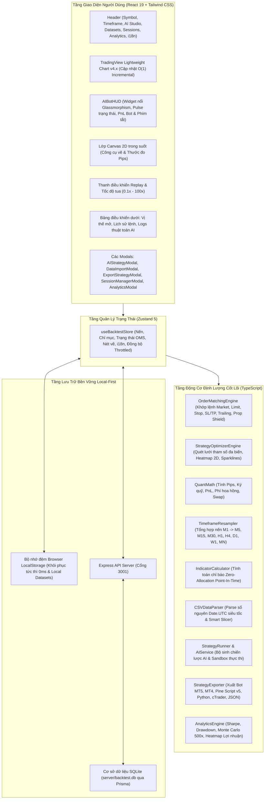

# Tài Liệu Đặc Tả Kiến Trúc Hệ Thống (System Architecture)
## Nền Tảng Quant Backtest Pro (Tiếng Việt)

Tài liệu này cung cấp đặc tả kỹ thuật chi tiết về kiến trúc hệ thống, động cơ Replay 60 FPS hiệu năng cao, cơ chế tính toán chỉ báo Zero-Allocation, bộ tối ưu hóa lưới tham số SL/TP, kiến trúc lưu trữ Local-First, bộ sinh thuật toán AI đa LLM và trung tâm xuất Bot giao dịch đa nền tảng của **Quant Backtest Pro**.

---

## 1. Ngăn Xếp Công Nghệ (Technology Stack)

| Tầng | Công nghệ | Mục đích & Trách nhiệm |
| :--- | :--- | :--- |
| **Framework Cốt lõi** | React 19, TypeScript 5.8 Strict Mode | Đảm bảo tính toàn vẹn kiểu dữ liệu tài chính và quản lý giao diện phản ứng |
| **Đóng gói & Tooling** | Vite 6.x | Tốc độ biên dịch HMR siêu tốc và tối ưu hóa bundle xuất bản |
| **Giao diện & Thiết kế** | Tailwind CSS 3.4, PostCSS | Giao diện tối hiện đại chuẩn Glassmorphism phục vụ phân tích kỹ thuật |
| **Quản lý State** | Zustand 5 | Quản lý state tập trung với cơ chế đồng bộ Throttled, không gây re-render thừa |
| **Động cơ Biểu đồ** | TradingView Lightweight Charts v4.x | Cập nhật nến $O(1)$ Incremental, đáp ứng mượt mà 200,000+ nến ở 60 FPS |
| **Lớp Vẽ Đồ Họa** | HTML5 Canvas 2D Engine tùy biến | Vẽ Trendline, Fibonacci, Khối hộp, Thước đo đồng bộ tọa độ biểu đồ |
| **Lưu Trữ Bền Vững** | Express REST API + Prisma + SQLite (`better-sqlite3`) | Lưu trữ vĩnh viễn các phiên giao dịch, lịch sử lệnh, chiến lược và datasets |
| **Động cơ Khớp lệnh** | OrderMatchingEngine tùy biến | Mô phỏng khớp lệnh Market/Pending, Spread, Commission, Slippage và Prop Firm Shield |
| **Phân Tích Định Lượng**| Quant Math Engine | Tính toán Sharpe Ratio, Max Drawdown, Profit Factor, Monte Carlo 500 vòng, PnL Heatmap |
| **Tối Ưu SL/TP** | StrategyOptimizerEngine | Quét lưới tham số đa biến, ma trận nhiệt 2D Heatmap, đường cong vốn SVG Sparkline |
| **Trình Xuất Bot** | StrategyExporter Engine | Chuyển đổi mã sang MQL5, MQL4, Pine Script v5, Python CCXT, cTrader C#, JSON |
| **Thuật Toán AI** | Function Sandbox & Multi-LLM API | Kết nối OpenAI, Gemini, Claude, DeepSeek, Ollama, và Reverse Proxy Tunnels |
| **Động cơ Dữ Liệu** | Fast Integer CSV Parser + REST Crawler | Parse 1.44M nến < 3.8s, tự động nhận diện dấu phân cách và crawl Binance API |

---

## 2. Sơ Đồ Kiến Trúc Tổng Thể (System Architecture Diagram)

```mermaid
graph TB
    subgraph UI_LAYER["Tầng Giao Diện Người Dùng (React 19 + Tailwind CSS)"]
        Header["Header (Symbol, Timeframe, AI Studio, Datasets, Sessions, Analytics, i18n)"]
        Chart["TradingView Lightweight Chart v4.x (Cập nhật O(1) Incremental)"]
        FloatingHUD["AIBotHUD (Widget nổi Glassmorphism, Pulse trạng thái, PnL Bot & Phím tắt)"]
        CanvasOverlay["Lớp Canvas 2D trong suốt (Công cụ vẽ & Thước đo Pips)"]
        ReplayBar["Thanh điều khiển Replay & Tốc độ tua (0.1x - 100x)"]
        PositionsTable["Bảng điều khiển dưới: Vị thế mở, Lịch sử lệnh, Logs thuật toán AI"]
        Modals["Các Modals: AIStrategyModal, DataImportModal, ExportStrategyModal, SessionManagerModal, AnalyticsModal"]
    end

    subgraph STATE_LAYER["Tầng Quản Lý Trạng Thái (Zustand 5)"]
        BacktestStore["useBacktestStore (Nến, Chỉ mục, Trạng thái OMS, Nét vẽ, i18n, Đồng bộ Throttled)"]
    end

    subgraph ENGINE_LAYER["Tầng Động Cơ Định Lượng Cốt Lõi (TypeScript)"]
        MatchingEngine["OrderMatchingEngine (Khớp lệnh Market, Limit, Stop, SL/TP, Trailing, Prop Shield)"]
        OptimizerEngine["StrategyOptimizerEngine (Quét lưới tham số đa biến, Heatmap 2D, Sparklines)"]
        QuantMath["QuantMath (Tính Pips, Ký quỹ, PnL, Phí hoa hồng, Swap)"]
        Resampler["TimeframeResampler (Tổng hợp nến M1 -> M5, M15, M30, H1, H4, D1, W1, MN)"]
        IndicatorEngine["IndicatorCalculator (Tính toán chỉ báo Zero-Allocation Point-In-Time)"]
        CSVParser["CSVDataParser (Parse số nguyên Date.UTC siêu tốc & Smart Slicer)"]
        AISandbox["StrategyRunner & AIService (Bộ sinh chiến lược AI & Sandbox thực thi)"]
        ExporterEngine["StrategyExporter (Xuất Bot MT5, MT4, Pine Script v5, Python, cTrader, JSON)"]
        AnalyticsEngine["AnalyticsEngine (Sharpe, Drawdown, Monte Carlo 500x, Heatmap Lợi nhuận)"]
    end

    subgraph STORAGE_LAYER["Tầng Lưu Trữ Bền Vững Local-First"]
        LocalCache["Bộ nhớ đệm Browser LocalStorage (Khôi phục tức thì 0ms & Local Datasets)"]
        BackendServer["Express API Server (Cổng 3001)"]
        SQLiteDB["Cơ sở dữ liệu SQLite (server/backtest.db qua Prisma)"]
    end

    UI_LAYER --> STATE_LAYER
    STATE_LAYER --> ENGINE_LAYER
    STATE_LAYER <--> LocalCache
    STATE_LAYER <--> BackendServer
    BackendServer <--> SQLiteDB
```

---

## 3. Các Phân Hệ Động Cơ Cốt Lõi

### 3.1. Động cơ Replay Biểu Đồ $O(1)$ Incremental (`TradingViewChart.tsx`)
- **Fast Path tuần tiến**: Khi bước qua 1 nến (`nextIndex === currentIndex + 1`), hệ thống chỉ gọi `candleSeries.update(candle)` và `volumeSeries.update(volume)`. Thời gian render giảm từ `150ms` xuống **`0.05ms`**, duy trì **60 FPS** ở tốc độ tua tối đa `100x`.
- **Full Refresh Path**: Chỉ kích hoạt khi đổi khung thời gian (Timeframe), kéo thanh trượt Scrubber hoặc nạp dataset mới.
- **Tối ưu Sự kiện Tin tức**: Giới hạn tối đa `100-150` nhãn tin tức trải đều trên toàn bộ dải nến lớn để tránh tràn DOM.

### 3.2. Đường Ống Chỉ Báo Zero-Allocation (`indicators.ts`)
- Mọi hàm chỉ báo (`sma`, `ema`, `rsi`, `atr`, `bollingerBands`, `macd`, `highest`, `lowest`) tính toán trực tiếp trên con trỏ `this.effectiveLength` của mảng nến đã nạp sẵn.
- Triệt tiêu hoàn toàn thao tác cắt mảng `candles.slice()`, không sinh rác bộ nhớ trong vòng lặp replay.

### 3.3. Bộ Tối Ưu Lưới Tham Số SL/TP Đa Biến (`strategyOptimizer.ts`)
- Tự động chạy hàng chục kịch bản mô phỏng Stop Loss và Take Profit trên dữ liệu nến thực tế.
- Xây dựng **Ma trận nhiệt 2D Heatmap** thể hiện mối tương quan giữa SL và TP với lợi nhuận ròng, giúp trader xác định vùng tham số ổn định (*Sweet Spot*).
- Lấy mẫu 10–12 điểm vốn cho mỗi cấu hình để vẽ **Đường cong vốn SVG Mini Sparkline** siêu nhẹ.
- Tích hợp bộ lọc chất lượng: `Số lệnh >= 5` và `Net PnL > 0`.
- Bơm tự động tham số SL/TP tối ưu vào mã nguồn Sandbox bằng thuật toán regex AST.

### 3.4. AI Bot Live Floating HUD (`AIBotHUD.tsx`)
- Widget nổi chuẩn Glassmorphism hiển thị số lệnh bot, tỷ lệ thắng, PnL đã chốt và PnL thả nổi.
- Hỗ trợ thu nhỏ thành thanh Pill và mở trực tiếp các tab Studio / Tối Ưu.

### 3.5. Quản Lý Dữ Liệu Data Import Manager 2.0 (`csvParser.ts`)
- Giải mã ngày giờ bằng số nguyên `Date.UTC(y, m - 1, d, h, min, s) / 1000`, xử lý **1.44 triệu nến (74.4 MB) trong 3.87 giây**.
- Tự động nhận diện dấu phân cách (`;`, `,`, `\t`) và tên symbol.
- Bộ cắt nến thông minh (`200k`, `100k`, `50k`, `Full`).
- Thư viện Dataset Local-First hỗ trợ lưu trữ cục bộ và đồng bộ SQLite.

### 3.6. Động cơ Khớp Lệnh Thực Tế (`orderMatchingEngine.ts`)
Mô phỏng tài khoản ECN chuyên nghiệp:
1. **Trạng thái tài khoản**: Cập nhật tức thời `balance`, `equity`, `margin`, `freeMargin`, `marginLevel`.
2. **Khớp lệnh thị trường**: Mô phỏng khớp lệnh với Spread và Slippage tùy chỉnh.
3. **Quản lý lệnh chờ**: Tự động kích hoạt `BUY_LIMIT`, `SELL_LIMIT`, `BUY_STOP`, `SELL_STOP` khi giá chạm mức.
4. **SL / TP & Trailing Stop**: Tự động chốt lời/cắt lỗ theo giá High/Low của nến.
5. **Prop Firm Shield**: Giám sát giới hạn lỗ ngày và mức sụt giảm tối đa, ngắt giao dịch tức thời khi vi phạm.

---

## 4. Kiến Trúc Bảo Mật & Local-First

1. **Đồng bộ Throttled Local Snapshot**: Trạng thái phiên lưu vào `localStorage` (debounce 2,000ms) kèm đường cong vốn nén mẫu để khôi phục F5 tức thời (0ms).
2. **Cơ sở dữ liệu SQLite**: Toàn bộ lịch sử lệnh, chiến lược và datasets được bảo toàn trong `server/backtest.db`.
3. **Bảo Mật Phía Client**: API keys và endpoint tùy chỉnh được lưu trữ nội bộ trên trình duyệt, tuyệt đối không gửi về bất kỳ máy chủ theo dõi thứ ba nào.

---

## 5. Kiến Trúc Đồng Bộ Đa Biểu Đồ Web Worker & Cầu Nối Khớp Lệnh v2.0 (RFC-002)

> 📄 **Tài Liệu Đặc Tả Kỹ Thuật Chính Thức**: Chi tiết công thức toán học, cấu trúc thông điệp Web Worker và giao thức các sàn, xem tại [Đặc Tả Kỹ Thuật RFC 002: Đồng Bộ Đa Biểu Đồ Web Worker & Cầu Nối Khớp Lệnh Cục Bộ](rfcs/RFC-002-MULTI-CHART-WORKER-SYNC-EXECUTION-BRIDGE.md).

### 5.1. Kiến Trúc Luồng Web Worker Riêng Biệt (`ReplaySyncWorker`)
- **Vòng Lặp Phát Lại Tách Biệt Khỏi Luồng Chính**: Chuyển toàn bộ tác vụ tính toán tua nến tần số cao, resample đa khung và khớp lệnh sang luồng Web Worker ngầm, duy trì tốc độ ổn định **60 FPS** trên giao diện người dùng ngay cả khi tua ở tốc độ tối đa 100x.
- **Bảng Đệm Tra Cứu Trực Tiếp $O(1)$ (`TimestampIndexBuffer`)**: Sử dụng mảng định kiểu `Int32Array` để tìm kiếm chỉ số nến tương ứng với mốc thời gian bất kỳ trong đúng $O(1)$ ($<5\mu s$), loại bỏ hoàn toàn độ trễ của tìm kiếm nhị phân ($O(\log N)$) trên 1,44 triệu nến lịch sử.
- **Bộ Tổng Hợp Nến Khung Lớn Đang Hình Thành**: Tổng hợp nến HTF (ví dụ H1) từng bước từ các nến LTF (ví dụ M5) với việc cập nhật râu nến và giá đóng cửa động, đảm bảo **Tuyệt Đối Không Nhìn Trước Tương Lai (Zero Lookahead Bias)**.
- **Gom Nhóm Khung Hình Thích Ứng (Coalesced Frame Throttling)**: Đồng bộ luồng thông điệp gửi về UI ở tần số quét màn hình (60 Hz / 16.6ms) khi tua nhanh, chống tràn hàng đợi sự kiện trình duyệt.

### 5.2. Quản Trị Bộ Nhớ Dual-Canvas & Đường Ống Render 60 FPS
- **Ảo Hóa Dữ Liệu Theo Cửa Sổ (Windowed Virtualization)**: Giới hạn số lượng nến nạp vào TradingView Lightweight Charts trong khoảng hiển thị thực tế cộng vùng đệm ($\approx 5.000$ nến mỗi biểu đồ), giảm dung lượng bộ nhớ Heap từ $>185 \text{ MB}$ xuống còn **$\le 68 \text{ MB}$**.
- **Đồng Bộ Con Trỏ Trực Tiếp Giữa Hai Biểu Đồ (0ms React Overhead)**: Đăng ký trực tiếp vào API tọa độ của Lightweight Charts và lớp vẽ Canvas 2D, hiển thị con trỏ đồng bộ giữa Biểu đồ A và Biểu đồ B với **0 lần render React** và 0 byte rác bộ nhớ phát sinh.
- **Bộ Lập Lịch Render Hợp Nhất (RAF Scheduler)**: Đồng bộ vẽ cả hai canvas biểu đồ trong một chu kỳ `requestAnimationFrame` duy nhất, tự động tạm dừng khi ẩn tab.

### 5.3. Daemon Cầu Nối Khớp Lệnh Cục Bộ (`localhost:8766`)
- **Mô Hình Dịch Vụ**: Daemon Node.js/TypeScript độc lập chạy trên giao diện loopback (`127.0.0.1`), kết nối an toàn giữa trình duyệt và các sàn giao dịch ngoài.
- **Kênh WebSocket Thời Gian Thực (`/stream`)**: Độ trễ song công $<2\text{ms}$ phục vụ đẩy lệnh, nhận biên lai khớp lệnh tức thời và cập nhật ký quỹ.
- **Cổng Thu Nhận Webhook TradingView (`/v1/webhook/tradingview`)**: Xác thực chữ ký mã hóa HMAC-SHA256, chuyển tiếp lệnh thẳng tới trình điều khiển sàn.
- **Bộ Trình Điều Khiển Sàn Đa Năng (`IBrokerDriver`)**:
  - `BinanceDriver`: Thị trường Giao ngay (Spot) và Hợp đồng Tương lai USD-M với xác thực HMAC.
  - `BybitDriver`: Tài khoản Hợp nhất Bybit v5 UTA (Linear & Inverse).
  - `InteractiveBrokersDriver`: Kết nối Socket IPC tới TWS / IB Gateway (cổng 7496/7497).
  - `MetaTraderDriver`: Tích hợp trạm MT4/MT5 qua cầu nối ZeroMQ/Python IPC.
- **Cổng Chắn Rủi Ro Prop Firm & Ngắt Mạch Độ Trễ**: Đánh giá giới hạn lỗ tối đa trong ngày, sụt giảm tài khoản thả nổi và tự động ngắt lệnh khi ping vượt quá 250ms.
