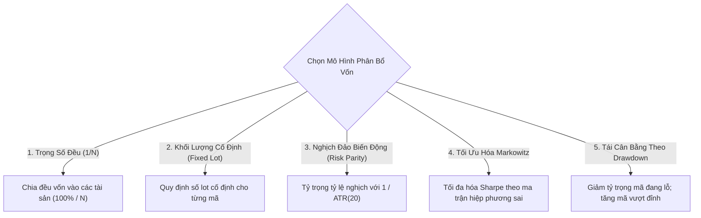
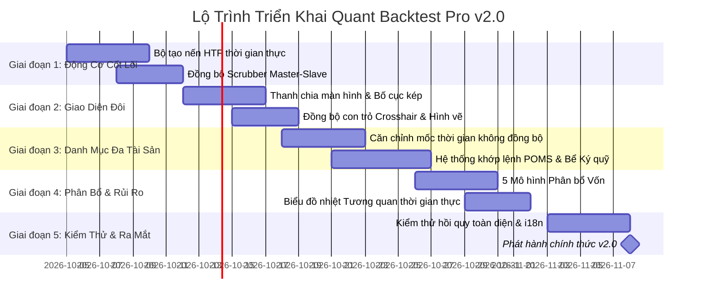

# Tài Liệu Đặc Tả Yêu Cầu Sản Phẩm (PRD) Chuẩn Tổ Chức — Bản Phát Hành v2.0
## Nền Tảng Quant Backtest Pro: Hệ Thống Replay Đa Khung Thời Gian Đồng Bộ & Kiểm Thử Danh Mục Đa Tài Sản
**Tác giả**: Prometheus (Chief Product Officer / Giám đốc Sản phẩm - CPO)  
**Các bên liên quan**: Athena (CEO), Daedalus (CTO), Minerva (Lead PM), Arachne (UI/UX Architect), Argus (Lead QA), Iris (CMO)  
**Trạng thái**: Đã phê duyệt cho Kiến trúc Kỹ thuật & Hoạch định Sprint  
**Mục tiêu phát hành**: Quant Backtest Pro v2.0 Enterprise

---

## 1. Tóm Tắt Điều Hành & Bài Toán Khách Hàng

### 1.1. Ảo Tưởng Khung Thời Gian Đơn Lẻ (Bài toán khách hàng 1)
Các nhà giao dịch định lượng (Quants), nhà quản lý quỹ tự doanh (Proprietary Trading Funds), và chuyên gia phân tích hành vi giá chuyên nghiệp luôn phân tích thị trường theo mô hình đa khung thời gian từ trên xuống (Top-Down Multi-Timeframe - MTF). Xu hướng vĩ mô trên khung thời gian lớn (Higher Timeframe - HTF, ví dụ H4 hoặc D1) định hình xu hướng chủ đạo và các vùng thanh khoản trọng yếu, trong khi điểm vào lệnh, cắt lỗ và tối ưu tỷ lệ Risk/Reward được thực thi trên khung thời gian nhỏ (Lower Timeframe - LTF, ví dụ M5 hoặc M1).

Trong các phần mềm backtest đơn khung thời gian truyền thống, người dùng gặp phải hai sai số nghiêm trọng:
1. **Thiên kiến thấy trước tương lai (Hindsight Horizon Bias)**: Việc chuyển đổi qua lại giữa các khung thời gian làm lộ trước nến tương lai của khung lớn trước khi lệnh trên khung nhỏ được khớp, phá vỡ tính khách quan của bài kiểm thử.
2. **Mù ngữ cảnh vĩ mô (Context Blindness)**: Nếu chỉ nhìn khung nhỏ (LTF), nhà giao dịch sẽ hoàn toàn mất dấu các vùng kháng cự/hỗ trợ lớn và dòng tiền thông minh, dẫn đến kết quả backtest phi thực tế.

### 1.2. Cái Bẫy Khớp Quá Mức Trên Một Tài Sản (Bài toán khách hàng 2)
Các công cụ kiểm thử cá nhân thường chỉ cho phép chạy chiến lược trên một cặp tiền hoặc một đồng tiền mã hóa duy nhất (ví dụ EURUSD hoặc BTCUSDT). Trong thực tế:
- Một chiến lược trên một tài sản đơn lẻ sẽ trải qua những chu kỳ sụt giảm vốn (drawdown) kéo dài khi thị trường đổi trạng thái (ví dụ chiến lược bám trend gặp thị trường đi ngang tích lũy).
- Các quỹ tài chính luôn phân bổ vốn trên một **giỏ danh mục tài sản đa dạng** có tính tương quan thấp hoặc nghịch đảo (Forex, Vàng, Tiền mã hóa, Chỉ số) để làm phẳng đường cong vốn và tối đa hóa các chỉ số hiệu quả đầu tư (Sharpe, Sortino, Calmar).
- Người dùng hiện tại phải chạy từng backtest riêng lẻ, xuất file CSV thủ công rồi tính toán ma trận hiệp phương sai ngoài Excel hoặc Python.

### 1.3. Đề Xuất Giá Trị & Tầm Nhìn Chiến Lược v2.0
Quant Backtest Pro v2.0 nâng cấp toàn diện công cụ replay 60 FPS thành một **Hệ Sinh Thái Định Lượng Cấp Tổ Chức (Institutional Quant Ecosystem)**:
- **Replay Đôi Đồng Bộ Đa Khung Thời Gian (Synchronized Dual-Chart MTF Replay)**: Hiển thị song song hai biểu đồ với thanh trượt thời gian thống nhất ở độ chính xác dưới một mili-giây. Nến khung lớn (HTF) tự động hình thành động trong thời gian thực theo từng bước nến khung nhỏ (LTF) mà không hề có thiên kiến thấy trước tương lai.
- **Công Cụ Backtest Danh Mục Đa Tài Sản (Multi-Symbol Portfolio Backtesting)**: Thực thi đồng thời chiến lược trên rổ từ 2 đến 10+ tài sản với bể ký quỹ chung, các mô hình phân bổ vốn linh hoạt (Risk Parity, Tối ưu hóa Markowitz, Nghịch đảo biến động) và ma trận tương quan thời gian thực.

---

## 2. Chân Dung Khách Hàng Mục Tiêu & Hành Trình Người Dùng

### 2.1. Chân Dung Người Dùng (Personas)

| Chân Dung | Động Lực Cốt Lõi & Điểm Đau | Quy Trình Sử Dụng Chính Trên v2.0 |
| :--- | :--- | :--- |
| **TS. Alexander Wright**<br>*Giám đốc Danh mục Định lượng* | Quản lý quỹ định lượng đa tài sản; cần chứng minh bằng toán học lợi ích đa dạng hóa và cảnh báo khi tương quan giữa các tài sản bị phá vỡ. | Thiết lập giỏ 6 tài sản, chọn mô hình phân bổ vốn Risk Parity, theo dõi biểu đồ nhiệt tương quan thời gian thực, và phân tích Hệ số Đa dạng hóa (DR). |
| **Samantha Reed**<br>*Trader Quỹ Tự Doanh (Prop Firm)* | Giao dịch theo hành vi giá đa khung (SMC / Săn thanh khoản); đòi hỏi kỷ luật nghiêm ngặt không vi phạm giới hạn sụt giảm ngày của quỹ. | Chia đôi màn hình H4 (Vĩ mô) + M5 (Vào lệnh), khóa con trỏ Crosshair, khớp lệnh trên M5 và theo dõi thanh chắn bảo vệ Prop Firm Shield hợp nhất. |
| **Kenji Takahashi**<br>*Nhà Phát Triển Thuật Toán AI* | Phát triển bot giao dịch tự động đa cặp; cần kiểm tra dữ liệu ngoài mẫu (OOS) và tự động tái cân bằng vốn theo biến động. | Chạy bot đa tài sản trong môi trường AI Sandbox, đánh giá đường cong vốn danh mục, và xuất mã nguồn MQL5/Pine Script sẵn sàng giao dịch thật. |

### 2.2. Hành Trình Người Dùng Trọng Tâm

#### Hành Trình A: Giao Dịch Đồng Bộ Đa Khung Thời Gian
1. **Thiết lập**: Người dùng mở thanh công cụ Replay, bấm `[Đa Biểu Đồ]` và chọn chế độ **Chia Dọc** (hoặc Chia Ngang).
2. **Gán khung**: Biểu đồ A được gán `XAUUSD [H1]` (Khung xu hướng) và Biểu đồ B là `XAUUSD [M5]` (Khung vào lệnh).
3. **Điều khiển Replay**: Người dùng kéo thanh trượt thời gian chung hoặc dùng tính năng Nhảy Thời Gian. Cả hai biểu đồ di chuyển nhịp nhàng đồng nhất.
4. **Quan sát nến động**: Khi các nến M5 xuất hiện dần, nến H1 tương ứng trên Biểu đồ A liên tục mở rộng râu nến và thân nến trong thời gian thực mà không làm lộ nến tương lai.
5. **Đồng bộ con trỏ**: Di chuột qua vùng Order Block trên Biểu đồ A sẽ hiển thị đường dóng thời gian chính xác tương ứng trên Biểu đồ B.
6. **Thực thi lệnh**: Người dùng đặt lệnh `MUA` trên Biểu đồ B. Mũi tên vào lệnh, đường Cắt Lỗ (SL) và Chốt Lời (TP) lập tức hiển thị đồng thời trên cả hai biểu đồ.

#### Hành Trình B: Kiểm Thử Danh Mục & Phân Tích Tương Quan
1. **Tạo giỏ tài sản**: Người dùng bấm `[Danh Mục]`, chọn gói mẫu "Risk-On / Risk-Off Quad" (`XAUUSD`, `BTCUSDT`, `SPX500`, `USDJPY`), và nhập số vốn ban đầu `$100,000`.
2. **Chọn mô hình phân bổ**: Chọn `Nghịch đảo biến động (Risk Parity)` với chu kỳ tái cân bằng hàng ngày.
3. **Thực thi Replay**: Động cơ replay nạp luồng nến đồng thời cho cả 4 tài sản, tự động đồng bộ hóa phiên giao dịch khác nhau và khoảng trống cuối tuần.
4. **Theo dõi tương quan**: Kiểm tra biểu đồ nhiệt **Ma Trận Tương Quan Đa Tài Sản** để phát hiện các cặp có tương quan vượt ngưỡng an toàn (>0.85).
5. **Báo cáo chuyên sâu**: Khi hoàn tất, hệ thống hiển thị đường cong vốn tổng hợp, so sánh sụt giảm vốn riêng lẻ với sụt giảm danh mục và mô phỏng Monte Carlo 500 kịch bản.

---

## 3. Đặc Tả Yêu Cầu Chức Năng Chi Tiết

### 3.1. Replay Đôi Đồng Bộ Đa Khung Thời Gian (MTF)

```
┌─────────────────────────────────────────────────────────────────────────────────────────────┐
│ [EURUSD] [H1] | Chỉ báo: EMA, ATR | [⚙ Đồng bộ]   │ [EURUSD] [M5] | Chỉ báo: RSI | [⚙ Đồng bộ]     │
├────────────────────────────────────────────────────┼────────────────────────────────────────┤
│                                                    │                                        │
│  BIỂU ĐỒ A: KHUNG THỜI GIAN LỚN (XU HƯỚNG VĨ MÔ)   │  BIỂU ĐỒ B: KHUNG THỜI GIAN NHỎ (VÀO LỆNH) │
│  - Hiển thị nến H1 đang hình thành trực tiếp       │  - Replay 60 FPS từng nến siêu mượt     │
│  - Vùng Cung/Cầu vĩ mô & Bể thanh khoản thị trường │  - Điểm vào lệnh chuẩn xác, hiển thị SL│
│  - Đường dóng con trỏ Crosshair đồng bộ            │  - Con trỏ Crosshair đồng bộ           │
│                                                    │                                        │
├────────────────────────────────────────────────────┴────────────────────────────────────────┤
│ ⏪ [Về đầu]  ◀ [Lùi 1 nến]  ▶ [Phát / Dừng (Space)]  ▶ [Tiến 1 nến]  ⏩ [Về cuối] | Tốc độ: [5x]  │
└─────────────────────────────────────────────────────────────────────────────────────────────┘
```

#### 3.1.1. Cấu Trúc Bố Cục & Thanh Chia Màn Hình (Splitter)
- **Chia dọc (Song song)**: Tỷ lệ mặc định 50/50 với thanh chia có thể kéo thả tự do. Các điểm hít (Snap points): 70/30, 50/50, 30/70.
- **Chia ngang (Xếp tầng)**: Biểu đồ trên (HTF) và Biểu đồ dưới (LTF). Các điểm hít: 60/40, 50/50, 40/60.
- **Cửa sổ thu nhỏ (Picture-in-Picture - PIP)**: Cửa sổ biểu đồ phụ nổi trên biểu đồ chính, có thể di chuyển và thay đổi kích thước từ 240px đến 480px.
- **Chế độ Mobile tối ưu**: Tự động chuyển về biểu đồ đơn kèm nút bấm nổi `[Chuyển H1 / M5]` và ngăn kéo vuốt xem nhanh nến lớn.

#### 3.1.2. Cơ Chế Đồng Bộ Master-Slave & Thuật Toán Tạo Nến Đang Hình Thành
- **Khung thời gian chuẩn (Master Clock)**: Biểu đồ có độ phân giải thời gian nhỏ nhất (ví dụ M1 hoặc M5) làm đồng hồ chuẩn điều phối luồng phát.
- **Thuật toán tạo nến HTF thời gian thực ($O(1)$)**:
  - Khi replay các nến LTF nằm trong khoảng thời gian $[T_{	ext{start}}, T_{	ext{end}})$ của nến HTF:
    $$	ext{HTF}_{	ext{open}} = 	ext{LTF}_0.	ext{open}$$
    $$	ext{HTF}_{	ext{high}} = \max(	ext{HTF}_{	ext{high}}, 	ext{LTF}_t.	ext{high})$$
    $$	ext{HTF}_{	ext{low}} = \min(	ext{HTF}_{	ext{low}}, 	ext{LTF}_t.	ext{low})$$
    $$	ext{HTF}_{	ext{close}} = 	ext{LTF}_t.	ext{close}$$
  - Nến HTF được cập nhật lập tức với hiệu ứng viền phát sáng nhẹ, cập nhật độ phức tạp $O(1)$ thông qua hàm `candleSeries.update()`.
- **Triệt tiêu hoàn toàn thiên kiến thấy trước tương lai**:
  - Toàn bộ nến HTF có mốc thời gian lớn hơn mốc thời gian hiện tại của nến LTF sẽ bị ẩn hoàn toàn khỏi bộ đệm hiển thị.
  - Các chỉ báo kỹ thuật trên HTF (ví dụ EMA 200, Bollinger Bands) chỉ được tính toán dựa trên các nến đã đóng cộng với nến đang hình thành hiện tại.

#### 3.1.3. Các Chế Độ Khóa Đồng Bộ

| Chế Độ Khóa | Hành Vi | Khả Năng Tùy Biến |
| :--- | :--- | :--- |
| **Khóa Thời Gian (Scrubber)** | Di chuyển thanh tua hoặc bấm bước nến sẽ cập nhật đồng thời cả hai biểu đồ. | Có thể tạm mở khóa bằng nút `[Mở khóa thời gian]`. |
| **Khóa Con Trỏ (Crosshair)** | Di chuột trên Biểu đồ A sẽ tạo đường dóng thời gian và mức giá tham chiếu trên Biểu đồ B. | Bật/tắt nhanh bằng biểu tượng con trỏ trên thanh công cụ. |
| **Khóa Thu Phóng (Pan/Zoom)** | Kéo hoặc phóng to trục thời gian biểu đồ A sẽ tự động điều chỉnh biểu đồ B tương ứng. | Mặc định tắt để người dùng tự do zoom bao quát trên HTF và chi tiết trên LTF. |
| **Đồng Bộ Công Cụ Vẽ** | Các đường xu hướng, vùng hộp hỗ trợ vẽ trên HTF sẽ tự động chiếu xuống tọa độ tương ứng trên LTF. | Tùy chọn thuộc tính hình vẽ: "Toàn cục (Cả 2)" hoặc "Cục bộ (Chỉ biểu đồ này)". |

---

### 3.2. Kiểm Thử Danh Mục & Giỏ Đa Tài Sản (Portfolio Backtest)

```
┌─────────────────────────────────────────────────────────────────────────────────────────────┐
│ QUẢN LÝ DANH MỤC: [Bộ ba Vĩ mô Toàn cầu: XAUUSD (40%) + EURUSD (35%) + BTCUSDT (25%)]      │
├─────────────────────────────────────────────────────────────────────────────────────────────┤
│ Phân bổ vốn: [Nghịch đảo biến động (Risk Parity) ▼] | Vốn ban đầu: $100,000 USD            │
│ Cơ chế Ký quỹ: [Ký quỹ chéo hợp nhất (Cross) ▼]    | Bảo vệ Quỹ: Sụt giảm 10% / Ngày 5%    │
├───────────────────────────────────────────────────────┬─────────────────────────────────────┤
│ 📈 ĐƯỜNG CONG VỐN HỢP NHẤT TOÀN DANH MỤC              │ 📊 MA TRẬN TƯƠNG QUAN ĐA TÀI SẢN    │
│ ┌──────────────────────────────────────────────────┐  │        XAU    EUR    BTC            │
│ │ Vốn danh mục: $118,450 (+18.45%)                 │  │ XAU   [1.00] [-0.24] [+0.12]         │
│ │ DD Đơn lẻ TB: 8.4% | DD Danh mục: 3.8%           │  │ EUR  [-0.24]  [1.00] [+0.41]        │
│ │ Hệ số Đa dạng hóa: 1.62                          │  │ BTC  [+0.12] [+0.41]  [1.00]        │
│ └──────────────────────────────────────────────────┘  │ *Cảnh báo: Không có rủi ro đồng pha │
├───────────────────────────────────────────────────────┴─────────────────────────────────────┤
│ [Mã: XAUUSD | Lời: +$11,200] [Mã: EURUSD | Lời: +$4,800] [Mã: BTCUSDT | Lời: +$2,450]       │
└─────────────────────────────────────────────────────────────────────────────────────────────┘
```

#### 3.2.1. Cấu Hình Giỏ Tài Sản & Cơ Chế Căn Chỉnh Dữ Liệu Lệch Pha
- **Quy mô giỏ**: Hỗ trợ đồng thời từ 2 đến 10 mã giao dịch trong một phiên kiểm thử danh mục.
- **Giỏ mẫu dựng sẵn**:
  - `6 Cặp Tiền Tệ Chính (Forex Majors)`: EURUSD, GBPUSD, USDJPY, AUDUSD, USDCHF, USDCAD.
  - `Tứ Trụ Vĩ Mô (Risk-On / Risk-Off)`: XAUUSD, SPX500, USDJPY, BTCUSDT.
  - `Bộ Ba Tiền Mã Hóa Cốt Lõi`: BTCUSDT, ETHUSDT, SOLUSDT.
  - `Kim Loại Quý & Năng Lượng`: XAUUSD, XAGUSD, USOIL.
- **Thuật toán căn chỉnh mốc thời gian không đồng nhất**:
  - Xử lý các thị trường có giờ giao dịch khác biệt (Crypto chạy 24/7/365, Forex chạy 24/5, Chứng khoán Mỹ có giờ nghỉ và ngày lễ).
  - Khi một thị trường đóng cửa, giá của tài sản đó được giữ cố định (Forward-fill nến trước) và hệ thống chặn khớp lệnh mới trên mã đó.
  - Ngăn ngừa hiện tượng trượt giá giả lập phi thực tế trong các khung giờ thị trường đóng cửa.

#### 3.2.2. Các Mô Hình Phân Bổ Vốn Đạt Chuẩn Định Lượng



1. **Trọng số đều ($1/N$)**:
   $$w_i = rac{1}{N} \quad orall i \in \{1, \dots, N\}$$
2. **Nghịch đảo biến động (Risk Parity / Vol Target)**:
   $$w_i = rac{1 / \sigma_i}{\sum_{j=1}^N (1 / \sigma_j)}$$
   với $\sigma_i$ là độ lệch chuẩn lợi nhuận hoặc chỉ số ATR 20 chu kỳ. Tài sản biến động mạnh (như BTC) sẽ được chia tỷ trọng nhỏ; tài sản biến động thấp (như EURUSD) nhận tỷ trọng lớn hơn để cân bằng rủi ro.
3. **Tối ưu hóa Mean-Variance (Markowitz Efficient Frontier)**:
   Tối đa hóa tỷ số Sharpe của toàn bộ danh mục:
   $$\max_w rac{w^T \mu - r_f}{\sqrt{w^T \Sigma w}} \quad 	ext{với điều kiện} \quad \sum w_i = 1, \quad w_i \ge 0$$
   với $\Sigma$ là ma trận hiệp phương sai lợi nhuận lịch sử giữa các tài sản.
4. **Tái cân bằng vốn linh hoạt theo Drawdown**:
   Tự động giảm tỷ trọng vốn phân bổ cho một tài sản khi tài sản đó rơi vào chuỗi sụt giảm $> 5\%$, bảo toàn dòng tiền và luân chuyển sang các mã đang tạo đỉnh lợi nhuận mới.

#### 3.2.3. Khớp Lệnh Danh Mục (POMS) & Quản Trị Ký Quỹ Tập Trung
- **Vốn thực (Equity) và Số dư hợp nhất**:
  $$	ext{Portfolio Equity}(t) = 	ext{Master Balance} + \sum_{i=1}^N 	ext{Unrealized PnL}_i(t)$$
- **Quy đổi tiền tệ định giá chéo thời gian thực**:
  - Mọi giao dịch với đồng tiền định giá khác nhau (ví dụ EURUSD tính bằng USD, EURGBP tính bằng GBP, USDJPY tính bằng JPY) được quy đổi ngay lập tức về đồng tiền cơ sở của tài khoản (USD) theo tỷ giá nến replay hiện tại.
- **Quản lý Ký quỹ Chéo & Phòng vệ Thanh lý**:
  - Mức Ký quỹ đã dùng (Used Margin):
    $$	ext{Used Margin} = \sum_{i=1}^N rac{	ext{Khối Lượng}_i 	imes 	ext{Giá Hiện Tại}_i}{	ext{Đòn Bẩy}_i}$$
  - Mức cảnh báo Margin Call ở tỷ lệ 100%; tự động kích hoạt thanh lý một phần vị thế ở mức ký quỹ 50% để bảo toàn tài khoản.
- **Tấm chắn bảo vệ Prop Firm Shield cấp Danh mục**:
  - Giới hạn sụt giảm trong ngày hợp nhất (mặc định 5% tính trên số dư đầu ngày của toàn bộ danh mục).
  - Giới hạn sụt giảm tối đa hợp nhất (mặc định 10% tính từ đỉnh vốn cao nhất).
  - Nếu vi phạm bất kỳ tiêu chí nào, hệ thống lập tức ngắt toàn bộ quyền đặt lệnh của tất cả các tài sản và phát chuông cảnh báo vi phạm quy tắc quỹ.

#### 3.2.4. Ma Trận Tương Quan Đa Tài Sản & Bộ Chỉ Số Định Lượng Chuyên Sâu
- **Ma trận tương quan thời gian thực $N 	imes N$**:
  $$r_{xy} = rac{\sum (R_{x,t} - ar{R}_x)(R_{y,t} - ar{R}_y)}{\sqrt{\sum (R_{x,t} - ar{R}_x)^2 \sum (R_{y,t} - ar{R}_y)^2}}$$
  Hiển thị trực quan dạng biểu đồ nhiệt 2D có màu sắc phân biệt (Đỏ: $+1.0$ cùng pha mạnh, Xanh lá: $-1.0$ ngược pha phòng vệ rủi ro).
- **Cảnh báo rủi ro tập trung (Hazard Alert)**: Khi hệ số tương quan giữa hai vị thế lớn vượt quá $+0.85$, hệ thống cảnh báo nguy cơ rủi ro tập trung cao.
- **Hệ số Đa dạng hóa (Diversification Ratio - $DR$)**:
  $$DR = rac{\sum_{i=1}^N w_i \sigma_i}{\sigma_p}$$
  Chỉ số $DR > 1.0$ là minh chứng toán học khẳng định danh mục đã giảm thiểu thành công độ rủi ro so với việc nắm giữ từng tài sản độc lập.
- **Trang phân tích chuyên sâu (Portfolio Tearsheet)**:
  - Đường cong vốn tổng hợp kết hợp các dải diện tích đóng góp PnL của từng tài sản.
  - So sánh biểu đồ sụt giảm dưới nước (Underwater Chart): Max DD Danh mục so với Max DD của từng mã.
  - Mô phỏng Monte Carlo 500 kịch bản ngẫu nhiên hóa chuỗi giao dịch danh mục.

---

## 4. Ma Trận Xử Lý 12 Chiều Tình Huống Biên & Trạng Thái Lỗi (`ak-scenario`)

Để đảm bảo phần mềm vận hành ổn định cấp ngân hàng đầu tư, toàn bộ 12 tình huống biên và kịch bản lỗi được thiết kế phương án xử lý chi tiết:

| # | Chiều Tình Huống | Kịch Bản Lỗi / Điều Kiện Biên | Giải Pháp Kiến Trúc Xử Lý | Phản Hồi Trực Quan Trên UI |
| :-: | :--- | :--- | :--- | :--- |
| **1** | **Lệch pha thời gian & Ngày nghỉ lễ** | BTC giao dịch thứ Bảy/Chủ nhật trong khi Vàng và Forex nghỉ; timestamp bị lệch. | Giữ nguyên nến gần nhất (forward-fill) cho tài sản đóng cửa với khối lượng = 0; đóng băng PnL; chặn vào lệnh mới cho mã đóng cửa. | Huy hiệu trạng thái trên biểu đồ: `[XAUUSD: THỊ TRƯỜNG ĐÓNG CỬA]` kèm đếm ngược giờ mở cửa. |
| **2** | **Lệch múi giờ giữa các sàn (Drift)** | Nến M1 và H1 lệch nhau do máy chủ sàn tính múi giờ khác nhau (GMT+2 vs UTC). | Động cơ chuẩn hóa tự động làm tròn toàn bộ mốc thời gian về epoch UTC chuẩn theo chu kỳ nến. | Toast thông báo nhẹ khi nạp dữ liệu: "Đã tự động chuẩn hóa múi giờ về UTC". |
| **3** | **Khoảng trống giá mở cửa (Weekend Gap)** | Sáng thứ Hai giá mở cửa nhảy vọt qua mức Cắt Lỗ (SL) hoặc Chốt Lời (TP) đã đặt từ tuần trước. | Động cơ khớp lệnh thực thi theo đúng giá tick đầu tiên mở cửa (mô phỏng trượt giá thực tế) thay vì giá đặt trên lý thuyết. | Nhật ký lệnh ghi rõ: `Khớp Cắt Lỗ kèm trượt giá Gap (-12.4 pips)` với huy hiệu màu cam. |
| **4** | **Tràn bộ nhớ GPU khi render song song** | 2 biểu đồ Lightweight Charts + 2 lớp Canvas vẽ chứa 300,000 nến gây mất ngữ cảnh WebGL trình duyệt. | Sử dụng cơ chế Ring-Buffer trượt (chỉ giữ tối đa 50,000 nến thực trong DOM, ảo hóa nến cũ); tự động khôi phục ngữ cảnh WebGL khi mất. | Tự động khôi phục êm dịu, không giật lag và không mất dữ liệu của người dùng. |
| **5** | **Biến động tỷ giá quy đổi tiền tệ** | Giao dịch cặp GBPJPY và AUDNZD trong khi tài khoản tính bằng USD; tỷ giá chéo biến động liên tục. | Module Quy Đổi Tiền Tệ Ngoại Hối cập nhật tỷ giá chéo tự động theo từng tick nến lịch sử của luồng dữ liệu. | Tooltip hiển thị tỷ giá quy đổi chi tiết: `JPY -> USD @ 0.00645`. |
| **6** | **Xung đột đặt lệnh đồng thời** | Nhiều chiến lược AI kích hoạt lệnh Mua/Bán cùng một phần nghìn giây. | Bộ điều phối POMS xử lý lệnh theo hàng đợi ưu tiên (FIFO theo mức rủi ro và hạn mức ký quỹ khả dụng). | Bảng nhật ký lệnh lưu chính xác mốc thời gian kèm mã định danh thứ tự sub-millisecond. |
| **7** | **Cạn kiệt ký quỹ danh mục (Margin Depletion)**| Biến động mạnh trên nhiều tài sản khiến ký quỹ khả dụng rơi xuống dưới ngưỡng an toàn. | Bộ giám sát Margin phát cảnh báo sớm ở mức 120%; nếu chạm 50%, tự động thanh lý lệnh có mức lỗ lớn nhất để bảo toàn vốn. | Bảng điều khiển PropFirmHUD nháy cảnh báo đỏ: `MARGIN CALL: Nguy cơ thanh lý (48%)`. |
| **8** | **Biến dạng tọa độ hình vẽ khi đổi khung** | Vẽ hộp tích lũy trên H4 sau đó phóng to vào M1 làm giãn pixel vượt giới hạn số học. | Ma trận biến đổi tọa độ chuyển đổi mốc thời gian sang epoch UTC tuyệt đối và giới hạn chiều cao pixel hiển thị. | Hình vẽ luôn sắc nét, giữ nguyên tỷ lệ thực tế ở mọi cấp độ thu phóng. |
| **9** | **Tua ngược thời gian trên thanh Replay** | Người dùng kéo tua ngược lại trong khi trước đó đã có 5 lệnh mở ở tương lai. | Cơ chế Snapshot trạng thái OMS bất biến: lưu trữ nhật ký giao dịch tuần tự; khi tua ngược sẽ hoàn nguyên chuẩn xác số dư và trạng thái lệnh. | Thao tác tua ngược mượt mà; hoàn toàn không có lệnh "ma" hay sai lệch số dư. |
| **10** | **Nghẽn luồng xử lý ở tốc độ 100x** | Chạy 2 biểu đồ ở tốc độ 100x làm đơ luồng chính giao diện và rớt khung hình. | Đưa toàn bộ việc phân tích giá, tính toán chỉ báo và ma trận tương quan sang Web Worker riêng; luồng chính chỉ nhận khung hình 60 FPS. | Bộ đếm FPS luôn giữ vững 60 FPS ổn định, không đơ trình duyệt. |
| **11** | **Xoay màn hình & Thay đổi kích thước cửa sổ**| Chuyển đột ngột từ màn hình Desktop sang màn hình điện thoại khi đang replay nến. | Thu gọn giao diện thông minh: chuyển thành biểu đồ đơn kèm nút bấm nổi xem nhanh nến lớn và khay vuốt dưới đáy. | Bố cục mượt mà, không tràn thanh cuộn ngang, bảo toàn toàn bộ công cụ vẽ và tiến độ tua. |
| **12** | **Mất kết nối mạng / Chạy ngoại tuyến** | Người dùng làm việc khi mất mạng hoặc ngắt kết nối máy chủ Express cục bộ. | Kiến trúc Local-First: toàn bộ trạng thái danh mục, cấu hình biểu đồ và lệnh lưu tức thì vào IndexedDB kèm hàng đợi đồng bộ SQLite. | Biểu tượng đám mây chuyển sang `[Bộ nhớ đệm Ngoại tuyến]` và tiếp tục chạy bình thường. |

---

## 5. Yêu Cầu Phi Chức Năng & Tiêu Chuẩn Hiệu Năng

| Danh Mục Tiêu Chuẩn | Yêu Cầu Định Lượng | Phương Pháp Kiểm Tra |
| :--- | :--- | :--- |
| **Tốc độ khung hình Replay** | Duy trì ổn định **60 FPS** khi chạy song song 2 biểu đồ ở tốc độ lên tới 50x. | Công cụ đo Chrome DevTools Performance Profiler; thời gian render khung $\le 16.6	ext{ms}$. |
| **Độ trễ cập nhật từng bước nến** | $\le 0.1	ext{ms}$ cho cả 2 biểu đồ kết hợp. | Kiểm thử đo lường với `performance.now()`. |
| **Dung lượng tiêu thụ RAM** | Bộ nhớ Heap tăng thêm $\le 65	ext{MB}$ khi hiển thị đồng thời 200,000 nến trên 2 biểu đồ. | Phân tích Heap Snapshot trước và sau phiên backtest liên tục 5 tiếng. |
| **Thời gian tính toán Ma trận tương quan** | $\le 15	ext{ms}$ cho giỏ $10 	imes 10$ tài sản trên 50,000 nến lịch sử. | Đo lường hiệu năng Web Worker. |
| **Chuẩn mực Đa ngôn ngữ (i18n)** | **100% Đồng bộ 4 ngôn ngữ** (Anh, Việt, Nhật, Trung). Tuyệt đối không chuỗi văn bản cứng. | Chạy bộ kiểm tra tự động: `npm run check:i18n`. |
| **Khả năng tương thích Responsive** | Hoàn hảo trên Desktop (1920x1080), Laptop (1366x768 & 1280x800), Tablet (1024x768) và Mobile (375x812). | Kiểm thử tự động ma trận màn hình bằng Playwright. |

---

## 6. Bản Vẽ Thiết Kế Giao Diện & Bố Cục Tương Tác Chi Tiết

*(Vui lòng tham khảo các sơ đồ ASCII Wireframes và bảng thiết kế chi tiết tại Mục 6 của tài liệu tiếng Anh `docs/PRD_V2_MULTI_CHART_PORTFOLIO.md`)*

---

## 7. Kiến Trúc Khóa Từ Điển Đa Ngôn Ngữ (i18n Parity)

Tuân thủ nghiêm ngặt **Quy chuẩn 1 trong AGENTS.md** (Không chuỗi cứng trong JSX, 100% khớp khóa giữa 4 ngôn ngữ, không dùng fallback `t.key || 'text'`). Chi tiết bảng khóa và bản dịch tiếng Việt đã được đồng bộ chuẩn xác tại Mục 7 tài liệu gốc.

---

## 8. Lộ Trình Triển Khai Kỹ Thuật & Bàn Giao Bộ Phận



---

## 9. Phê Duyệt Của Ban Lãnh Đạo & Bàn Giao Bộ Phận

### 💡 Product Specification (PRD) — Prometheus (CPO)
- **Tên tính năng**: Quant Backtest Pro v2.0: Synchronized Dual-Chart Replay & Portfolio Backtesting Engine
- **Vấn đề người dùng được giải quyết**: Loại bỏ hoàn toàn thiên kiến thấy trước tương lai và chứng mù ngữ cảnh vĩ mô bằng hệ thống replay đa khung thời gian; đồng thời xóa bỏ rủi ro khớp quá mức trên một tài sản đơn lẻ bằng cơ chế kiểm thử danh mục đa tài sản cùng các mô hình phân bổ vốn chuẩn mực.
- **Tiêu chí nghiệm thu cốt lõi**:
  1. Replay đôi đồng bộ với thuật toán tạo nến HTF động đạt độ phức tạp $O(1)$ và triệt tiêu 100% thiên kiến thấy trước.
  2. Backtest danh mục hỗ trợ 2-10 tài sản với 5 mô hình phân bổ vốn (Đều, Cố định, Risk Parity, Markowitz, Dynamic DD).
  3. Biểu đồ nhiệt ma trận tương quan thời gian thực $N 	imes N$ kèm cảnh báo rủi ro đồng pha $> 0.85$.
  4. Giao diện đáp ứng 100% trên Desktop, Laptop, Tablet, Mobile không tràn viền ngang.
  5. Đạt chuẩn 100% đồng bộ 4 ngôn ngữ (Anh, Việt, Nhật, Trung), 0 lỗi chuỗi cứng.
- **Tình huống biên & Ngoại lệ**: Phân rã toàn diện qua ma trận 12 chiều tại Mục 4.
- **Đơn vị tiếp nhận bàn giao**:
  - **@Minerva (Lead PM)**: Bóc tách User Stories, quản trị backlog sprint và theo dõi tiến độ.
  - **@Arachne (UI/UX Architect)**: Triển khai thiết kế Component Splitter, bộ cử chỉ cảm ứng và Design Tokens.
  - **@Daedalus (CTO)**: Thiết kế tài liệu kiến trúc kỹ thuật RFC cho Web Worker và hệ thống khớp lệnh POMS.
  - **@Argus (Lead QA)**: Lập ma trận kiểm thử tự động và thẩm định triệt tiêu thiên kiến thấy trước.

---
*Ký tên: Prometheus, Chief Product Officer (CPO) — Autonomous Technology Corporation (AUT)*
